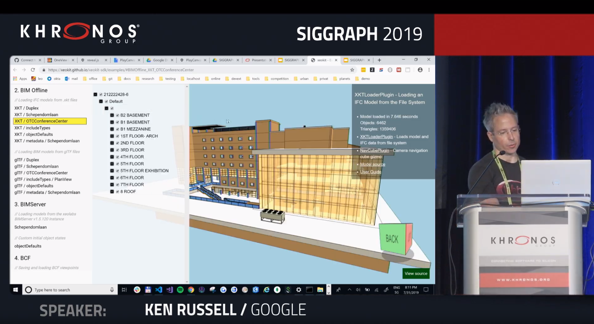
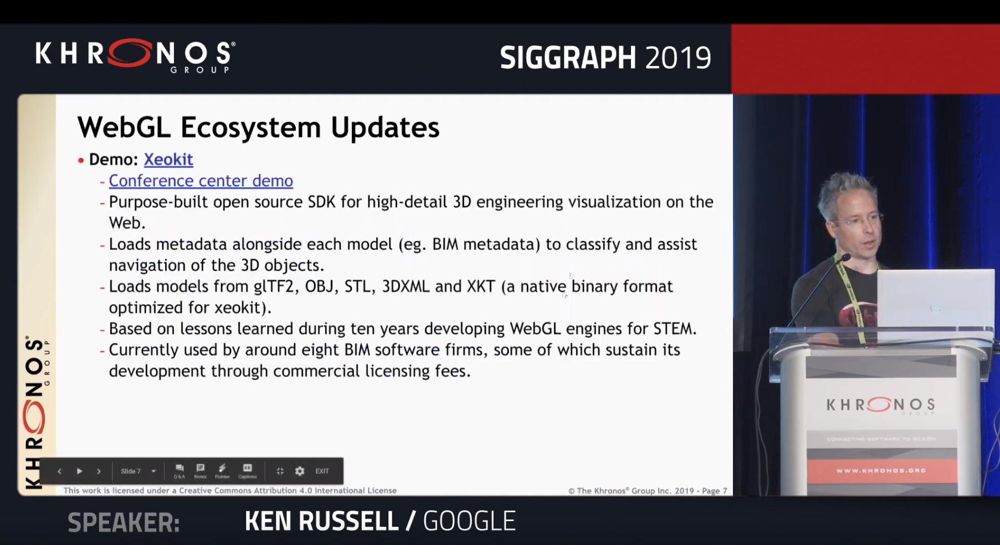

This week, [Ken Russell](https://twitter.com/gfxprogrammer) of the [Khronos Group](https://www.khronos.org/) gave a short demonstration of xeokit at the SIGGRAPH 2019 WebGL BOF in Los Angeles!

{/* truncate */}

The xeokit renderer was showcased as an example of how WebGL can be used for BIM visualization and collaboration in the Web browser. WebGL (Web Graphics Library) is a JavaScript API for rendering interactive 2D and 3D graphics within any compatible web browser without the use of plug-ins.

View the entire WebGL BOF stream [here](https://www.youtube.com/watch?v=WPsf2NWPu_Y&feature=youtu.be).

