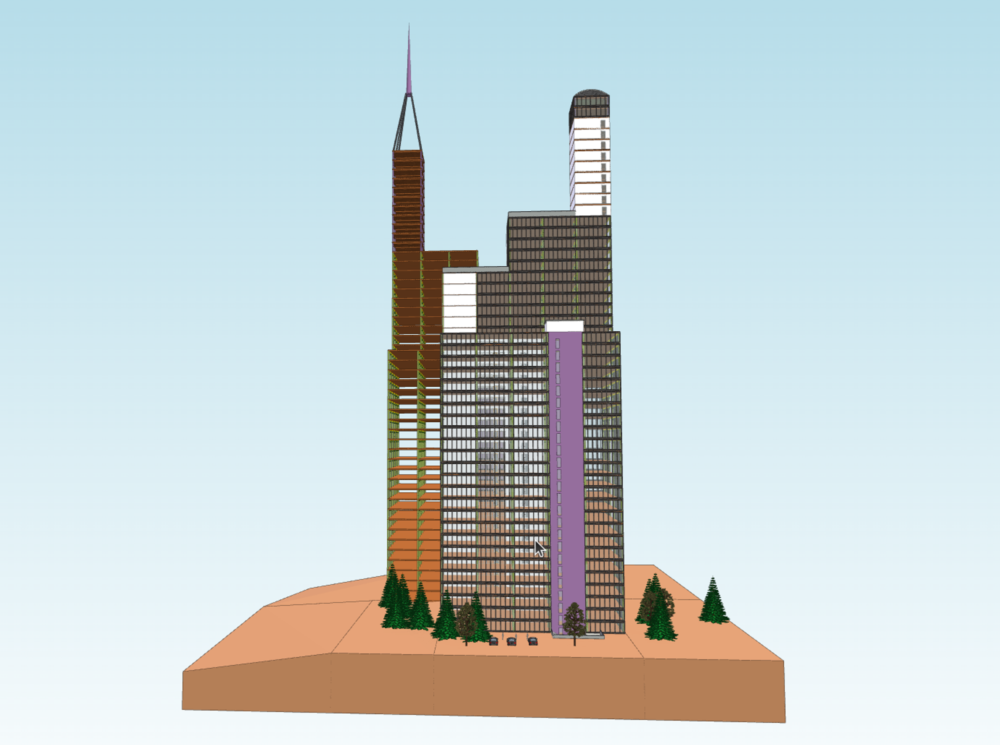

# Compact Model Representation using Data Textures

In xeokit v2.4, we have implemented a new technique for internally storing and rendering models in the xeokit `Viewer`, which we call **data texture model representation** (or DTX for short). Compared to the traditional Vertex Buffer Objects (VBOs) used in other browser graphics libraries, this technique has a much lower memory footprint. As a result, users can now view even larger models in xeokit.

Note that this feature requires a reasonably good GPU and may not work well on low-spec graphics hardware. It has been found to work well on recent-model iPhones and desktop graphics hardware, including Intel HD and NVIDIA GPUs.

- [How to Use Data Textures in xeokit](#how-to-use-data-textures-in-xeokit)
- [How Data Textures Work](#how-data-textures-work)
- [Faster Model Loading](#faster-model-loading)
- [Faster Object Updates](#faster-object-updates)

# How to Use Data Textures in xeokit

To utilize data textures, create a `Viewer` that is enabled to support them. By default, the `Viewer` component does not enable data textures and instead uses conventional Vertex Buffer Objects (VBOs) as a fallback. We’ll enable data textures by configuring our `Viewer` with `dtxEnabled: true`.

Next, use a loader plugin, such as `XKTLoaderPlugin`, to load a model. These loader plugins will use data textures by default, as long as the `Viewer` is also configured to support them. However, if desired, we have the option to override this behavior and use VBOs instead. In this example, we will explicitly instruct our `XKTLoader` to use data textures, just to demonstrate this option.

Data textures will only be used for triangle meshes. Points and lines, on the other hand, will use VBOs (Vertex Buffer Objects). For points, VBOs provide the most optimal representations. As for lines, we use VBOs because they tend to be less numerous in our models compared to triangles.

```js
import {Viewer, XKTLoaderPlugin} from "https://cdn.jsdelivr.net/npm/@xeokit/xeokit-sdk/dist/xeokit-sdk.es.min.js";

// Create a Viewer, configured to use data textures
// to represent and render triangle meshes
const viewer = new Viewer({
    canvasId: "myCanvas",
    dtxEnabled: true // Default is false
});

viewer.scene.camera.eye = [14.91, 14.39, 5.43];
viewer.scene.camera.look = [6.59, 8.34, -4.15];
viewer.scene.camera.up = [-0.28, 0.90, -0.32];

const xktLoader = new XKTLoaderPlugin(viewer);

// Load an IFC model from XKT, into a SceneModel,
// using data textures to store and render it
const sceneModel = xktLoader.load({
    id: "myModel",
    src: "HolterTower.xkt",
    dtxEnabled: true // Default is true
});
```


> [Run this example](https://xeokit.github.io/xeokit-sdk/examples/buildings/#xkt_dtx_HolterTower)



# How Data Textures Work

Our data texture model representation was developed by one of our core xeokit SDK developers, [Toni Marti](https://github.com/tmarti). This technique stores model geometry and attributes in a set of textures in GPU memory.

Essentially, GPU shaders can access attribute information within these textures randomly, allowing for a lot of attribute information to be reused among primitives. This significantly reduces the memory footprint, as we no longer need to duplicate attributes among primitives as we do with Vertex Buffer Objects (VBOs).

In xeokit, we combine this technique with our existing Vertex Buffer Object (VBO) techniques. We dynamically switch to this technique to store and render sections of models that contain large triangle meshes. However, for point clouds and line segments, which are more efficiently stored as VBOs, we continue to use VBOs.

To learn more about Toni's data texture technique and its implementation, check out his presentation from the 2022 WebGL/WebGPU Meetup:

- [Slides](https://www.khronos.org/assets/uploads/developers/presentations/GPU_RAM_Savings_Toni_Marti_Apr22.pdf)
- [YouTube Video](https://www.youtube.com/watch?v=dpfJRxZgJN8&t=3004s&ab_channel=TheKhronosGroup)

[https://www.youtube.com/watch?v=dpfJRxZgJN8&t=3004s&ab\_channel=TheKhronosGroup](https://www.youtube.com/watch?v=dpfJRxZgJN8&t=3004s&ab_channel=TheKhronosGroup)

Video of Toni Marti’s presentation of his data texture contribution to xeokit SDK, for the 2022 WebGL+WebGPU Meetup.

# Faster Model Loading

The xeokit viewer can load model geometry and materials into data textures with less effort than loading them into VBOs. This results in faster model loading times, especially on computers with powerful graphics hardware.

In the video below, you can see the loading of the seven federated models that make up the IFC4 West Riverside Hospital BIM model. In the demonstration, all seven models (air conditioning, plumbing, electrical, alarms, sprinklers, structure, and architecture) load in approximately seven seconds over a fast local network connection.


> [Run this example](https://xeokit.github.io/xeokit-sdk/examples/buildings/#xkt_dtx_WestRiverSideHospital)

<video controls width="640" height="360" controlsList="nodownload">
  <source src="/attachments/Screencast_from_01.09.2023_21_03_42.mp4" type="video/mp4" />
  <source src="/attachments/Screencast_from_01.09.2023_21_03_42.webm" type="video/webm" />
  Your browser does not support the video tag.
</video>

# Faster Object Updates

Data textures provide a more compact representation to avoid duplicating data such as colors and transform matrices for objects. As a result, there is less data that needs to be updated when changing object colors or positions. This makes operations like highlighting, X-raying, colorizing, and moving objects much more efficient within xeokit.

The screen capture below demonstrates the improved efficiency achieved by randomly changing colors within our Lyon city model. This model, which contains 73,203 objects, was imported from a LOD-3 CityGML model.

[//]: 

<video controls width="640" height="360" controlsList="nodownload">
  <source src="/attachments/160140308-59a7e7d8-0398-45c2-a557-ccb5a722efc6.mp4" type="video/mp4" />
  <source src="/attachments/160140308-59a7e7d8-0398-45c2-a557-ccb5a722efc6.webm" type="video/webm" />
  Your browser does not support the video tag.
</video>

Here's another video in which we dynamically animate the positional offsets of the objects in the Lyon city model. These two videos are taken from the [slides](https://www.khronos.org/assets/uploads/developers/presentations/GPU_RAM_Savings_Toni_Marti_Apr22.pdf) from Toni’s presentation at the WebGL/WebGPU Meetup.

[//]: 

<video controls width="640" height="360" controlsList="nodownload">
  <source src="/attachments/160140790-41cb4caa-0bef-40f4-8ef1-ac8d47dd3d2b.mp4" type="video/mp4" />
  <source src="/attachments/160140790-41cb4caa-0bef-40f4-8ef1-ac8d47dd3d2b.webm" type="video/webm" />
  Your browser does not support the video tag.
</video>
