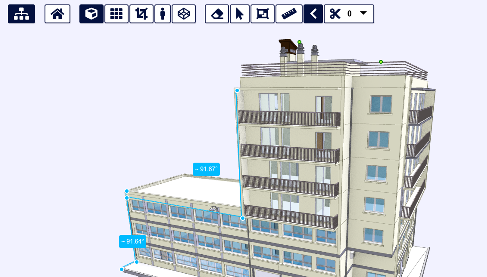

# Accurate Measurements with Snapping

In xeokit v2.4, we have introduced a new feature that allows users to measure distances and angles more accurately in their models. When using the xeokit SDK's `DistanceMeasurementsPlugin` or `AngleMeasurementsPlugin`, or the measurement tools in xeokit’s bundled `BIMViewer`, the mouse pointer now automatically snaps to the nearest vertex or edge. This makes it easier to position the pointer accurately and obtain precise measurements.

This innovative technique was developed by one of our core xeokit SDK developers, [Toni Marti](https://github.com/tmarti). It relies almost entirely on the GPU to find the nearest vertex or edge. Compared to traditional nearest-neighbor spatial search techniques used in other graphics libraries, this technique performs much faster. Additionally, its performance scales smoothly to work with the largest models that we can view with xeokit.

You can read more about Toni's technique and its implementation on his [graphics research blog](https://github.com/tmarti/graphics-research/blob/main/articles/webgl2-gpu-based-snapping.mdx).

- [BIMViewer Measurements with Snapping](#bimviewer-measurements-with-snapping)
-   [How to Use the BIMViewer Distance Measurement Tool](#how-to-use-the-bimviewer-distance-measurement-tool)

  -   [Activate Tool](#activate-tool)

  -   [Create Measurement](#create-measurement)

  -   [Delete or Customize a Measurement](#delete-or-customize-a-measurement)
-   [How to Use the BIMViewer Angle Measurement Tool](#how-to-use-the-bimviewer-angle-measurement-tool)

  -   [Activate Tool](#activate-tool)

  -   [Create Measurement](#create-measurement)

  -   [Delete or Customize Measurement](#delete-or-customize-measurement)
- [SDK Distance Measurement with Snapping](#sdk-distance-measurement-with-snapping)
- [SDK Angle Measurement with Snapping](#sdk-angle-measurement-with-snapping)
- [Smooth Performance with Large Models](#smooth-performance-with-large-models)

# BIMViewer Measurements with Snapping

In addition to the SDK, xeokit's bundled `BIMViewer` application includes distance and angle measurement tools, complete with snapping functionality. To activate these tools, simply click on the corresponding buttons in the toolbar. You can then create measurements using mouse input. Support for touch input will be added in a future release. The various context menus provide options to delete measurements, enable or disable snapping, show or hide labels and axis wires, and more. We’ll find a better icon for the angle measurements tool soon - a simple “right angle” icon will suffice for this release.


> [Run this example](https://xeokit.io/demo.html?projectId=MAP)

<video controls width="640" height="360" controlsList="nodownload">
  <source src="/attachments/Screencast_from_19.10.2023_03_53_56.mp4" type="video/mp4" />
  <source src="/attachments/Screencast_from_19.10.2023_03_53_56.webm" type="video/webm" />
  Your browser does not support the video tag.
</video>

## How to Use the BIMViewer Distance Measurement Tool

### Activate Tool

To activate the distance measurements tool in the `BIMViewer`, click on the ruler icon in the toolbar.


### Create Measurement

Make a measurement by clicking on the start and end points. The pointer will automatically snap to the nearest vertex or edge.


### Delete or Customize a Measurement

To delete or customize a measurement, simply right-click or long-tap on it to bring up a context menu.


## How to Use the BIMViewer Angle Measurement Tool

### Activate Tool

To activate the angle measurements tool in the `BIMViewer`, click on the angle icon in the toolbar.


### Create Measurement

To create an angle measurement, click on three positions on the model’s objects. The pointer will automatically snap to the nearest vertex or edge for each position.



### Delete or Customize Measurement

To delete or customize an angle measurement, right-click or long-tap on the measurement.


# SDK Distance Measurement with Snapping

In the example below, we use the mouse to create point-to-point distance measurements on our IFC4 Duplex test model. Notice how the cursor snaps to the nearest vertex or edge as we set the endpoints of each measurement.

In this example, we create a `DistanceMeasurementsPlugin`, which does the actual measurement creation and storage. We then create a `DistanceMeasurementsMouseControl`, which controls the plugin using our mouse input. We configure that with a \[`PointerLens](<https://xeokit.github.io/xeokit-sdk/docs/class/src/extras/PointerLens/PointerLens.js~PointerLens.html>),` which shows a magnified view of the region around our mouse cursor, to help us better position the measurement endpoints with the mouse. Notice of the `PointerLens` shifts to the opposite corner whenever the mouse pointer hovers over it, to stay out of the way of the pointer.

In v2.4, we have refactored the measurement tools to allow users to implement their own custom controller classes for controlling the measurement plugins. Currently, touch controllers for measurements are being developed.

```js
import {
  Viewer,
  XKTLoaderPlugin,
  DistanceMeasurementsPlugin,
  DistanceMeasurementsMouseControl,
  PointerLens,
} from "https://cdn.jsdelivr.net/npm/@xeokit/xeokit-sdk/dist/xeokit-sdk.es.min.js";

constviewer = new Viewer({
  canvasId: "myCanvas"
});

viewer.camera.eye = [-3.93, 2.85, 27.01];
viewer.camera.look = [4.4, 3.72, 8.89];
viewer.camera.up = [-0.01, 0.99, 0.039];

constxktLoader = new XKTLoaderPlugin(viewer);

constsceneModel = xktLoader.load({
  id: "myModel",
  src: "Duplex.xkt",
  edges: true,
});

constdistanceMeasurements = new DistanceMeasurementsPlugin(viewer);

constdistanceMeasurementsMouseControl = new DistanceMeasurementsMouseControl(
  distanceMeasurements, {
    pointerLens: new PointerLens(viewer),
  }
);

distanceMeasurementsMouseControl.snapping = true;

distanceMeasurementsMouseControl.activate();
```


> [Run this example](https://xeokit.github.io/xeokit-sdk/examples/measurement/#distance_createWithMouse_snapping)

<video controls width="640" height="360" controlsList="nodownload">
  <source src="/attachments/Screencast_from_22.09.2023_12_50_46.mp4" type="video/mp4" />
  <source src="/attachments/Screencast_from_22.09.2023_12_50_46.webm" type="video/webm" />
  Your browser does not support the video tag.
</video>

# SDK Angle Measurement with Snapping

In the next video, we will use the mouse to create angle measurements on our Duplex model using vertex and edge snapping. You will notice how the pointer snaps to the nearest vertex. With our measurements, we will discover to our relief that the angle between two walls is indeed perfectly 90 degrees.

In this example, we create an `AngleMeasurementsPlugin`, which does the actual measurement creation and storage. We then create an `AngleMeasurementsMouseControl`, which controls the plugin using our mouse input. We configure that with a `PointerLens`, which shows a magnified view of the region around our mouse cursor, to help us better position the measurement endpoints with the mouse. That `PointerLens` can be shared with the \[D`istancemeasurementsMouseControl](<https://xeokit.github.io/xeokit-sdk/docs/class/src/plugins/DistanceMeasurementsPlugin/DistanceMeasurementsMouseControl.js~DistanceMeasurementsMouseControl.html>)` from our previous example.

```js
import {
  Viewer,
  XKTLoaderPlugin,
  AngleMeasurementsPlugin,
  AngleMeasurementsMouseControl,
  PointerLens,
} from "https://cdn.jsdelivr.net/npm/@xeokit/xeokit-sdk/dist/xeokit-sdk.es.min.js";

constviewer = new Viewer({
  canvasId: "myCanvas"
});

viewer.camera.eye = [-3.93, 2.85, 27.01];
viewer.camera.look = [4.4, 3.72, 8.89];
viewer.camera.up = [-0.01, 0.99, 0.039];

constxktLoader = new XKTLoaderPlugin(viewer);

constsceneModel = xktLoader.load({
  id: "myModel",
  src: "Duplex.xkt",
  edges: true,
});

constangleMeasurements = new AngleMeasurementsPlugin(viewer);

constangleMeasurementsMouseControl = new AngleMeasurementsMouseControl(
  angleMeasurements, {
    pointerLens: new PointerLens(viewer),
  }
);

angleMeasurementsMouseControl.snapping = true;

angleMeasurementsMouseControl.activate();
```


> [Run this example](https://xeokit.github.io/xeokit-sdk/examples/measurement/#angle_createWithMouse_snapping)

<video controls width="640" height="360" controlsList="nodownload">
  <source src="/attachments/Screencast_from_03.09.2023_18_17_24.mp4" type="video/mp4" />
  <source src="/attachments/Screencast_from_03.09.2023_18_17_24.webm" type="video/webm" />
  Your browser does not support the video tag.
</video>

# Smooth Performance with Large Models

To demonstrate how well snapping performance scales up with model size, we created point-to-point distance measurements in our Lyon city model. This model, which contains 73,203 objects, was imported from a LOD-3 CityGML model. If we were using the standard nearest-neighbor search technique instead of our GPU-based approach, the performance would be too slow.


> [Run this example](https://xeokit.github.io/xeokit-sdk/examples/measurement/#distance_createWithMouse_snapping_Lyon)

[//]: 

<video controls width="640" height="360" controlsList="nodownload">
  <source src="/attachments/Screencast_from_27.08.2023_00_57_09.mp4" type="video/mp4" />
  <source src="/attachments/Screencast_from_27.08.2023_00_57_09.webm" type="video/webm" />
  Your browser does not support the video tag.
</video>
