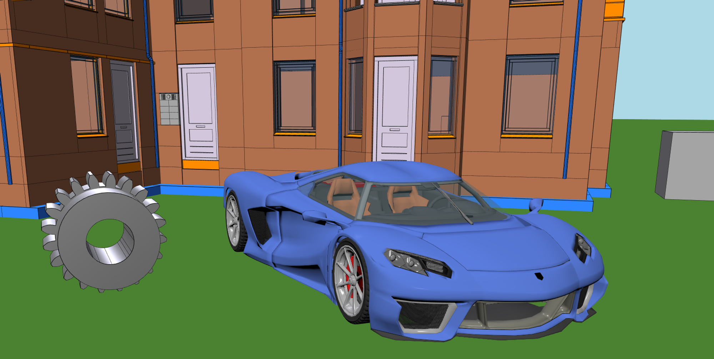

# Viewing Multiple Models

- [Introduction](#introduction)
- [Loading Three Models](#loading-three-models)
- [Finding Models and Objects by ID](#finding-models-and-objects-by-id)
- [Unloading the Models](#unloading-the-models)

# **Introduction**

xeokit-sdk can load multiple models from a variety of file formats into the same 3D scene.

Supported formats (so far) include IFC, glTF, DAE, OBJ, STL and 3DXML. Regardless of where models were loaded from, xeokit exposes their objects via an abstract interface through which we can access them uniformly.

In this tutorial, you'll load several models from different formats into the same scene, then update rendering states on a couple of their objects.

{/* truncate */}

# Loading Three Models

In this guide below, we'll use an [XKTLoaderPlugin](https://xeokit.github.io/xeokit-sdk/docs/class/src/plugins/XKTLoaderPlugin/XKTLoaderPlugin.js~XKTLoaderPlugin.html) to load the Schependomlaan house model, an [OBJLoaderPlugin](https://xeokit.github.io/xeokit-sdk/docs/class/src/plugins/OBJLoaderPlugin/OBJLoaderPlugin.js~OBJLoaderPlugin.html) to load a model of a car, and an [STLLoaderPlugin](https://xeokit.github.io/xeokit-sdk/docs/class/src/plugins/STLLoaderPlugin/STLLoaderPlugin.js~STLLoaderPlugin.html) to load a model of a spur gear. We'll also add a scene graph [Mesh](https://xeokit.github.io/xeokit-sdk/docs/class/src/viewer/scene/mesh/Mesh.js~Mesh.html) to represent the green ground plane, which gets a plane shaped [Geometry](https://xeokit.github.io/xeokit-sdk/docs/class/src/viewer/scene/geometry/Geometry.js~Geometry.html), which we'll create using a [buildPlaneGeometry](https://xeokit.github.io/xeokit-sdk/docs/function/index.html#static-function-buildPlaneGeometry) builder function.

This is a good example of a scene that contains mixed material workflows. The house is shaded using simple-but-fast [Gouroud](https://en.wikipedia.org/wiki/Gouraud_shading) shading, the car is rendered using [Blinn-Phong shading](https://en.wikipedia.org/wiki/Blinn%E2%80%93Phong_reflection_model), and the spur gear is rendered using metallic/roughness [physically-based rendering](https://en.wikipedia.org/wiki/Physically_based_rendering) (PBR). Things look a little flat in this example, because we're only using simple directional lighting, without reflection or light maps.


> [Run this example](https://xeokit.github.io/xeokit-sdk/examples/#loading_MultipleModels)



```js
import {Viewer,Node,OBJLoaderPlugin,XKTLoaderPlugin,STLLoaderPlugin,Mesh,buildPlaneGeometry,ReadableGeometry,PhongMaterial} from "https://cdn.jsdelivr.net/npm/@xeokit/xeokit-sdk/dist/xeokit-sdk.es.min.js";

const viewer = new Viewer({
    canvasId: "myCanvas"
});

const objLoader = new OBJLoaderPlugin(viewer);
const gltfLoader = new GLTFLoaderPlugin(viewer);
const stlLoader = new STLLoaderPlugin(viewer);

// Car loaded from OBJ

const car = objLoader.load({
    id: "myCarModel",
    src: "./models/obj/sportsCar/sportsCar.obj",
    position: [-5, -1, 0],
});

// House loaded from XKT

const house = xktLoader.load({
    id: "myHouseModel",
    src: "./models/xkt/schependomlaan/schependomlaan.xkt",
    rotation: [0, 50, 0],
    edges: true
});

// Spur gear loaded from STL

stlLoader.load({
    id: "myGearModel",
    src: "./models/stl/binary/spurGear.stl",
    position: [-8, -1, 0],
    scale: [0.07, 0.07, 0.07],
    rotation: [0, 180, 0],
    smoothNormals: true,
    edges: true
});

// Ground plane, built using the scene graph

const ground =  new Mesh(viewer.scene, {
    id: "myGroundPlane",
    geometry: new ReadableGeometry(viewer.scene, buildPlaneGeometry({
        xSize: 500,
        zSize: 500
    }),
    material: new PhongMaterial(viewer.scene, {
        diffuse: [0.4, 1.0, 0.4],
        backfaces: true
    }),
    position: [0, -1.0, 0],
    pickable: false,
    collidable: false
});
```

# **Finding Models and Objects by ID**

[XKTLoaderPlugin](https://xeokit.github.io/xeokit-sdk/docs/class/src/plugins/XKTLoaderPlugin/XKTLoaderPlugin.js~XKTLoaderPlugin.html), [OBJLoaderPlugin](https://xeokit.github.io/xeokit-sdk/docs/class/src/plugins/OBJLoaderPlugin/OBJLoaderPlugin.js~OBJLoaderPlugin.html) and [STLLoaderPlugin](https://xeokit.github.io/xeokit-sdk/docs/class/src/plugins/STLLoaderPlugin/STLLoaderPlugin.js~STLLoaderPlugin.html) each created [Entities](https://xeokit.github.io/xeokit-sdk/docs/class/src/viewer/scene/Entity.js~Entity.html) within the Viewer's [Scene](https://xeokit.github.io/xeokit-sdk/docs/class/src/viewer/scene/scene/Scene.js~Scene.html) to represent the models and their objects.

Each model is represented by an Entity registered in `viewer.scene.models`, while each model object is represented by an Entity registered in `viewer.scene.objects`.

We can then find the model and object Entities like this:

```js
const carModel = viewer.scene.models["myCarModel"];
const houseModel = viewer.scene.models["myHouseModel"];
const gearModel = viewer.scene.models["myGearModel"];

const carWheelObject = viewer.scene.objects["3yjlObltnCpO3ehdiY7mcZ"];
const houseWindowObject = viewer.scene.objects["3yjlObltnCpO3ehdiY7mcZ"];
```

Just to get a taste of what we can do with our objects, let's hide the car wheel and highlight the window:

```js
carWheelObject.visible = false;
houseWindowObject.highlighted = true;
```

Let's get the 3D boundary of the window:

```js
const aabb = houseWindowObject.aabb; // [xmin,ymin,zmin,xmax,ymax,zmax]
```

Let's fly the camera to look at the window:

```js
viewer.cameraFlight.flyTo(window);
```

# **Unloading the Models**

To unload the model, just destroy the Entity components that represent them:

```js
carModel.destroy();
houseModel.destroy();
gearModel.destroy();
```
