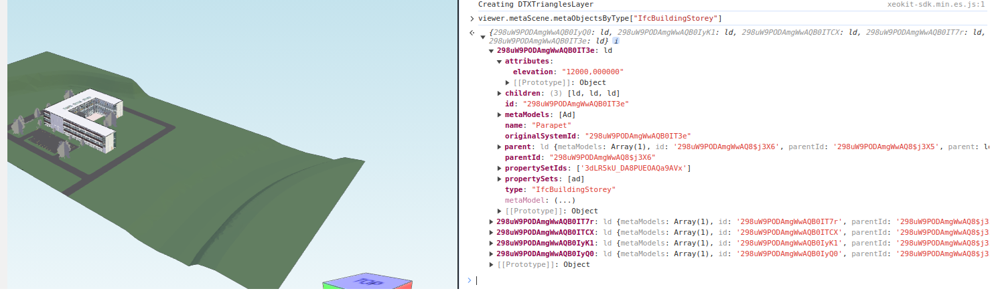

# How to extract ifc building storey ?


> ifcBuildingStorey often contains the information about the floor level heights, i.e. their elevations as meta data. How to extract this data?

<!-- truncate -->

* * *

The following code snippet shows how this can be done:

```js
const ifcBuildingStoreys = viewer.metaScene.metaObjectsByType["IfcBuildingStorey"];
const ifcBuildingStorey = ifcBuildingStoreys["298uW9PODAmgWwAQB0IT3e"];
const elevation = ifcBuildingStorey.attributes.elevation;
```

Also, a snapshot of making this query in the JS console on one of the examples:


