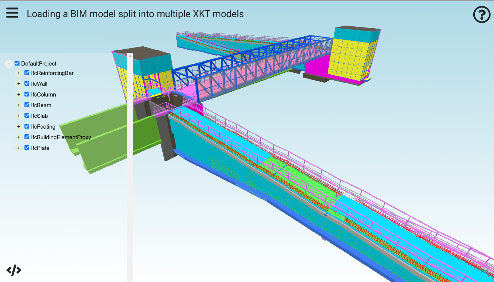
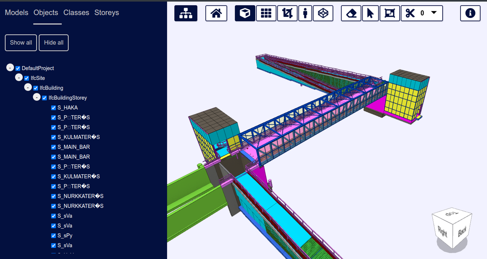

# Automatically Splitting Large Models for Better Performance

To most efficiently view IFC model files in xeokit, we first convert them to XKT files. This conversion allows for fast loading into the browser. We have extended xeokit to automatically split IFC files into multiple XKT files during conversion. This feature enables us to view even bigger models in the browser, like the 2GB Baku Stadium IFC model, shown in the screenshot above.

By splitting models during conversion, we improve xeokit's performance and stability. This is achieved by reducing the memory stress on the converter tools and the xeokit viewer components. These components perform much more reliably and faster when dealing with smaller files (e.g., 20MB) than larger files (e.g., 500MB). Larger files may cause difficulty allocating sufficient system memory for conversion and parsing.

In this tutorial, we’ll show how to use this new feature with our conversion and model viewing components. The IFC file we’ll use for this tutorial is the Karhumaki Bridge model from `http://drumbeat.cs.hut.fi/ifc/`. It’s not exactly a huge model, but good for demonstration purposes. It does contain a lot of rebar objects though (concrete reinforcing), so nevertheless is a fairly complex model, geometrically speaking.

- [How Splitting Helps](#how-splitting-helps)
-   [Splitting prevents NodeJS from crashing](#splitting-prevents-nodejs-from-crashing)
- [Splitting Models with ifc2gltf](#splitting-models-with-ifc2gltf)
- [Converting Split Models with convert2xkt](#converting-split-models-with-convert2xkt)
- [Viewing Split Models with the SDK](#viewing-split-models-with-the-sdk)
- [Viewing Split Models with BIMViewer](#viewing-split-models-with-bimviewer)

# How Splitting Helps

### Splitting prevents NodeJS from crashing

Before we dive into how to use our new model splitting feature, let's briefly examine one of the issues that splitting is designed to avoid. As described in this tutorial, we use our `ifc2gltfcxconverter` tool to convert IFC files into glTF geometry and JSON metadata files. We then use our `convert2xkt` tool to convert those glTF+JSON files into XKT files for fast loading into xeokit.

However, `convert2xkt` runs on NodeJS, which has its own limitations. Sometimes, NodeJS cannot allocate all the necessary memory, and it always has a hard 1GB limit on how much memory it can allocate for text strings in memory. When we try to process large glTF and JSON files, users often encounter the error shown below. We can avoid this error by using the splitting feature described in this tutorial.

```bash
node convert2xkt.js -s myModel.glb -m myModel.json -o myModel.xkt -l

#
# Fatal error in , line 0
# Fatal JavaScript invalid size error 169220804
#
#
#FailureMessage Object: 0x7ffd9e6d5470
1: 0xbe67b1  [node]
2: 0x1e4d6a4 V8_Fatal(char const*, ...) [node]
3: 0xf00158  [node]
4: 0x10af622  [node]
5: 0x10af8e2  [node]
6: 0x12beb8b v8::internal::Runtime_GrowArrayElements(int, unsigned long*, v8::internal::Isolate*) [node]
7: 0x16fb6f9  [node]
Trace/breakpoint trap (core dumped)
```

# Splitting Models with `ifc2gltf`

We use the `ifc2gltfcxconverter` tool to convert IFC files into glTF geometry and JSON metadata files.

We have now extended this tool with the option to split its output into multiple files, accompanied by a JSON manifest that list them.

This new option is activated using the `-s` parameter.

The parameters we use in this tutorial are:

- `-i` specifies the IFC file to convert
- `-o` specifies the name to prefix on each output glTF file
- `-m` specifies the name to prefix on each JSON metadata file
- `-s` specifies the maximum number of megabytes in each XKT file - smaller value means more output files, lower value means less files

```bash
ifc2gltfcxconverter -i Karhumaki-Bridge.ifc -o model.glb -m model.json -s 100
```

The files output by `ifc2gltf` are:

```
.
├── model.glb.manifest.json
├── model_1.glb
├── model_1.json
├── model_2.glb
├── model_2.json
├── model_3.glb
├── model_3.json
├── model_4.glb
├── model_4.json
├── model_5.glb
├── model_5.json
├── model_6.glb
├── model_6.json
├── model_7.glb
├── model_7.json
├── model_8.glb
├── model_8.json
├── model_9.glb
├── model_9.json
├── model.glb
└── model.json
```

The `model.glb.manifest.json` manifest looks like this:

```json
{
    "inputFile": "Karhumaki-Bridge.ifc",
    "converterApplication": "ifc2gltfcxconverter",
    "converterApplicationVersion": "2.8.6",
    "conversionDate": "2023-09-08 03:01:39",
    "gltfOutFiles": [
        "model.glb",
        "model_1.glb",
        "model_2.glb",
        "model_3.glb",
        "model_4.glb",
        "model_5.glb",
        "model_6.glb",
        "model_7.glb",
        "model_8.glb",
        "model_9.glb"
    ],
    "metadataOutFiles": [
        "model.json",
        "model_1.json",
        "model_2.json",
        "model_3.json",
        "model_4.json",
        "model_5.json",
        "model_6.json",
        "model_7.json",
        "model_8.json",
        "model_9.json"
    ]
}
```

# Converting Split Models with `convert2xkt`

We use the `convert2xkt` tool to convert glTF+JSON files into XKT files for fast loading into xeokit.

To integrate with the new `ifc2gltfcxconverter` splitting option, the `convert2xkt` tool can now batch-convert multiple glTF+JSON files into a set of XKT files, in one invocation.

When this option is used, `convert2xkt` outputs several XKT files, along with a JSON manifest file that lists them.

The parameters we use are:

- `-a` specifies the the path to the input manifest, `model.glb.manifest.json`
- `-o` specifies the path to the output manifest, `model.xkt.manifest.json`

```bash
node convert2xkt -a model.glb.manifest.json -o model.xkt.manifest.json
```

The files output by `convert2xkt` are:

```
.
├── model.xkt.manifest.json
├── model_1.xkt
├── model_2.xkt
├── model_3.xkt
├── model_4.xkt
├── model_5.xkt
├── model_6.xkt
├── model_7.xkt
├── model_8.xkt
├── model_9.xkt
└── model.xkt
```

The `model.xkt.manifest.json` manifest looks like this:

```json
{
  "xktFiles": [
    "model.xkt",
    "model_1.xkt",
    "model_2.xkt",
    "model_3.xkt",
    "model_4.xkt",
    "model_5.xkt",
    "model_6.xkt",
    "model_7.xkt",
    "model_8.xkt",
    "model_9.xkt"
  ]
}
```

# Viewing Split Models with the SDK

To integrate with the new `ifc2gltfcxconverter` splitting and `convert2xkt` batching-conversion options just mentioned, the `XKTLoaderPlugin` also now has the option to batch-load all XKT files listed in a manifest into a xeokit `Viewer` in one shot, combining them into a single `SceneModel` and a single `MetaModel`.

To load the set of XKT files we just created, simply provide the `model.xkt.manifest.json` to the `XKTLoaderPlugin.load` method, as shown below:

```js
import { Viewer, XKTLoaderPlugin } from "https://cdn.jsdelivr.net/npm/@xeokit/xeokit-sdk/dist/xeokit-sdk.es.min.js";

const viewer = new Viewer({
  canvasId: "myCanvas"
});

viewer.scene.camera.eye = [26.54, 29.29, 36.20,];
viewer.scene.camera.look = [-23.51, -8.26, -21.65,];
viewer.scene.camera.up = [-0.2, 0.89, -0.33,];

const xktLoader = new XKTLoaderPlugin(viewer);

const sceneModel = xktLoader.load({
  manifestSrc: "model.xkt.manifest.json",
  id: "myModel",
});

const metaModel = viewer.metaScene.metaModels[sceneModel.id];

// Then when we need to, we can destroy the SceneModel
// and MetaModel in one shot, like so:

sceneModel.destroy();
metaModel.destroy();
```

Shown below is the result. Notice how [TreeViewPlugin](https://xeokit.github.io/xeokit-sdk/docs/class/src/plugins/TreeViewPlugin/TreeViewPlugin.js~TreeViewPlugin.html) has created a single tree in the left panel, for a single `MetaModel`. The geometry in the canvas is represented by a single `SceneModel`.


> [Run this example](https://xeokit.github.io/xeokit-sdk/examples/buildings/#xkt_manifest_KarhumakiBridge)



# Viewing Split Models with BIMViewer

`BIMViewer` is a browser-based BIM model viewing application bundled withe the xeokit SDK.

We’ve extended this application to load split models created with `ifc2gltfcxconverter` and `convert2xkt` as described above.

When loading a split model, `BIMViewer` will load all the XKT in one shot, combining them into a single tree view, and treat them as a single model, which you can also unload in one operation.

We’ll skip ahead a little bit and show our Karhumaki split model in `BIMViewer`:


> [Load the Karhumaki Project in BIMViewer](https://xeokit.io/demo.html?projectId=Karhumaki)



Shown below is the data directory structure for our Karhumaki demo project in `BIMViewer`.

The `Kathumaki` directory contains our project. The `models` subdirectory contains all the models within our project (just one, named `Karhumaki-Bridge`).

Notice the `model.xkt.manifest.json` and XKT files within our single model directory, which are the ones we just created with `convert2xkt` before.

```
.app/data/projects
  │
  └── Karhumaki
        │
        ├── index.json
        │
        └── models
              └──  Karhumaki-Bridge
                      ├── model.xkt.manifest.json
                      ├── model.xkt
                      ├── model_1.xkt
                      ├── model_2.xkt
                      ├── model_3.xkt
                      ├── model_4.xkt
                      ├── model_5.xkt
                      ├── model_6.xkt
                      ├── model_7.xkt
                      ├── model_8.xkt
                      └── model_9.xkt
```

Above our `models` directory, the `index.json` file tells `BIMViewer` what models are in the project (just the single `Karhumaki-Bridge` model). Within this file, as usual, the `id` of each model matches the name of that model's subdirectory in `models`. Each model's `name` is the human-readable name that's displayed in the `BIMViewer` ”Models” tab.

To indicate that the model is a multi-part model, with multiple XKTs, the model entry gets a `manifest` property containing the file name of our `model.xkt.manifest.json` file.

In `viewerContent`, we specify that our multipart model gets loaded immediately, as soon as the project is loaded.

```json
{
  "id": "Karhumaki",
  "name": "Karhumaki",
  "models": [
    {
      "id": "Karhumaki-Bridge",
      "name": "Karhumaki Bridge",
      "manifest": "model.xkt.manifest.json"
    }
  ],
  "viewerConfigs": {
    "backgroundColor": [
      0.9,
      0.9,
      1.0
    ]
  },
  "viewerContent": {
    "modelsLoaded": [
      "Karhumaki-Bridge"
    ]
  },
  "viewerState": {
    "tabOpen": "models"
  }
}
```

See the full documentation of [https://github.com/xeokit/xeokit-bim-viewer](https://github.com/xeokit/xeokit-bim-viewer) for more information on deploying a model to `BIMViewer`.
