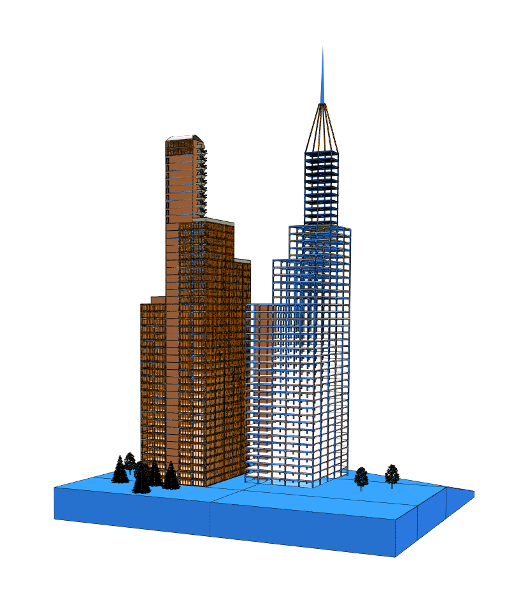
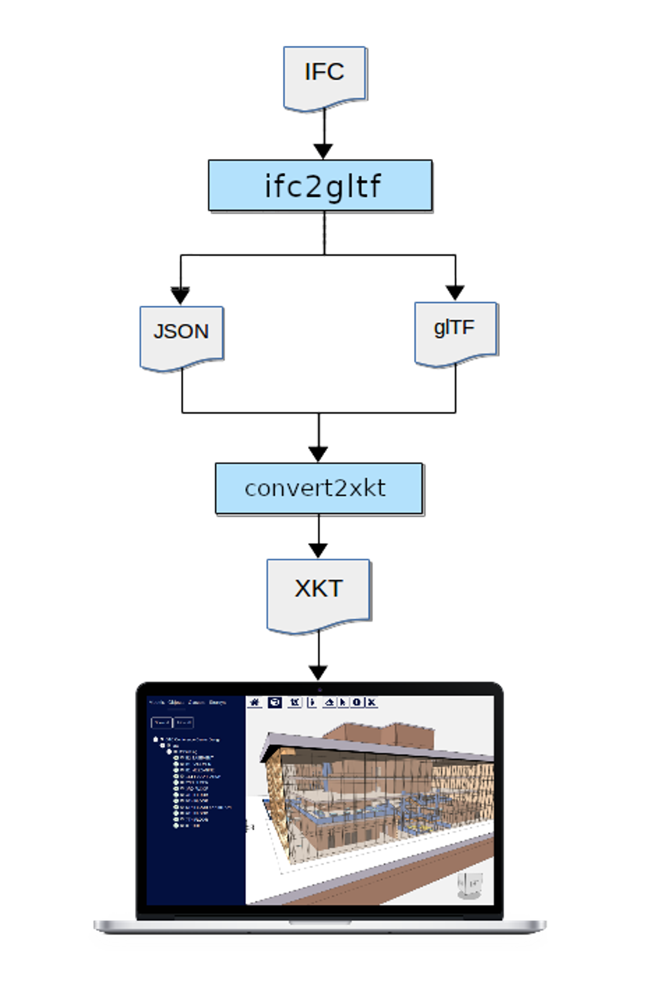

# Converting IFC to XKT using ifc2gltfcxconverter


> See also:
> [Converting Models to XKT with convert2xkt](/blog/converting-models-to-xkt-with-convert2xkt)
> [Automatically Splitting Large Models for Better Performance](/blog/2024/05/31/automatically-splitting-large-models-for-better-performance)

The xeokit SDK enables us to load large, full-precision BIM models over the Web in seconds and view them in the browser. To do this, we pre-convert our IFC files into xeokit's native *XKT* format. The XKT format compresses model geometry and metadata into a compact payload that a xeokit viewer can load quickly while using minimal browser resources.

In this tutorial, we'll use a combination of the closed-source `ifc2gltfcxconverter` tool from [Creoox AG](https://creoox.com/en/contact/) and the open source `convert2xkt` tool from xeolabs to convert an IFC 4 model into an XKT file, which we'll then load into a xeokit Viewer. This combination is the most efficient IFC → XKT conversion option we have so far, industrial-strength stuff.

- [Introduction](#introduction)
-   [What's IFC?](#whats-ifc)
-   [What's XKT?](#whats-xkt)
- [1\. Install File Conversion Tools](#1-install-file-conversion-tools)
-   [ifc2gltf](#ifc2gltf)
-   [convert2xkt](#convert2xkt)
- [2\. Convert IFC to GLB and Metadata JSON](#2-convert-ifc-to-glb-and-metadata-json)
- [3\. Convert GLB and Metadata JSON to XKT](#3-convert-glb-and-metadata-json-to-xkt)
- [4\. View the Model](#4-view-the-model)

# Introduction

## What's IFC?

The Industry Foundation Classes (IFC) data model is used to describe architectural, building and construction industry data.

IFC defines an entity-relationship model consisting of various entities organized into a object-based inheritance model, with classes representing various building elements such as `IfcWall`, geometry such as `IfcExtrudedAreaSolid`, and basic constructs such as `IfcCartesianPoint`.

The data model is developed by [buildingSMART](https://www.buildingsmart.org/) to facilitate interoperability in the AEC industry, and is a commonly used open collaboration format in BIM based projects.

An IFC file is usually provided as an IFC-SPF file ("STEP-file") , which is a text format in which each line represents an entity that instantiates a class within the data model.

## What's XKT?

XKT is xeokit's native 3D model format, which compresses IFC models (and other formats) into a compact binary payload from which we can load large numbers of objects over the Web in seconds, at full geometric precision.

An XKT file also contains metadata on its objects, which enables a xeokit viewer to navigate them according to their types. That's useful for building things like object tree view UIs, automatic building storey plan views, and so on.

For each object/element, the metadata stores:

- Name,
- Element ID,
- Element IFC type
- Parent element ID
- Element-specific attributes (eg. `IfcBuildingStorey` `elevation`)

The metadata also stores IFC property sets, some of which may be associated with objects/elements.

In this tutorial, we'll use a combination of proprietary and open source CLI tools to convert an IFC 4 model into an XKT file, which we'll then load into a xeokit Viewer.

For our IFC file, we'll use the Holter Tower example from the [Open IFC Repository](http://openifcmodel.cs.auckland.ac.nz/Model/Details/316). When that's converted and loaded, it will look like the example below.


> [Run this example](https://xeokit.github.io/xeokit-sdk/examples/#BIMOffline_XKT_HolterTower)



# 1\. Install File Conversion Tools

Let's get started. We'll use the following proprietary and open source CLI tools to transform the IFC file into an XKT geometry file and a JSON metadata file:

- `ifc2gltfcxconverter` to convert IFC into a glTF geometry file and a JSON metadata file, and
- `convert2xkt` (from package [xeokit/xeokit-convert](https://xeokit.github.io/xeokit-convert/docs/)) to convert the glTF and JSON files into an XKT file.

### ifc2gltf

The `ifc2gltfcxconverter` tool converts IFC 2x3 and 4 directly into a glTF file and a JSON file. `ifc2gltf` is a closed-source product from [Creoox AG](https://creoox.com/en/contact/), who provide executables for Windows and Linux. This tool performs the same steps as the IfcConvert and COLLADA2GLTF tools used in the [Converting IFC Models to XKT using Open Source Tools](https://www.notion.so/c373e48bc4094ff5b6e5c5700ff580ee?pvs=21) pipeline, but with the following advantages:

- Implemented purely in C++
- Handles larger IFC files
- Better speed and memory efficiency
- No intermediate file formats within the IFC→glTF conversion step (ie. DAE)
- Better geometry reuse

### convert2xkt

The `convert2xkt` tool is a NodeJS-based CLI tool from [xeolabs](https://xeolabs.com) which is open source and bundled with the xeokit SDK. This tool converts a bunch of different source file formats into XKT. In this tutorial, we’ll use it to convert the glTF and JSON files output by `ifc2gltfcxconverter` into an XKT file.

Make sure to get the latest versions of these two tools, along with the latest version of the xeokit-sdk. We'll assume that the tools are installed relative to the current working directory.

The diagram below shows how the tools fit together to form our IFC →XKT data pipeline for this tutorial.




> Please not that the recommended format to use is the **binary** glTF → GLB

# 2\. Convert IFC to GLB and Metadata JSON

Convert the IFC file into a binary glTF file and a JSON file, as shown below. Recall that the glTF will contain the model geometry, while the JSON will contain the IFC metadata.

```bash
./ifc2gltfcxconverter HolterTower.ifc HolterTower.glb HolterTower.json

-------------------IFC to GLTF converter---------------------
converting file rac_sample.ifc.numVerticesPerCircle: 14
..num coord accessors: 35523, reused: 73001
num normal accessors: 33841, reused: 74683
num indices accessors: 162, reused: 108362
 done in 55 seconds
```

# 3\. Convert GLB and Metadata JSON to XKT

Now convert the binary glTF and JSON-encoded IFC metadata into an `XKT` file:

```bash
node convert2xkt.js -s HolterTower.glb -m HolterTower.json -o HolterTower.xkt

[convert2xkt] Reading input file: HolterTower.gltf
[convert2xkt] Input file size: 144851.61 kB
[convert2xkt] Reading input metadata file: HolterTower.json
[convert2xkt] Converting...
[convert2xkt] Converted to: XKT v9
[convert2xkt] XKT size: 8659.50 kB
[convert2xkt] Compression ratio: 16.73
[convert2xkt] Conversion time: 7.92 s
[convert2xkt] Converted metaobjects: 0
[convert2xkt] Converted property sets: 0
[convert2xkt] Converted drawable objects: 108524
[convert2xkt] Converted geometries: 35578
[convert2xkt] Converted triangles: 435470
[convert2xkt] Converted vertices: 755412
[convert2xkt] Writing XKT file: HolterTower.xkt
```


> If NodeJS throws an out-of-memory exception, try setting a larger heap size, eg. node --max-old-space-size=25192 convert2xkt.js -s HolterTower.ifc -o HolterTower.ifc.xkt -l

Now we have our model in a compact format that can be loaded efficiently into xeokit.

# 4\. View the Model

Finally, let's view our model on the Web. We have two options:

1. Deploy the model in a fork of [xeokit-bim-viewer](https://xeokit.github.io/xeokit-bim-viewer/), xeokit's bundled IFC viewer.
2. Code an HTML page containing a custom viewer, built using xeokit components.

We'll go with option (2) for this guide. The JavaScript snippets below show how it's done. We'll omit the HTML, since all we need for this example is the WebGL canvas element.

First, we'll import the JavaScript classes we'll need from the xeokit-sdk library:

```js
import {Viewer, XKTLoaderPlugin} from "https://cdn.jsdelivr.net/npm/@xeokit/xeokit-sdk/dist/xeokit-sdk.es.min.js";
```

Then we'll instantiate our [Viewer](https://xeokit.github.io/xeokit-sdk/docs/class/src/viewer/Viewer.js~Viewer.html), configuring it with ID of our WebGL canvas.

```js
const viewer = new Viewer({
     canvasId: "myCanvas"
});
```

Next, we'll add the [XKTLoaderPlugin](https://xeokit.github.io/xeokit-sdk/docs/class/src/plugins/XKTLoaderPlugin/XKTLoaderPlugin.js~XKTLoaderPlugin.html) to our Viewer.

```js
const xktLoader = new XKTLoaderPlugin(viewer);
```

Now, using the `XKTLoaderPlugin`, we'll load our XKT file.


> Tip: Note that when we load our XKT file, we can sometimes get a speedup by specifying `reuseGeometries: false`. This is a performance hack to get smoother interaction viewing XKT models that were converted using `ifc2gltf`. Usage of this hack is recommended, because `ifc2gltf` is good at reusing geometry, and WebGL performance unfortunately degrades with too much reused geometry. The penalty for this hack is a slightly longer loading time, since it causes `XKTLoaderPlugin` to internally transform and "bake" the vertex coordinates of each reused geometry instance while loading the XKT file.

```js
const modelNode = xktLoader.load({
     id: "myModel",
     src: "HolterTower.xkt",

     reuseGeometries: false // See above
     edges: true // Emphasise edges
});
```

When the model has loaded, we'll then position the Viewer's camera to look at it, and we're done.

```js
modelNode.on("loaded", () => {

     const scene = viewer.scene;
     const camera = scene.camera;

     camera.eye = [-2.37, 18.97, -26.12];
     camera.look = [10.97, 5.82, -11.22];
     camera.up = [0.36, 0.83, 0.40];
});
```


> [Run this example](https://xeokit.github.io/xeokit-sdk/examples/#BIMOffline_XKT_HolterTower)
