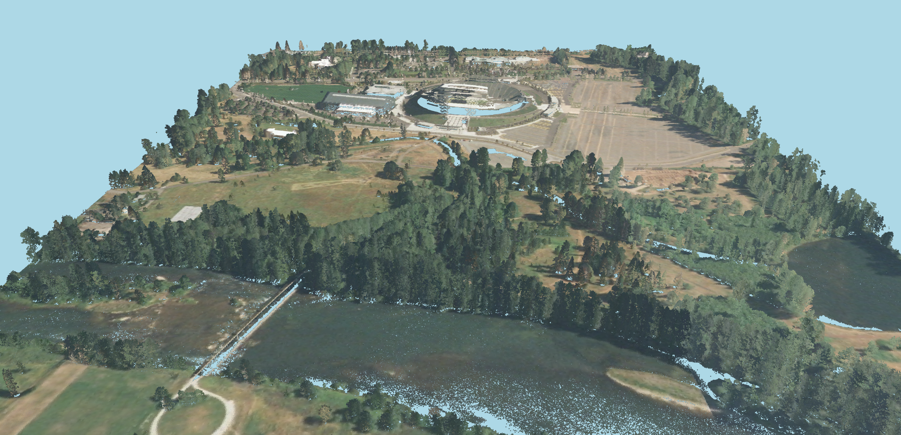

# Viewing a LAS Point Cloud with XKTLoaderPlugin

- [Introduction](#introduction)
- [1\. Install convert2xkt](#1-install-convert2xkt)
- [2\. Convert LAS to XKT](#2-convert-las-to-xkt)
- [3\. View the XKT](#3-view-the-xkt)

# Introduction

In this mini-tutorial, we'll use xeokit's `convert2xkt` CLI tool to convert a point cloud model from LAS format into xeokit's compact XKT native model format, which we'll then view in the browser using a xeokit Viewer.

LAS is an open format for the interchange and archiving of lidar point cloud data.

The XKT format compresses models into a compact payload from which xeokit can load large numbers of objects over the Web in seconds, at full geometric precision.

For our point cloud file, we'll use an LAS point cloud capture of the Autzen Stadium in Oregon, provided by [http://loaders.gl](http://loaders.gl) . When that's converted and loaded, it will look like the example below. This model contains 31 million points, and xeokit can usually load it over a good Internet connection in around ~15 seconds.


> [Run this example](https://xeokit.github.io/xeokit-sdk/examples/#loading_LAZ_Autzen)



# 1\. Install convert2xkt

Using git and npm, clone and install our `xeokit-convert` repository, which contains the `convert2xkt` tool that we'll use to convert our LAS into XKT.

Be sure to use the latest versions of both `xeokit-convert` and `xeokit-sdk`.

```bash
git clone https://github.com/xeokit/xeokit-convert.git
cd xeokit-convert
npm install
```

# 2\. Convert LAS to XKT

Now convert the LAS into an `XKT` file:

```bash
node ./convert2xkt.js -s autzen.laz -o autzen.xkt
```

# 3\. View the XKT

Let's view our model in the browser using xeokit. We'll create a [Viewer](https://xeokit.github.io/xeokit-sdk/docs/class/src/viewer/Viewer.js~Viewer.html) attached to an HTML canvas, install an [XKTLoaderPlugin](https://xeokit.github.io/xeokit-sdk/docs/class/src/plugins/XKTLoaderPlugin/XKTLoaderPlugin.js~XKTLoaderPlugin.html), and use that to load our XKT model. Find the full example [here](https://xeokit.github.io/xeokit-sdk/examples/#loading_LAZ_Autzen).

```js
import {Viewer,XKTLoaderPlugin} from "https://cdn.jsdelivr.net/npm/@xeokit/xeokit-sdk/dist/xeokit-sdk.es.min.js";

const viewer = new Viewer({
     canvasId: "myCanvas"
});

viewer.scene.camera.eye = [635796.06, 855416.18, -3167.35];
viewer.scene.camera.look = [637290.78, 851209.90, 510.70];
viewer.scene.camera.up = [0.27, 0.68, 0.67];
viewer.scene.camera.project.far = 100000; // Make sure we don't clip the model

const xktLoader = new XKTLoaderPlugin(viewer);

const modelNode = xktLoader.load({
     id: "myModel",
     src: "autzen.xkt"
});
```


> [Run this example](https://xeokit.github.io/xeokit-sdk/examples/#loading_LAZ_Autzen)
