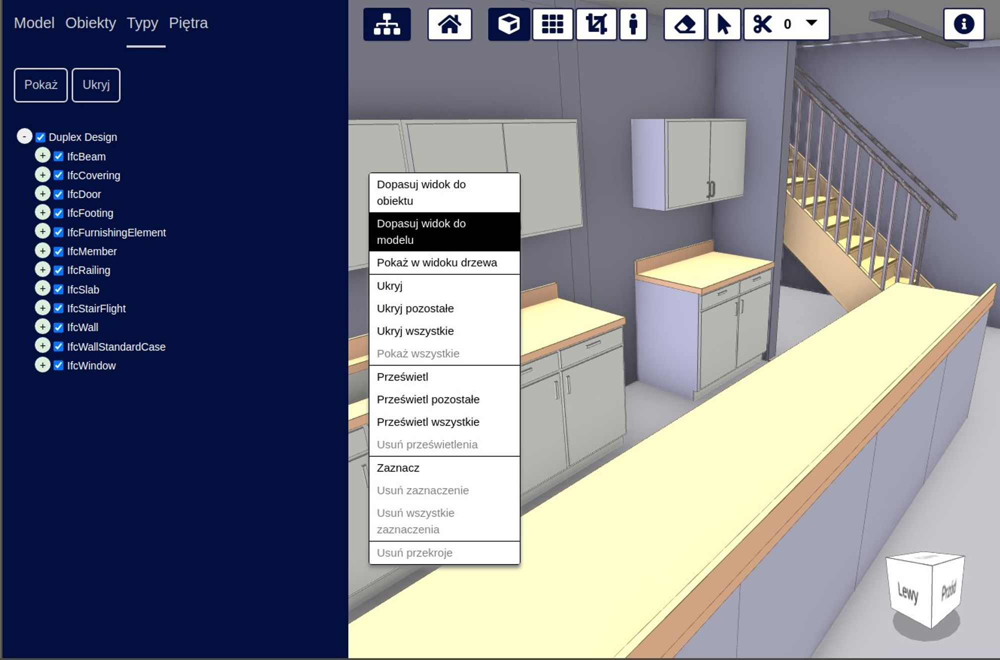

# Localization in xeokit

In this guide, we'll introduce how to localize xeokit, so that we can dynamically it between different languages. Specifically, we'll show how to localize xeokit's core Viewer component and plugins, and how to localize xeokit's bundled BIM viewer application.

<!-- truncate -->

- [Localizing a Viewer](#localizing-a-viewer)
- [Localizing a BIMViewer](#localizing-a-bimviewer)

# Localizing a Viewer

In this example, we'll use JavaScript to create a simple localized Viewer component that's configured with translation files for English, Māori, French and Japanese. We'll add a [NavCube](https://xeokit.github.io/xeokit-sdk/docs/class/src/plugins/NavCubePlugin/NavCubePlugin.js~NavCubePlugin.html) to the Viewer, which will show localized text on its faces (see below). After loading a BIM model, we'll dynamically switch the Viewer between our locales, to see the NavCube labels switch between languages.

<iframe width="100%" height="400" src="https://xeokit.github.io/xeokit-sdk/examples/viewer/localization_NavCubePlugin.html"></iframe>
> [Run this example](https://xeokit.github.io/xeokit-sdk/examples/#localization_NavCubePlugin)

First, import the JavaScript classes we'll need:

```js
import {Viewer,LocaleService,XKTLoaderPlugin,NavCubePlugin} from "https://cdn.jsdelivr.net/npm/@xeokit/xeokit-sdk/dist/xeokit-sdk.es.min.js";
```

Create a [LocaleService](https://xeokit.github.io/xeokit-sdk/docs/class/src/viewer/localization/LocaleService.js~LocaleService.html), configured with the translations needed by our [NavCubePlugin](https://xeokit.github.io/xeokit-sdk/docs/class/src/plugins/NavCubePlugin/NavCubePlugin.js~NavCubePlugin.html):

```js
new LocaleService({
    messages: {
        "en": { // English
            "NavCube": {
                "front": "Front",
                "back": "Back",
                "top": "Top",
                "bottom": "Bottom",
                "left": "Left",
                "right": "Right"
            }
        },
        "mi": { // Māori
            "NavCube": {
                "front": "Mua",
                "back": "Tuarā",
                "top": "Runga",
                "bottom": "Raro",
                "left": "Mauī",
                "right": "Tika"
            }
        },
        "fr": { // Francais
            "NavCube": {
                "front": "Avant",
                "back": "Arrière",
                "top": "Supérieur",
                "bottom": "Inférieur",
                "left": "Gauche",
                "right": "Droit"
            }
        },
        "jp": { // Japanese
            "NavCube": {
                "front": "前部",
                "back": "裏",
                "top": "上",
                "bottom": "底",
                "left": "左",
                "right": "右"
            }
        }
    },
    locale: "en" // Initial locale
})
```

Create a Viewer, configured with our LocaleService:

```js
const viewer = new Viewer({
    canvasId: "myCanvas",
    localeService: localeService
});
```

Add an [XKTLoaderPlugin](https://xeokit.github.io/xeokit-sdk/docs/class/src/plugins/XKTLoaderPlugin/XKTLoaderPlugin.js~XKTLoaderPlugin.html) and load an IFC model into our Viewer:

```js
const xktLoader = new XKTLoaderPlugin(viewer);

const model = xktLoader.load({
    id: "myModel",
    src: "../assets/models/xkt/v8/ifc/Duplex.ifc.xkt",
    edges: true
});
```

Arrange the Viewer's camera to look at the model:

```js
viewer.camera.eye = [-3.933, 2.855, 27.018];
viewer.camera.look = [4.400, 3.724, 8.899];
viewer.camera.up = [-0.018, 0.999, 0.039];
```

Add a NavCube to the Viewer:

```js
new NavCubePlugin(viewer, {
    canvasId: "myNavCubeCanvas"
});
```

With our Viewer all set up, NavCube added and model loaded, we can now dynamically switch our Viewer between locales:

```js
viewer.localeService.setLocale("en");
viewer.localeService.setLocale("fr");
```

In our simple Viewer, the only component that shows any text is the NavCube. As we switch between locales, we'll see the text on our NavCube switching between the translations for each locale.

Note that, if we were to add any other components to our Viewer that support localization, we'd need to ensure that our translation files contain any translation strings that are required by those components.

# Localizing a BIMViewer

In this section, we'll briefly show how to set up a BIMViewer with localization translations. BIMViewer is xeokit's bundled BIM viewer application, which is provided in [xeokit-bim-viewer](https://github.com/xeokit/xeokit-bim-viewer). It's a complete BIM viewer built on xeokit, which serves as both a quick start MVP to get your models on the Web, and as demonstration of some of xeokit's features.

For a more detailed look at localizing a xeokit BIMViewer, please see the complete [BIMViewer documentation](https://xeokit.github.io/xeokit-bim-viewer/).




> [Run this example](https://xeokit.io/demo.html?projectId=OTCConferenceCenter&tab=storeys&locale=pl)

To localize a BIMViewer, we'll configure it with a [LocaleService](https://xeokit.github.io/xeokit-sdk/docs/class/src/viewer/localization/LocaleService.js~LocaleService.html), which we'll configure with our translations, as before.

Once we've created our BIMViewer, we'll listen for an "updated" event on our LocaleService. Whenever we get that event, we'll iterate over all DOM elements tagged with class "xeokit-i18n" and replace their text content with translations that we'll pull from our LocaleService.

Each of those elements has a data attribute named `data-xeokit-i18n` which specifies the ID of its translation.

The BIMViewer has created those DOM elements internally, and has tagged them with that class and data attribute so that we can iterate over them for this purpose.

```js
import {Server, BIMViewer, LocaleService} from "../dist/xeokit-bim-viewer.es.js";
import {messages as localeMessages} from "./locales/messages.js";

window.onload = function () {

    // Server client will load data from the file systems
    const server = new Server({
        dataDir: "./data"
    });

    // LocaleService provides translations for the current locale
    const localeService = new LocaleService({
        messages: localeMessages,
        locale: "en"
    })

    // Create a BIMViewer, giving it our server client and LocaleService
    const bimViewer = new BIMViewer(server, {
        localeService: localeService,
        //.. other arguments, omitted for brevity
    });

    // We can update the BIMViewer's locale dynamically
    bimViewer.localeService.locale = "jp";

    // Whenever the locale is updated, refresh the BIMViewer's HTML
    // from the translations configured for that locale
    bimViewer.localeService.on("updated", () => {

        const localizedElements = document.querySelectorAll('.xeokit-i18n');

        localizedElements.forEach((localizedElement) => {

            // Update text label
            if (localizedElement.dataset.xeokitI18n) {
                localizedElement.innerText =
                    bimViewer.localeService.translate(
                        localizedElement.dataset.xeokitI18n);
            }

            // Create text for tooltip
            if (localizedElement.dataset.xeokitI18ntip) {
                localizedElement.dataset.tippyContent =
                    bimViewer.localeService.translate(
                        localizedElement.dataset.xeokitI18ntip);
            }

            // Create tooltip from text, or update existing tooltip
            if (localizedElement.dataset.tippyContent) {
                if (localizedElement._tippy) {
                    localizedElement._tippy.setContent(
                        localizedElement.dataset.tippyContent);
                } else {
                    tippy(localizedElement, {
                        appendTo: "parent",
                        zIndex: 1000000,
                        allowHTML: true
                    });
                }
            }
        });
    });

    //.... more BIMViewer setup, omitted for brevity
};
```

See the [BIMViewer documentation](https://xeokit.github.io/xeokit-bim-viewer/) for more detailed information on localizing a BIMViewer.
