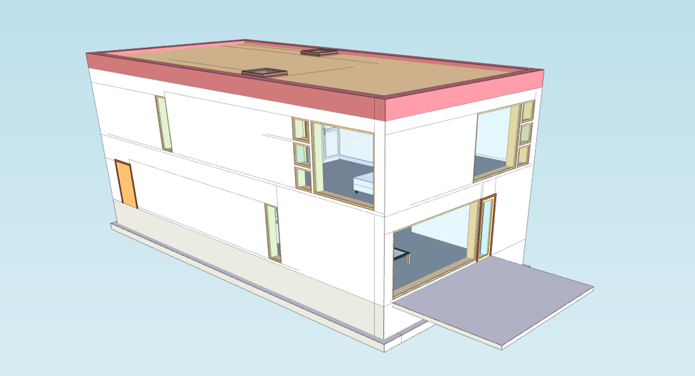

# Positioning an IFC Model at Mercator-Projected Geodesic Coordinates

In this tutorial, you'll learn how to load an IFC model into a xeokit Viewer, and position it within the Viewer's double-precision 3D Cartesian World coordinate system using mercator-projected geodesic coordinates (*longitude, latitude and height*).

- [Introduction](#introduction)
- [1\. Create the xeokit Viewer](#1-create-the-xeokit-viewer)
- [2\. Create the mercator projection function](#2-create-the-mercator-projection-function)
- [3\. Load a model at mercator-projected geodesic coordinates](#3-load-a-model-at-mercator-projected-geodesic-coordinates)

# Introduction

The xeokit [Viewer](http://localhost:8081/docs/class/src/viewer/Viewer.js~Viewer.html) has a double-precision 3D Cartesian coordinate system, which we call xeokit's *World* coordinate system.

Since it's double-precision, we can view models that have huge vertex coordinates, and position them far from the origin, without loss of visual accuracy (see [Viewing Double-Precision Models](https://www.notion.so/Viewing-Double-Precision-Models-3f9e155fd1394d1f974474484decf31b?pvs=21)).

In practice, we can actually treat the Viewer's coordinate system as anything that fits into 3D double-precision Cartesian coordinates. This includes \[WGS84\]([https://en.wikipedia.org/wiki/World\_Geodetic\_System#:~:text=The coordinate origin of WGS,latitude of the Royal Observatory.)](https://en.wikipedia.org/wiki/World_Geodetic_System#:~:text=The%20coordinate%20origin%20of%20WGS,latitude%20of%20the%20Royal%20Observatory.)) , and the [Web Mercator](https://en.wikipedia.org/wiki/Web_Mercator_projection) projected coordinate system, which is used by Google Maps, [Mapbox](https://en.wikipedia.org/wiki/Mapbox), [Bing Maps](https://en.wikipedia.org/wiki/Bing_Maps),  [OpenStreetMap](https://en.wikipedia.org/wiki/OpenStreetMap),  [Mapquest](https://en.wikipedia.org/wiki/Mapquest), [Esri](https://en.wikipedia.org/wiki/Esri), and many others

In this tutorial, we'll configure the Viewer's coordinate system to work as a variation of the [W](https://en.wikipedia.org/wiki/Web_Mercator_projection)eb Mercator coordinate system. Then, when we load our model, we'll position it using mercator coordinates, which we'll project from our geodesic coordinates.

To load our model, we'll use a [WebIFCLoaderPlugin](https://xeokit.github.io/xeokit-sdk/docs/class/src/plugins/WebIFCLoaderPlugin/WebIFCLoaderPlugin.js~WebIFCLoaderPlugin.html), which uses [web-ifc](https://github.com/tomvandig/web-ifc) internally to load an IFC file directly into our xeokit Viewer. Note that this tutorial also works with all the other xeokit loader plugins, including [XKTLoaderPlugin](https://xeokit.github.io/xeokit-sdk/docs/class/src/plugins/XKTLoaderPlugin/XKTLoaderPlugin.js~XKTLoaderPlugin.html).

Our example is really not that much to look at, since there are no terrain features to show where we've actually positioned our model. Nevertheless, click the link below for a live demo. Perhaps we could add a ground plane with an image or coordinate markings at some point in the future.


> [Run this example](https://xeokit.github.io/xeokit-sdk/examples/#positioningModels_WebIFCLoaderPlugin_geodesicCoordinates)



# 1\. Create the xeokit Viewer

To start with, we'll create a xeokit [Viewer](https://xeokit.github.io/xeokit-sdk/docs/class/src/viewer/Viewer.js~Viewer.html).

We'll push the Viewer's far clipping plane a long way back, and enable the Viewer's logarithmic depth buffer, to improve rendering accuracy for distant objects - a good idea in case we want to load more models and look at them from a distance.

We'll also configure the Viewer's World coordinate axis for the mercator system, making +Z the direction of the "up" axis. Consequently, we'll need to rotate our IFC model 90° about the X-axis when we load it in Step 4, since the model was authored with +Y as "up".

```js
import {Viewer, WebIFCLoaderPlugin, math} from "https://cdn.jsdelivr.net/npm/@xeokit/xeokit-sdk/dist/xeokit-sdk.es.min.js";
import * as WebIFC from "https://cdn.jsdelivr.net/npm/web-ifc@0.0.51/web-ifc-api.js";

const viewer = new Viewer({
    canvasId: "myCanvas",
    transparent: true,
    logarithmicDepthBufferEnabled: true
});

// Set up viewer coordinate axis for mercator
// coordinate system, where +Z is "up"
viewer.camera.worldAxis = [
    1, 0, 0, // Right +X
    0, 0, 1, // Up +Z
    0, -1, 0  // Forward -Y
];

// Point camera along -Y axis
viewer.scene.camera.eye = [0, 1, 0];
viewer.scene.camera.look = [0, 0, 0];
viewer.scene.camera.up = [0, 0, 1];

// Make sure we don't clip our model
viewer.camera.project.far = 10000000;
```

# 2\. Create the mercator projection function

Now we'll define a function to projecting our geodesic coordinates to mercator.

Our mercator projection is the same as [EPSG:3857](https://epsg.io/3857), except that the origin of our coordinate space is at the north-west corner instead of the middle. For example, \[0,0,0\] is the north-west corner of our mercator world and \[1,1,0\] is the south-east corner. The Z dimension of our mercator world is conformal.

```js
function longLatToMercator(longitude, latitude, altitude = 0) {

    const EARTH_RADIUS = 6371008.8; // Meters
    const EARTH_CIRCUMFERENCE = 2 * Math.PI * EARTH_RADIUS; // Meters

    function mercatorXfromLng(longitude) {
        return (180 + longitude) / 360;
    }

    function mercatorYfromLat(latitude) {
        return (180 - (180 / Math.PI * Math.log(Math.tan(Math.PI / 4
                + latitude * Math.PI / 360)))) / 360;
    }

    function mercatorZfromAltitude(altitude, latitude) {
        return altitude / circumferenceAtLatitude(latitude);
    }

    function circumferenceAtLatitude(latitude) {
        return EARTH_CIRCUMFERENCE * Math.cos(latitude * Math.PI / 180);
    }

    function mercatorScaleAtLatitude(latitude) {
        return 1 / Math.cos(latitude * Math.PI / 180);
    }

    function latFromMercatorY(y) {
        const y2 = 180 - y * 360;
        return 360 / Math.PI * Math.atan(Math.exp(y2 * Math.PI / 180)) - 90;
    }

    // Returns the distance of 1 meter in Mercator coordinate units at the given latitude.
    function meterInMercatorCoordinateUnits(y) {
        return 1 / EARTH_CIRCUMFERENCE * mercatorScaleAtLatitude(latFromMercatorY(y));
    }

    const mercator = [
        mercatorXfromLng(longitude),
        mercatorYfromLat(latitude),
        mercatorZfromAltitude(altitude, latitude)
    ];

    const modelMercatorScale = meterInMercatorCoordinateUnits(mercator[1]);

    math.mulVec3Scalar(mercator, 1 / modelMercatorScale);

    return mercator;
}
```

# 3\. Load a model at mercator-projected geodesic coordinates

Finally, and add an [WebIFCLoaderPlugin](https://xeokit.github.io/xeokit-sdk/docs/class/src/plugins/WebIFCLoaderPlugin/WebIFCLoaderPlugin.js~WebIFCLoaderPlugin.html) which we'll use to load our BIM model from an IFC file, then we'll load our model, positioning it at the given geodesic coordinates.

We use our projection function to convert the geodesic coordinates to Mercator coordinates. Then we'll load the model and position it at those coordinates.

Note that we position the model using the `position` parameter. That sets the model's position within xeokit's double-precision World-space coordinate system. All the transformations and geometries within the model are relative to the position.

Recall that we configured the Viewer's World coordinate axis to make the +Z axis the direction of "up", so we also need to rotate our IFC model 90° about the X-axis, since the model was authored with +Y as "up".

```js
const IfcAPI = new WebIFC.IfcAPI();

IfcAPI.SetWasmPath("https://cdn.jsdelivr.net/npm/web-ifc@0.0.51/");

IfcAPI.Init().then(() =>
  const webIFCLoader = new WebIFCLoaderPlugin(viewer, {
    WebIFC,
    IfcAPI,
  });

  webIFCLoader.load({
    src: "../assets/models/ifc/Duplex.ifc",
    rotation: [90, 0, 0],
    position: longLatToMercator(34.56545, 11.3424, 0.0),
  });
});
```


> [Run this example](https://xeokit.github.io/xeokit-sdk/examples/#positioningModels_WebIFCLoaderPlugin_geodesicCoordinates)
