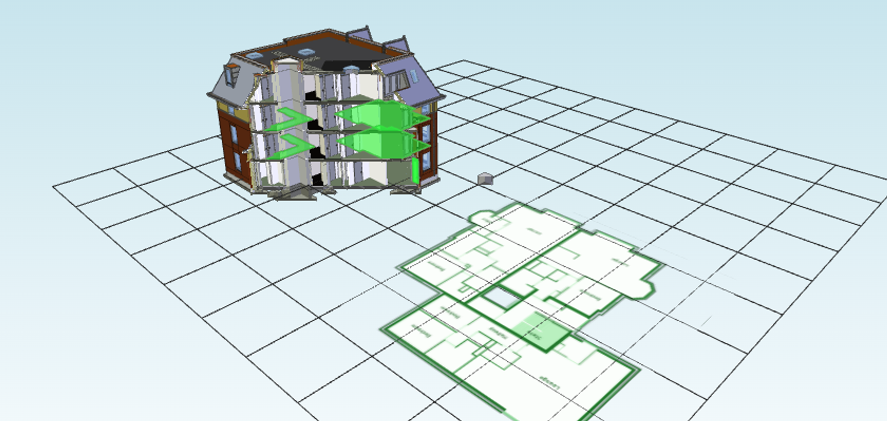

# Saving and Loading BCF Viewpoints

A xeokit viewer can exchange BCF viewpoints with other BIM software, allowing us to use the viewer to report and view issues in BIM models. In this tutorial, we'll demonstrate this capability by creating a BCF viewpoint with a xeokit viewer, which we'll then import it into a second xeokit viewer.

{/* truncate */}


## **Introduction**

BCF is an open standard that enables workflow communications between BIM software tools. An XML schema, called Building Collaboration Format (BCF), encodes messages that inform one BIM tool of issues found by another.

A BCF viewpoint captures a viewpoint of a model that highlights an issue. The viewpoint can then be loaded by another viewer to examine the issue.

The xeokit-sdk provides a `BCFViewpointsPlugin` component, which saves and loads JSON-encoded viewpoints that conform to the [BCF Version 2.1](https://github.com/buildingSMART/BCF-API) specification. In this guide, we'll take a look at how to use that functionality.

## Saving a BCF Viewpoint

In the example below, we'll create a `Viewer`, then add an `XKTLoaderPlugin`, which we'll use to load the Schependomlaan house model, a `SectionPlanesPlugin` to slice the model in half, and a `BCFViewpointsPlugin` to capture our BCF viewpoint.

When the model has loaded, we'll slice it half by creating a section plane using the `SectionPlanesPlugin`, then we'll position the `Camera`, select some objects (which marks them green), and then use the `BCFViewpointsPlugin` to save the BCF viewpoint.

We’ll also add a `LineSet` to create a grid ground plane, and a `Bitmap` to show a PNG image of a plan view of one of the building storeys. This scene doesn’t have a lot of practical value, but serves to demonstrate the features we support in BCF viewpoints.


> [Run this example](https://xeokit.github.io/xeokit-sdk/examples/#BCF_SaveViewpoint)



```js
import {Viewer, XKTLoaderPlugin, SectionPlanesPlugin,
LineSet, Bitmap, BCFViewpointsPlugin} from "https://cdn.jsdelivr.net/npm/@xeokit/xeokit-sdk/dist/xeokit-sdk.es.min.js";

// Create a Viewer
const viewer = new Viewer({
     canvasId: "myCanvas",
     transparent: true
});

// Set camera position and orientation
viewer.scene.camera.eye = [-48.93, 54.54, 50.41];
viewer.scene.camera.look = [0.55, -0.61, -0.55];
viewer.scene.camera.up = [0, -1, 0];
viewer.scene.camera.perspective.fov = 60;

// Add a XKTLoaderPlugin
const xktLoader = new XKTLoaderPlugin(viewer);

// Add a SectionPlanesPlugin
const sectionPlanes = new SectionPlanesPlugin(viewer);

// Add a BCFViewpointsPlugin
const bcfViewpoints = new BCFViewpointsPlugin(viewer);

// Load an .XKT model
const modelNode = xktLoader.load({
     id: "myModel",
     src: "Schependomlaan.xkt",
     edges: true // Emphasise edges
});

// Slice it in half
sectionPlanes.createSectionPlane({
     id: "myClip",
     pos: [0, 0, 0],
     dir: [0.5, 0.0, 0.5]
});

// Create a bitmap
const bitmap = new Bitmap(viewer.scene, {
    src: "schependomlaanPlanView.png",
     visible: true,
     height: 24.0,
     pos: [-15, 0, -10],
     normal: [0, -1, 0],
     up: [0, 0, 1],
     collidable: false,
     opacity: 1.0,
     clippable: false,
     pickable: true
 });

// Create a grid ground plane
const geometryArrays = buildGridGeometry({
     size: 60,
     divisions: 10
 });

new LineSet(viewer.scene, {
     positions: geometryArrays.positions,
     indices: geometryArrays.indices,
     position: [10,0,10],
     clippable: false
 });

// When model is loaded, select some objects and capture a BCF
// viewpoint to the console
modelNode.on("loaded", () => {

     const scene = viewer.scene;

     scene.setObjectsSelected([
         "3b2U496P5Ebhz5FROhTwFH",
         "2MGtJUm9nD$Re1_MDIv0g2",
         "3IbuwYOm5EV9Q6cXmwVWqd",
         "3lhisrBxL8xgLCRdxNG$2v",
         "1uDn0xT8LBkP15zQc9MVDW"
     ], true);

     const viewpoint = bcfViewpoints.getViewpoint();
     const viewpointStr = JSON.stringify(viewpoint, null, 4);

     console.log(viewpointStr);
});
```

## The **BCF Viewpoint Data**

Our `BCFViewpointsPlugin` has saved the viewpoint as the JSON shown below.

The viewpoint JSON contains:

- the position of the `Camera` for perspective and orthographic projections,
- the position and orientation of the `SectionPlane` that we created with our `SectionPlanesPlugin`,
- the visibility and selection status of all the `Entities` in the scene that represent objects,
- the bitmap provided by our \[`Bitmap](<https://xeokit.github.io/xeokit-sdk/docs/class/src/viewer/scene/Bitmap/Bitmap.js~Bitmap.html>),`
- the line segments provided by our `LineSet`, and
- a data URI containing a PNG snapshot of the canvas.

```json
{
     "perspective_camera": {
         "camera_view_point": { "x": -48.93, "y": 54.54, "z": 50.41 },
         "camera_direction": { "x": 0.55, "y": -0.61, "z": -0.55},
         "camera_up_vector": { "x": 0.37, "y": -0.41, "z": 0.83 },
         "field_of_view": 60.0
     },
     "lines": [{
         "start_point": { "x": 1.0, "y": 1.0, "z": 1.0 },
         "end_point": { "x": 0.0, "y": 0.0, "z": 0.0 },
         //...(truncated)
     }],
     "bitmaps": [{
         "bitmap_type": "png",
         "bitmap_data": "data:image/png;base64,iVBOAAAAdp...", //...(truncated)
         "location": { "x": -15, "y": 10, "z": 0 },
         "normal": { "x": 0, "y": 0, "z": -1 },
         "up": { "x": 0, "y": -1, "z": 0 },
         "height": 24
     }],
     "clipping_planes": [{
         "location": { "x": 0.0, "y": 0.0, "z": 0.0 },
         "direction": { "x": 0.5, "y": 0.0, "z": 0.5 }
     }],
     "snapshot": {
         "snapshot_type": "png",
         "snapshot_data": "data:image/png;base64,......"
     },
     "components": {
         "visibility": {
             "default_visibility": false,
             "exceptions": [{
                     "ifc_guid": "4$cshxZO9AJBebsni$z9Yk",
                     "originating_system": "xeokit.io",
                     "authoring_tool_id": "xeokit/v3.2"
                 },
                 //...
             ]
         },
         "selection": [{
                 "ifc_guid": "4$cshxZO9AJBebsni$z9Yk",
             },
             //...
         ]
     }
}
```

## **Saving View Setup Hints**

When saving a viewpoint, we can give some hints about what we want to save. To show what hints are supported, let's save the viewpoint again, this time providing a value for each hint:

```js
const viewpoint = bcfViewpoints.getViewpoint({ // Options

    // Force IfcSpace types visible in the viewpoint (default is false)
    spacesVisible: false,

    // Show IfcSpace boundaries in the viewpoint (default is false)
    spaceBoundariesVisible: false,

    // Force IfcOpening types visible in the viewpoint (default is false)
    openingsVisible: false
});
```

## **Loading the BCF Viewpoint**

Now let's load our BCF viewpoint. We'll set up another `Viewer` with a  `XKTLoaderPlugin` and a `BCFViewpointsPlugin`, and load the same Schependomlaan house model into it as before.

Note that our second `Viewer` does not need a `SectionPlanesPlugin` because the `BCFViewpointsPlugin` will recreate the `SectionPlane` component directly.

```js
import {Viewer, XKTLoaderPlugin, BCFViewpointsPlugin} from "https://cdn.jsdelivr.net/npm/@xeokit/xeokit-sdk/dist/xeokit-sdk.es.min.js";

const viewer = new Viewer({
    canvasId: "myCanvas",
    transparent: true
});

const xktLoader = new XKTLoaderPlugin(viewer);
const bcfViewpoints = new BCFViewpointsPlugin(viewer);

const model = xktLoader.load({
    id: "myModel",
    src: "./models/xkt/schependomlaan/geometry.xkt"
});
```

We'll assume that we've got the BCF viewpoint JSON in a variable named `viewpoint`. Then, when the model has loaded, we'll use the `BCFViewpointsPlugin` to load our viewpoint.

```js
model.on("loaded", () => {
    bcfViewpoints.setViewpoint(myViewpoint);
});
```

And voilà - our viewer is restored to the state captured in the BCF viewpoint.


> [Run this example](https://xeokit.github.io/xeokit-sdk/examples/#BCF_LoadViewpoint)


## Special Cases

### Dealing With Pre-Loaded Models That Are Not in the Viewpoint

When exchanging a BCF viewpoint between two viewers, we normally assume that both viewers have the same models loaded. When the target viewer has extra models loaded, this can create unexpected results, since the BCF viewpoint will not reference any of the objects in those extra models.

To illustrate the problem more clearly, consider this workflow:

1. load the "duplex" model,
2. hide a small number of objects,
3. save a BCF viewpoint,
4. load another model, "schependomlaan",
5. hide the "schependomlaan" model, then
6. load the viewpoint again.

Loading the viewpoint makes all the objects in the "schependomlaan" become unexpectedly visible, even though their states were not saved in the viewpoint. The reason is that, when saving a BCF viewpoint, BCF logic works like the following pseudo code:

```
If numVisibleObjects < numInvisibleObjects
     save IDs of visible objects in BCF
     exceptions = "visible objects"
else
     save IDS of invisible objects in BCF
     exceptions = "invisible objects"
```

When loading the viewpoint again:

```
If exceptions = "visible objects"
     hide all objects
     show visible objects in BCF
else
     show all objects
     hide invisible objects in BCF
```

When the exception is "visible objects", then things work fine for us, because loading the viewpoint hides everything, then shows the objects listed in the BCF.

When the exception is "invisible objects", then this logic is a problem for us, because loading the viewpoint shows everything (including our "schependomlaan" model) and then hides only the objects listed in the BCF. This is confusing because the "schependomlaan" model was not in the viewer when we first saved the viewpoint.

To solve this, we can supply a `defaultInvisible` option to`BCFViewpointsPlugin#getViewpoint`, which will force the plugin to save the IDs of all visible objects while making invisible objects the exception. That way, when we load the viewpoint again, after loading model "schependomlaan", the plugin will hide all objects in the scene first (which will include objects belonging to model "schependomlaan"), then make the objects in the viewpoint visible (which will only be those of object "duplex"). This option can make our BCF viewpoints quite large, so only use this option when necessary.

```js
const viewpoint = bcfViewpoints.getViewpoint({ // Options
    //..
    defaultInvisible: true
});
```


> [Run this example](http://xeokit.github.io/xeokit-sdk/examples/#BCF_LoadViewpoint_defaultInvisible)
