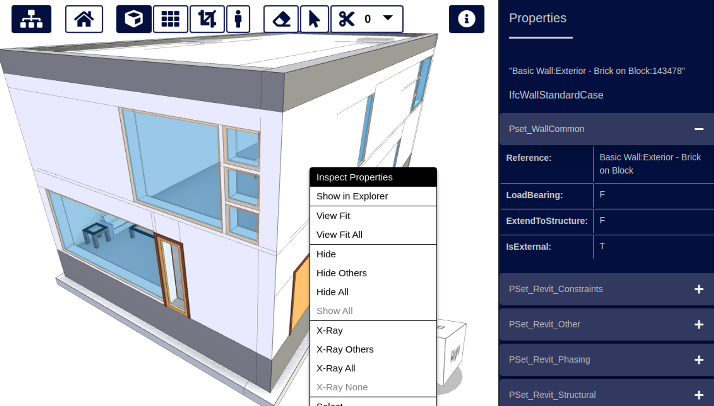
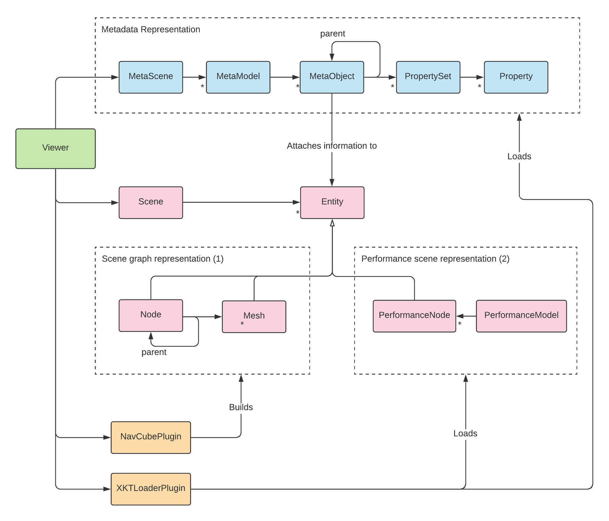
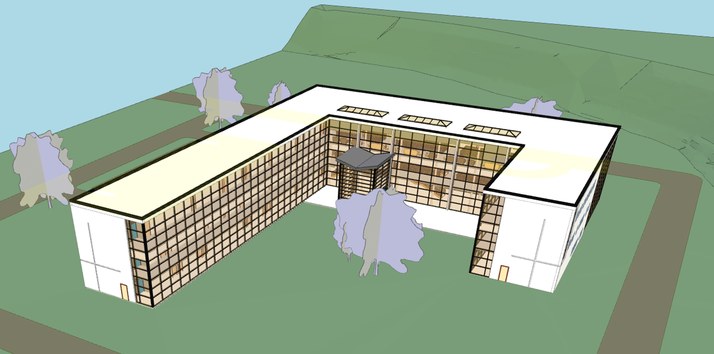
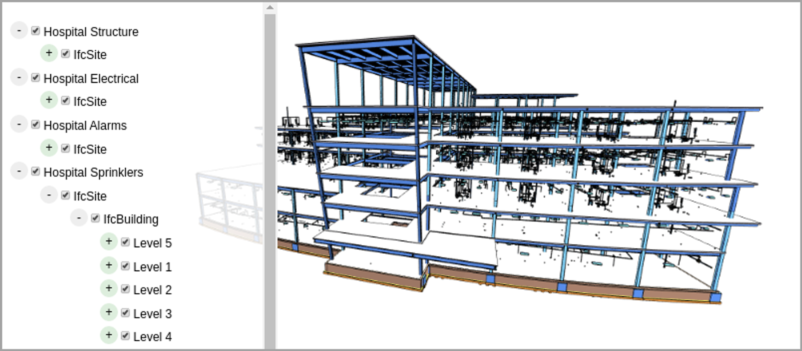
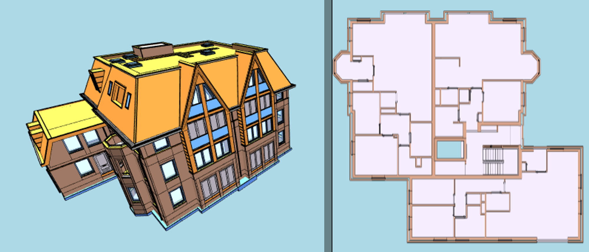

# Scene Representation and Metadata

In this guide, we'll use [convert2xkt](https://github.com/xeokit/xeokit-convert) to convert an IFC file to xeokit's native, fast-loading XKT format. Then, using JavaScript, we'll view the XKT model in the browser using xeokit Viewer component. As the Viewer loads our model, it will create 3D scene objects, along with a parallel metadata structure. We'll show how to use that metadata to navigate the scene objects and get information about them.



{/* truncate */}

> [Run this example](https://xeokit.io/demo.html?projectId=Duplex)


## Introduction

The xeokit SDK's core Viewer is built for viewing large AEC and BIM models. These models are often complex assembles, with metadata that classifies the objects and attaches domain-specific information to them. In this guide, we'll describe how the xeokit Viewer represents scene objects and metadata, and how we can access that metadata from JavaScript. As we go, we'll refer to the UML diagram below, which shows the main components we'll be discussing.

We'll use an IFC model as our example, converted to XKT using [convert2xkt](/blog/converting-models-to-xkt-with-convert2xkt), so that we can load it into our Viewer. This tutorial only works with convert2xkt currently.

Although we're using IFC in this guide, the core xeokit Viewer is not bound to IFC, or any other data model. Therefore, with the exception of one or two Viewer plugins, much of what you'll see here also works with other source formats, such as CityJSON.



## Scene Representation

The xeokit SDK's Viewer class supports two scene representations:

1. **a conventional scene graph**, with a node graph containing transform hierarchies, physically-based materials, textures etc, and
2. **a lean high-performance scene representation** for large high-detail models, for which fast loading, low memory footprint and high rendering performance are essential.

We use (1) for interactive 3D gizmos like the [NavCubePlugin](https://xeokit.github.io/xeokit-sdk/docs/class/src/plugins/NavCubePlugin/NavCubePlugin.js~NavCubePlugin.html). As shown in the class diagram, xeokit's two main scene graph components are its Node and Mesh classes. Classes like NavCubePlugin create their scene objects from those components.

We use (2) for high-detail engineering models loaded from XKT format using [XKTLoaderPlugin](https://xeokit.github.io/xeokit-sdk/docs/class/src/plugins/XKTLoaderPlugin/XKTLoaderPlugin.js~XKTLoaderPlugin.html). Whenever XKTLoaderPlugin loads a model, it creates a PerformanceModel, which represents each of the model's objects as a PerformanceNode.

Scene objects in both these representations implement the common abstract Entity interface. Via that interface, we can attach metadata to each object, update its visual state etc, regardless of how its represented within the scene.

## Metadata Representation

To attach information to a model, the Viewer usually also loads a metadata structure alongside the model's scene representation. The metadata structure works with both of the scene representations described above.

## Using Scene Entities and Metadata

Let's take a look at how we can find Entities and MetaObjects in our models.

### Converting an IFC Model to XKT

We'll use xeokit's [convert2xkt](https://github.com/xeokit/xeokit-convert) tool to convert a sample IFC model from AutoDesk into an XKT model:

```bash
convert2xkt.js -s rac_sample_project.ifc -o rac_sample_project.ifc.xkt
```


> See also: [Converting Models to XKT with convert2xkt](/blog/converting-models-to-xkt-with-convert2xkt)

### Loading XKT into a Viewer

Next, we'll create a Viewer to view our model in the browser. We'll install an XKTLoaderPlugin into the Viewer, which we'll use to load our XKT file.

```js
import {Viewer, XKTLoaderPlugin} from "https://cdn.jsdelivr.net/npm/@xeokit/xeokit-sdk/dist/xeokit-sdk.es.min.js";

const viewer = new Viewer({
    canvasId: "myCanvas"
});

const xktLoader = new XKTLoaderPlugin(viewer);

const model = xktLoader.load({
    id: "myModel",
    src: "rac_sample_project.ifc.xkt"
});
```

When the model has loaded, it looks like this:




> [Run this example](https://xeokit.github.io/xeokit-sdk/examples/#BIMOffline_XKT_RevitSamples_RAC)

### Accessing the MetaModel

Now we can access our model's objects and metadata. We'll start by getting the [MetaModel](https://xeokit.github.io/xeokit-sdk/docs/class/src/viewer/metadata/MetaModel.js~MetaModel.html) that represents our model.

```js
const metaModel = viewer.metaScene.metaModels["myModel"];

console.log(metaModel.id); // "myModel"
console.log(metaModel.projectId); // 131073
console.log(metaModel.revisionId); // 65539
console.log(metaModel.author); // "Autodesk"
console.log(metaModel.createdAt); // eg. "24 August, 2021"
console.log(metaModel.creatingApplication); // eg. "Revit"
console.log(metaModel.schema); // eg. "IFC4"
console.log(metaModel.propertySets); // [..]
console.log(metaModel.rootMetaObject}; // MetaObject
```

From here on, we'll focus our tutorial on the stairway object in the screenshot below. Let's position the camera to look at it.

```js
viewer.scene.camera.eye = [15.23, 2.15, -4.30];
viewer.scene.camera.look = [9.68, 0.98, -12.71];
viewer.scene.camera.up = [-0.06, 0.99, -0.09];
```


### Accessing MetaObjects

Now we'll get the [MetaObject](https://xeokit.github.io/xeokit-sdk/docs/class/src/viewer/metadata/MetaObject.js~MetaObject.html) that represents the stairway, and log some of its properties.

```js
const stairWayMetaObject = metaModel.metaObjects["09H8bZdNrFqAgGbw11nlyy"];

console.log(stairWayMetaObject.id); // "09H8bZdNrFqAgGbw11nlyy"
console.log(stairWayMetaObject.name); // "Escalera:150mm max riser 300mm tread"
console.log(stairWayMetaObject.type); // "IfcStair"
```

Let's make an X-ray view of the stairway. There are several ways to update the states of objects in the Viewer, depending on what's most convenient. In the next snippet, we'll use some convenient setters on the Viewer's [Scene](https://xeokit.github.io/xeokit-sdk/docs/class/src/viewer/scene/scene/Scene.js~Scene.html) object, to direct our state updates to the right objects.

```js
// Get the IDs of the objects that comprise our stairway
const stairwayObjectIds = stairWayMetaObject.getObjectIDsInSubtree();

// Make all objects X-rayed, then undo X-ray on our stairway
viewer.scene.setObjectsXRayed(viewer.scene.objectIds, true);
viewer.scene.setObjectsXRayed(stairwayObjectIds, false);
```


Let's isolate the stairway, making all other objects invisible.

```js
// Hide all objects, then show our stairway
viewer.scene.setObjectsVisible(viewer.scene.objectIds, false);
viewer.scene.setObjectsVisible(stairwayObjectIds, true);
```


Our stairwell has seven child objects, representing the steps and rails. Let's get the MetaObject for one of the rails.

```js
const railingMetaObject = metaModel.metaObjects["0LUOqC48DCsBp1FbwV8J5Y"];

console.log(railingMetaObject.id); // "0LUOqC48DCsBp1FbwV8J5Y"
console.log(railingMetaObject.name); // "Barandilla:900mm Pipe:173061"
console.log(railingMetaObject.type); // "IfcRailing"
console.log(railingMetaObject.parent); // "09H8bZdNrFqAgGbw11nlyy"
```

Note that the sub-object's parent is our stairway object.

### Accessing Scene Entities

Each leaf MetaObject has a corresponding Scene [Entity](https://xeokit.github.io/xeokit-sdk/docs/class/src/viewer/scene/Entity.js~Entity.html) with the same ID.

Let's get the Entity for the stair rail and set it highlighted. This snippets demonstrates another way to set the visual state of our objects. This time, we're updating a property of an Entity directly.

```js
const railingEntity = viewer.scene.entities["0LUOqC48DCsBp1FbwV8J5Y"];

railingEntity.highlighted = true;
```


### Accessing PropertySets

Each MetaObject can be attached to one or more [PropertySets](https://xeokit.github.io/xeokit-sdk/docs/class/src/viewer/metadata/PropertySet.js~PropertySet.html).

These contain domain-specific information about the object, such as materials, dimensions, cost and so on. Each PropertySet can also be shared among multiple MetaObjects.

```js
const propertySet0 = railingMetaObject.propertySets[0];

console.log(propertySet0.name); // "Pset_QuantityTakeOff"
console.log(propertySet0.id); // "1ZmUBg2f17Gxz3xZ52e7U9"

const property0 = propertySet0.properties[0];

console.log(property0.name); // "Handrail"
console.log(property0.id); // "Gxz3xZ52e7U91ZmUBg2f17"
console.log(property0.type); // 2
console.log(property0.value); // "900mm Pipe"
console.log(property0.valueType); // 4
```

## How we use Metadata in xeokit

We designed xeokit's metadata to be abstract and not dependent on on model that is abstracted away from any particular data model, such as IFC.

### TreeViewPlugin

[TreeViewPlugin](https://xeokit.github.io/xeokit-sdk/docs/class/src/plugins/TreeViewPlugin/TreeViewPlugin.js~TreeViewPlugin.html) is a Viewer plugin that provides an HTML tree view to navigate the IFC elements in models. The tree has various hierarchy modes, including one which groups IFC elements by their IfcBuildingStorey parents.

```js
import {Viewer, XKTLoaderPlugin, TreeViewPlugin} from "https://cdn.jsdelivr.net/npm/@xeokit/xeokit-sdk/dist/xeokit-sdk.es.min.js";

const viewer = new Viewer({
     canvasId: "myCanvas"
});

const treeView = new TreeViewPlugin(viewer, {
    containerElement: document.getElementById("myTreeViewContainer")
});

const xktLoader = new XKTLoaderPlugin(viewer);

const model = xktLoader.load({
    id: "myModel",
    src: "westRiversideHospital.ifc.xkt"
});
```




> [Run this example](https://xeokit.github.io/xeokit-sdk/examples/#TreeViewPlugin_Storeys)

### StoreyViewsPlugin

[StoreyViewsplugin](https://xeokit.github.io/xeokit-sdk/docs/class/src/plugins/StoreyViewsPlugin/StoreyViewsPlugin.js~StoreyViewsPlugin.html) is a Viewer plugin that provides a bunch of flexible methods for isolated views of of IfcBuildingStoreys.

```js
import {Viewer, XKTLoaderPlugin, StoreyViewsPlugin} from "https://cdn.jsdelivr.net/npm/@xeokit/xeokit-sdk/dist/xeokit-sdk.es.min.js";

const viewer = new Viewer({
     canvasId: "myCanvas",
     transparent: true
});

const xktLoader = new XKTLoaderPlugin(viewer);
const storeyViewsPlugin = new StoreyViewsPlugin(viewer);

const model = xktLoader.load({
     id: "myModel",
     src: "./models/xkt/Schependomlaan.xkt",
     edges: true
});

const storeyMap = storeyViewsPlugin.createStoreyMap("2SWZMQPyD9pfT9q87pgXa1", {
    width: 300,
    format: "png"
});

document.getElementById("myImage").src = storeyMap.imageData;
```




> [Run this example](https://xeokit.github.io/xeokit-sdk/examples/#storeyViews_StoreyViewsPlugin_recipe2)
