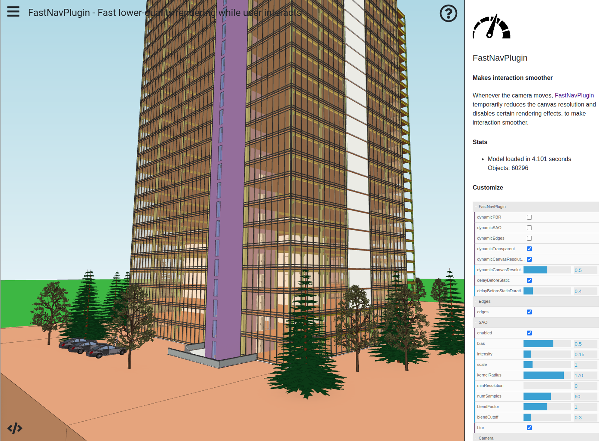

# Viewer Performance Tips

- [Introduction](#introduction)
- [Tip 1: Disable Geometry Reuse](#tip-1-disable-geometry-reuse)
-   [Tip 2: Use FastNavPlugin](#tip-2-use-fastnavplugin)

# Introduction

The xeokit Viewer is designed for performance, but some of its special rendering effects can run slowly with huge models. Furthermore, if our models contain excessive geometry reuse (described below), then they can hit a pathological case for the Viewer and slow it down considerably.

Fortunately, xeokit has some options we can use to keep our Viewers smooth and responsive for these cases, which we'll describe in this article.

<!-- truncate -->

# Tip 1: Disable Geometry Reuse


> If our XKT models contain huge sets of distinct geometries that are shared by objects, then we may need to disable xeokit's internal geometry reuse for best performance.

The xeokit Viewer and the XKT format support geometry reuse, which is where multiple objects share the same geometries. This provides a smaller XKT file, lower browser memory footprint, and can also speed up rendering. This is normally called *instancing*.

There is, however, a pathological case for performance when the number of instanced geometries is large. Internally, the Viewer performs an expensive WebGL draw call for each geometry, to draw its complete set of instances in one shot. Even though instancing is great because it saves making a draw call for each instance, it still means the Viewer makes a draw call for each of the geometries. If the number of geometries is large, then so is the number of draw calls.

We can fix that with a new `reuseGeometries` configuration for XKTLoaderPlugin, as shown below. Internally, that will make XKTLoaderPlugin automatically convert all geometry instances into the Viewer's batched geometry representation, which will render them more efficiently. This will increase browser memory footprint slightly, and will work for XKT v8 and v9.

```js
const viewer = new Viewer({
    canvasId: "myCanvas"
});

const xktLoader = new XKTLoaderPlugin(viewer, {
    reuseGeometries: false // <------- Disable geometry resuse
});

const model = xktLoader.load({
    id: "myModel",
    src: "myHugeModel.xkt"
});
```

## Tip 2: Use FastNavPlugin


> To improve Viewer responsiveness, install a [FastNavPlugin](https://xeokit.github.io/xeokit-sdk/docs/class/src/plugins/FastNavPlugin/FastNavPlugin.js~FastNavPlugin.html), which will temporarily simplify the Viewer's rendering quality whenever we interact with it.

The xeokit Viewer supports a bunch of visual effects for making our models look good, such as edge enhancement, physically-based shading and ambient shadows. Each of these effects has some impact on Viewer responsiveness, however, so we often want to disable them while we're interacting.

In the example below, we'll create a Viewer and install a FastNavPlugin. Whenever we interact with the Viewer, our FastNavPlugin will temporarily switch off various expensive rendering effects, and will also down-scale the canvas resolution by a factor of 0.5. The down-scaling will cause the Viewer to render 75% less pixels, which gives us a significant performance boost, at the cost of a slightly rougher image while we're moving around.

For extra speed, we'll also configure our XKTLoaderPlugin to disable geometry reuse, as described in the previous section.


> [Run this example](https://xeokit.github.io/xeokit-sdk/examples/#performance_FastNavPlugin)




```js
const viewer = new Viewer({
    canvasId: "myCanvas"
});

new FastNavPlugin(viewer, {

    // Don't show edges while we interact (default is true)
    hideEdges: true,

		// Don't show ambient shadows (SAO) while we interact (default is true)
		hideSAO: true,

    // No physically-based rendering (PBR) while we interact (default is true)
		hidePBR: true,

		// Hide transparent objects while we interact (default is false)
    // We don't care if the windows temporarily dissapear while we move around.
    hideTransparentObjects: true,

    // Scale the canvas resolution while we interact (default is false).
    // This makes the canvas slightly blurry while we're interacting, but
    // draws 75% less pixels.
    scaleCanvasResolution: true,

    // Factor by which we scale canvas when we interact (default is 0.6)
    scaleCanvasResolutionFactor: 0.5,

    // When we stop interacting, have a delay before restoring
    // normal render (default is true)
    delayBeforeRestore: true,

    // The delay duration, in seconds (default is 0.5)
    delayBeforeRestoreSeconds: 0.5
});

const xktLoader = new XKTLoaderPlugin(viewer, {
    reuseGeometries: false // See: Disable Geometry Reuse above
});

const model = xktLoader.load({
    id: "myModel",
    src: "myHugeModel.xkt"
});
```


## Tip 3: Check if ViewCullPlugin improves FPS

The [ViewCullPlugin](https://xeokit.github.io/xeokit-sdk/docs/class/src/plugins/ViewCullPlugin/ViewCullPlugin.js~ViewCullPlugin.html) performs view frustum culling to accelerate rendering performance.
For each Entity that represents an object, ViewCullPlugin automatically sets the `culled` property whenever it falls outside the field of view. When culled, an Entity is not processed by xeokit's renderer.

The Trade-off: However, there's an associated cost for calculating whether an object is inside or outside the field of view.
This means that if your users work mostly with full model views (where everything is visible), this option may actually degrade performance rather than help.

**Our recommendation:** Test whether ViewCullPlugin helps in your specific use case rather than enabling it by default.

Example Usage:
```js
const viewer = new Viewer({
   canvasId: "myCanvas",
   transparent: true
});

const viewCullPlugin = new ViewCullPlugin(viewer, {
   maxTreeDepth: 20
});

const xktLoader = new XKTLoaderPlugin(viewer);

const model = xktLoader.load({
     id: "myModel",
     src: "./models/xkt/OTCConferenceCenter.xkt"
});
```

## Tip 4: Check if You compress buffers in xeokit-convert

As of version v1.1.25, [xeokit-convert](https://github.com/xeokit/xeokit-convert) does not compress buffers by default.
However, by adding the -b option when producing an XKT file, buffers are compressed:
```bash
node convert2xkt.js -a manifest.json -o model.xkt -b
```
Alternatively, we recommend using native webserver/browser compression (gzip), which should be more efficient.

Why This Matters: Using compressed buffers significantly helps users on slower network connections load models faster.
Even on faster networks, smaller file sizes usually translate to faster initial load times.

Bottom line: If you're experiencing loading problems or want to optimize performance,
make sure your XKT files are compressed—either through the -b flag or via webserver compression.

## Tip 5: Make sure you are using the right GPU

This one is for Windows users having a dedicated GPU.
Make sure your browser (for instance Google Chrome) uses the correct (dedicated) GPU.
If you have doubts - check this article - [Chrome To Use Specific GPU?](https://support.google.com/chrome/thread/77636044/chrome-to-use-specific-gpu?hl=en)

