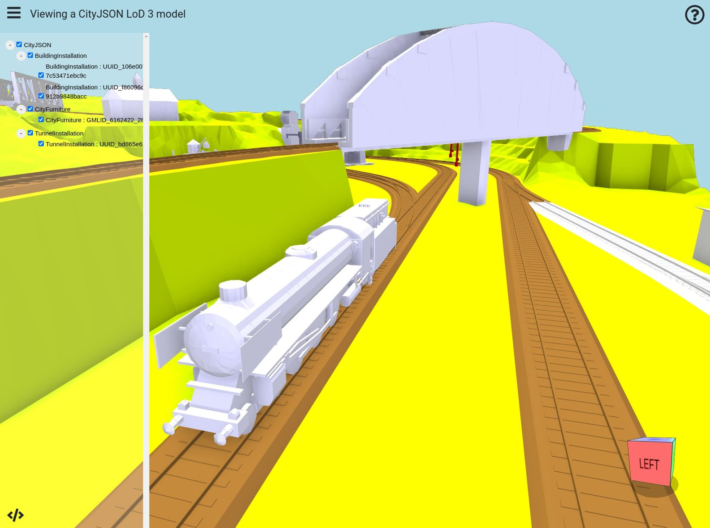

# Viewing a CityJSON Model with XKTLoaderPlugin

- [Introduction](#introduction)
- [1\. Install convert2xkt](#1-install-convert2xkt)
- [2\. Convert CityJSON to XKT](#2-convert-cityjson-to-xkt)
- [3\. View the XKT in the Browser](#3-view-the-xkt-in-the-browser)

# Introduction

In this mini-tutorial, we'll use xeokit's `convert2xkt` CLI tool to convert a [CityJSON](https://www.cityjson.org/) model into xeokit's native XKT geometry format, which we'll then view in the browser using a xeokit Viewer.

CityJSON is a JSON-based encoding for a subset of the OGC CityGML data model (version 2.0.0), and is now published as an OGC community standard.

The XKT format compresses models into a compact payload from which xeokit can load large numbers of objects over the Web in seconds, at full geometric precision.

For our CityJSON file, we'll use a LoD-3 model of a railway line, which is one of the sample datasets provided at [here](https://www.cityjson.org/datasets). When that's converted and loaded, it will look like the example below.


> [Run this example](https://xeokit.github.io/xeokit-sdk/examples/#loading_CityJSON_Railway)



# 1\. Install convert2xkt

Using git and npm, clone and install our `xeokit-convert` repository, which contains the `convert2xkt` tool that we'll use to convert our CityJSON into XKT.

Be sure to use the latest versions of both `xeokit-convert` and `xeokit-sdk`.

```bash
git clone https://github.com/xeokit/xeokit-convert.git
cd xeokit-convert
npm install
```

# 2\. Convert CityJSON to XKT

Now convert the CityJSON into an `XKT` file:

```bash
node convert2xkt.js -s LoD3_Railway.json -o LoD3_Railway.json.xkt -l

[convert2xkt] Reading input file: LoD3_Railway.json
[convert2xkt] Input file size: 4521.41 kB
[convert2xkt] Converting...
[convert2xkt] Converting CityJSON 1.0
[convert2xkt] Rotating model about X-axis
[convert2xkt] Converted objects: 120
[convert2xkt] Converted geometries: 36984
[convert2xkt] Converted triangles: 113537
[convert2xkt] Converted vertices: 170281
[convert2xkt] Converted to: XKT v9
[convert2xkt] XKT size: 878.98 kB
[convert2xkt] Compression ratio: 5.14
[convert2xkt] Conversion time: 2.99 s
[convert2xkt] Writing XKT file: LoD3_Railway.json.xkt
```

Now we have the CityJSON/CityGML model in a compact format that can be loaded quickly into xeokit.

# 3\. View the XKT in the Browser

Finally, let's view our model in the browser using xeokit. We'll create a [Viewer](https://xeokit.github.io/xeokit-sdk/docs/class/src/viewer/Viewer.js~Viewer.html) attached to an HTML canvas, install an [XKTLoaderPlugin](https://xeokit.github.io/xeokit-sdk/docs/class/src/plugins/XKTLoaderPlugin/XKTLoaderPlugin.js~XKTLoaderPlugin.html), and use that to load our XKT model. Find the full example [here](https://xeokit.github.io/xeokit-sdk/examples/#loading_CityJSON_Railway).

```js
import {Viewer, XKTLoaderPlugin} from "https://cdn.jsdelivr.net/npm/@xeokit/xeokit-sdk/dist/xeokit-sdk.es.min.js";

const viewer = new Viewer({
     canvasId: "myCanvas"
});

viewer.scene.camera.eye = [15.84, 11.17, 15.33];
viewer.scene.camera.look = [7.96, 1.76, 8.46];
viewer.scene.camera.up = [-0.50, 0.74, -0.43];

const xktLoader = new XKTLoaderPlugin(viewer);

const modelNode = xktLoader.load({
     id: "myModel",
     src: "LoD3_Railway.json.xkt"
});
```


> [Run this example](https://xeokit.github.io/xeokit-sdk/examples/#loading_CityJSON_Railway)
