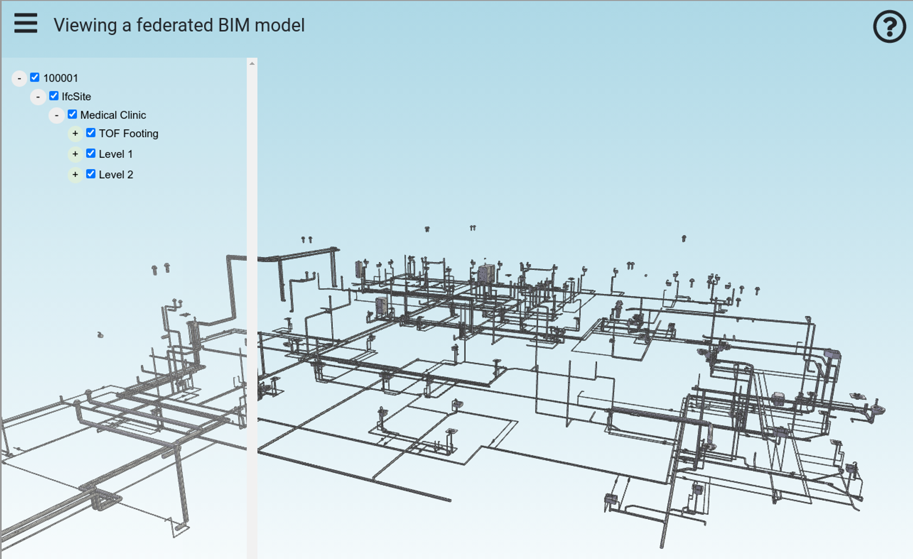
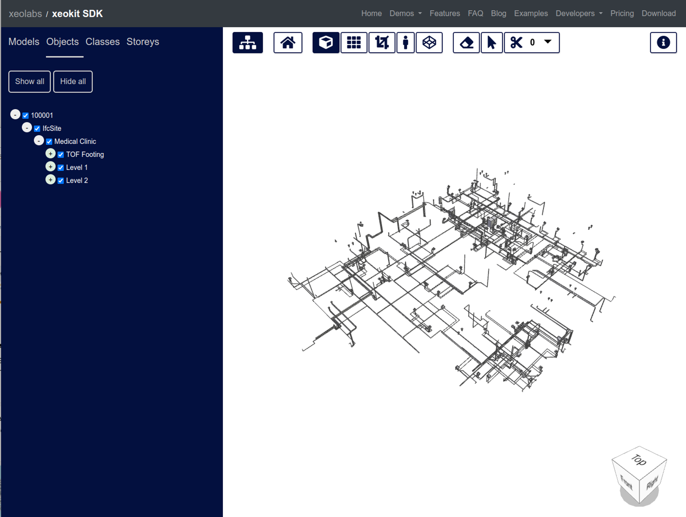

# Viewing Federated IFC Models


> See also: [Converting Models to XKT with convert2xkt](/blog/converting-models-to-xkt-with-convert2xkt)

The xeokit SDK enables the loading of large, full-precision BIM models over the web in seconds, which can then be viewed in a browser. To achieve this, we convert our IFC files into xeokit's native *XKT* format. This format compresses model geometry and metadata into a compact payload that can be quickly loaded by a xeokit viewer while using minimal browser resources.

This tutorial demonstrates how to use the `ifc2gltfcxconverter` tool from [Creoox AG](https://creoox.com/en/contact/) and the open source `convert2xkt` tool from xeolabs to convert an IFC model into an XKT file, which can then be loaded into a xeokit viewer. This combination is currently the most efficient option for converting IFC files to XKT.

Additionally, this tutorial shows how these tools can automatically split each model into multiple XKT files, allowing huge models to be converted and loaded in chunks that don't overwhelm server and browser resources.

<!-- truncate -->

- [Introduction](#introduction)
-   [What's IFC?](#whats-ifc)
-   [What's XKT?](#whats-xkt)
- [1\. Install File Conversion Tools](#1-install-file-conversion-tools)
-   [ifc2gltfcxconverter](#ifc2gltfcxconverter)
-   [convert2xkt](#convert2xkt)
- [2\. Convert IFC to glTF and JSON Files](#2-convert-ifc-to-gltf-and-json-files)
- [3\. Convert glTF and JSON Files to XKT](#3-convert-gltf-and-json-files-to-xkt)
- [4\. Viewing the XKT with a xeokit Viewer and TreeViewPlugin](#4-viewing-the-xkt-with-a-xeokit-viewer-and-treeviewplugin)
-   [Viewing the XKT Model with xeokit BIMViewer](#viewing-the-xkt-model-with-xeokit-bimviewer)
- [Model Conversion Tests Page](#model-conversion-tests-page)
-   [Clinic Plumbing Model Test Results](#clinic-plumbing-model-test-results)
-   [Test Script Source](#test-script-source)

# Introduction

## What's IFC?

The Industry Foundation Classes (IFC) data model is used to describe architectural, building, and construction industry data.

IFC defines an entity-relationship model consisting of various entities organized into an object-based inheritance model. Classes represent various building elements, such as `IfcWall`, geometry, such as `IfcExtrudedAreaSolid`, and basic constructs, such as `IfcCartesianPoint`.

The data model is developed by [buildingSMART](https://www.buildingsmart.org/) to facilitate interoperability in the AEC industry. It is a commonly used open collaboration format in BIM-based projects.

An IFC file is usually provided as an IFC-SPF file ("STEP-file"), which is a text format in which each line represents an entity that instantiates a class within the data model.

## What's XKT?

XKT is xeokit's native 3D model format. It compresses IFC models (and other formats) into a compact binary payload from which large numbers of objects can be loaded over the Web in seconds, at full geometric precision.

An XKT file also contains metadata on its objects, which enables a xeokit viewer to navigate them according to their types. This is useful for building things like object tree view UIs and automatic building storey plan views.

For each object/element, the metadata stores the following information:

- Name
- Element ID
- Element IFC type
- Parent element ID

The metadata also stores IFC property sets, some of which may be associated with objects/elements.

This tutorial uses a combination of proprietary and open-source CLI tools to convert an IFC 4 model into an XKT file, which can then be loaded into a xeokit Viewer.

For the IFC file, the Holter Tower example from the Open IFC Repository is used. When converted and loaded, it will look like the example below.


> [Run this example](https://xeokit.github.io/xeokit-sdk/examples/#BIMOffline_XKT_Federated_Clinic)


We periodically run our AEC test files through all pipelines to statically generate the [Model Conversion Tests](https://xeokit.github.io/xeokit-model-conversion-tests/tests.html) page. This page allows you to check if the latest pipelines are correctly converting our test models.

[https://xeokit.github.io/xeokit-model-conversion-tests/viewer.html?batchId=buildingSMART\_IFC2.3&modelId=Clinic\_Plumbing](https://xeokit.github.io/xeokit-model-conversion-tests/viewer.html?batchId=buildingSMART_IFC2.3&modelId=Clinic_Plumbing)

# 1\. Install File Conversion Tools

Let's get started!

We will use these CLI tools:

- [ifc2gltfcxconverter](https://creoox.com/en/contact/) to convert an IFC file into glTF geometry and JSON metadata files.
- [convert2xkt](https://xeokit.github.io/xeokit-convert/docs/) to convert the glTF and JSON files into XKT files.

## ifc2gltfcxconverter

The [ifc2gltfcxconverter](https://creoox.com/en/contact/) tool converts IFC 2x3 and 4 files directly into glTF files and JSON metadata files. This tool is from [Creoox AG](https://creoox.com/en/contact/), who provide versions for Windows and Linux. This tool performs the same steps as the IfcConvert and COLLADA2GLTF tools used in the [Converting IFC Models to XKT using Open Source Tools](https://www.notion.so/c373e48bc4094ff5b6e5c5700ff580ee?pvs=21) pipeline, but with the following advantages:

- Implemented in C++, with faster geometry kernel
- Handles larger IFC files - better speed and memory efficiency
- Full IFC metadata support
- Splits output into multiple sets of output files (which we’ll demonstrate here)

## convert2xkt

The [convert2xkt](https://xeokit.github.io/xeokit-convert/docs/) tool is an open-source NodeJS-based CLI tool from [xeolabs](https://xeolabs.com/). This tool converts a variety of different source file formats into XKT. In this tutorial, we will use it to convert the glTF and JSON files output by `ifc2gltfcxconverter` into an XKT file.

Make sure to obtain the latest versions of these two tools, along with the latest version of the xeokit-sdk. We will assume that the tools are installed relative to the current working directory.

# 2\. Convert IFC to glTF and JSON Files

Convert the Clinic Plumbing IFC file into a set of glTF and metadata files using the following command:

```bash
./ifc2gltfcxconverter -s 5 -i Clinic_Plumbing.ifc -o model.glb -m model.json
```

The `-s 5` option splits the output into multiple pairs of glTF and JSON metadata files.

The output files created by `ifc2gltfcxconverter` include `.glb` files with geometry and materials for objects, and `.json` files with IFC element data and property sets.

Note that the `.json` files may contain duplicate IFC elements with duplicate IDs, such as `IfcSite` and `IfcBuilding`. However, elements that represent concrete objects, like `IfcWall` and `IfcSlab`, which have geometry and materials in the `.xkt` files, will not be duplicated among the `.json` and `.xkt` files.

The `model.glb.manifest.json` file is the manifest of all the output files.

```js
model_1.glb
model_1.json
model_2.glb
model_2.json
model_3.glb
model_3.json
model.glb
model.glb.manifest.json
model.json
```

The contents of `model.glb.manifest.json` are shown below. Each chunk of our Clinic model has a corresponding glTF geometry file and JSON metadata file.

```json
{
    "inputFile": "Clinic_Plumbing.ifc",
    "converterApplication": "ifc2gltfcxconverter",
    "converterApplicationVersion": "2.7.6",
    "conversionDate": "2023-04-11 18:56:03",
    "gltfOutFiles": [
        "model.glb",
        "model_1.glb",
        "model_2.glb",
        "model_3.glb"
    ],
    "metadataOutFiles": [
        "model.json",
        "model_1.json",
        "model_2.json",
        "model_3.json"
    ]
}
```

# 3\. Convert glTF and JSON Files to XKT

We will now convert the four pairs of glTF and JSON files into four XKT files:

```bash
./convert2xkt.js -s model.glb -m model.json -o model.xkt -l
[convert2xkt] Running convert2xkt v1.1.7...
[convert2xkt] Reading input file: model.glb
[convert2xkt] Input file size: 6104.56 kB
[convert2xkt] Reading input metadata file: model.json
[convert2xkt] Using parser: parseGLTFIntoXKTModel
[convert2xkt] Parsing normals: enabled
[convert2xkt] Parsing textures: enabled
[convert2xkt] Input file parsed OK. Building XKT document...
[convert2xkt] XKT document built OK. Writing to XKT file...
[convert2xkt] Converted to: XKT v10
[convert2xkt] XKT size: 4368.53 kB
[convert2xkt] XKT textures size: 0.01kB
[convert2xkt] Compression ratio: 1.40
[convert2xkt] Conversion time: 6.58 s
[convert2xkt] Converted metaobjects: 0
[convert2xkt] Converted property sets: 0
[convert2xkt] Converted drawable objects: 2248
[convert2xkt] Converted geometries: 3777
[convert2xkt] Converted textures: 0
[convert2xkt] Converted textureSets: 0
[convert2xkt] Converted triangles: 825139
[convert2xkt] Converted vertices: 2475417
[convert2xkt] Converted UVs: 0
[convert2xkt] Converted normals: 0
[convert2xkt] minTileSize: 200
[convert2xkt] Writing XKT file: model.glb.xkt
[convert2xkt] Done.

./convert2xkt.js -s model_1.glb -m model_1.json -o model_1.xkt -l
[convert2xkt] Running convert2xkt v1.1.7...
[convert2xkt] Reading input file: model_1.glb
[convert2xkt] Input file size: 6217.33 kB
[convert2xkt] Reading input metadata file: model_1.json
[convert2xkt] Using parser: parseGLTFIntoXKTModel
[convert2xkt] Parsing normals: enabled
[convert2xkt] Parsing textures: enabled
[convert2xkt] Input file parsed OK. Building XKT document...
[convert2xkt] XKT document built OK. Writing to XKT file...
[convert2xkt] Converted to: XKT v10
[convert2xkt] XKT size: 4307.43 kB
[convert2xkt] XKT textures size: 0.01kB
[convert2xkt] Compression ratio: 1.44
[convert2xkt] Conversion time: 6.00 s
[convert2xkt] Converted metaobjects: 0
[convert2xkt] Converted property sets: 0
[convert2xkt] Converted drawable objects: 2653
[convert2xkt] Converted geometries: 4097
[convert2xkt] Converted textures: 0
[convert2xkt] Converted textureSets: 0
[convert2xkt] Converted triangles: 694063
[convert2xkt] Converted vertices: 2082189
[convert2xkt] Converted UVs: 0
[convert2xkt] Converted normals: 0
[convert2xkt] minTileSize: 200
[convert2xkt] Writing XKT file: model_1.glb.xkt
[convert2xkt] Done.

./convert2xkt.js -s model_2.glb -m model_2.json -o model_2.xkt -l
[convert2xkt] Running convert2xkt v1.1.7...
[convert2xkt] Reading input file: model_2.glb
[convert2xkt] Input file size: 5494.67 kB
[convert2xkt] Reading input metadata file: model_2.json
[convert2xkt] Using parser: parseGLTFIntoXKTModel
[convert2xkt] Parsing normals: enabled
[convert2xkt] Parsing textures: enabled
[convert2xkt] Input file parsed OK. Building XKT document...
[convert2xkt] XKT document built OK. Writing to XKT file...
[convert2xkt] Converted to: XKT v10
[convert2xkt] XKT size: 8248.16 kB
[convert2xkt] XKT textures size: 0.01kB
[convert2xkt] Compression ratio: 0.67
[convert2xkt] Conversion time: 8.79 s
[convert2xkt] Converted metaobjects: 0
[convert2xkt] Converted property sets: 0
[convert2xkt] Converted drawable objects: 600
[convert2xkt] Converted geometries: 876
[convert2xkt] Converted textures: 0
[convert2xkt] Converted textureSets: 0
[convert2xkt] Converted triangles: 1011144
[convert2xkt] Converted vertices: 3033432
[convert2xkt] Converted UVs: 0
[convert2xkt] Converted normals: 0
[convert2xkt] minTileSize: 200
[convert2xkt] Writing XKT file: model_2.glb.xkt
[convert2xkt] Done.

./convert2xkt.js -s model_3.glb -m model_3.json -o model_3.xkt -l
[convert2xkt] Running convert2xkt v1.1.7...
[convert2xkt] Reading input file: model_3.glb
[convert2xkt] Input file size: 5347.75 kB
[convert2xkt] Reading input metadata file: model_3.json
[convert2xkt] Using parser: parseGLTFIntoXKTModel
[convert2xkt] Parsing normals: enabled
[convert2xkt] Parsing textures: enabled
[convert2xkt] Input file parsed OK. Building XKT document...
[convert2xkt] XKT document built OK. Writing to XKT file...
[convert2xkt] Converted to: XKT v10
[convert2xkt] XKT size: 5887.46 kB
[convert2xkt] XKT textures size: 0.01kB
[convert2xkt] Compression ratio: 0.91
[convert2xkt] Conversion time: 6.62 s
[convert2xkt] Converted metaobjects: 0
[convert2xkt] Converted property sets: 0
[convert2xkt] Converted drawable objects: 1086
[convert2xkt] Converted geometries: 1455
[convert2xkt] Converted textures: 0
[convert2xkt] Converted textureSets: 0
[convert2xkt] Converted triangles: 682575
[convert2xkt] Converted vertices: 2047725
[convert2xkt] Converted UVs: 0
[convert2xkt] Converted normals: 0
[convert2xkt] minTileSize: 200
[convert2xkt] Writing XKT file: model_3.glb.xkt
[convert2xkt] Done.
```

After conversion, `convert2xkt` has created four `XKT` files that make up our Clinic Plumbing model.

```
model.glb.xkt
model_1.glb.xkt
model_2.glb.xkt
model_3.glb.xkt
```

# 4\. Viewing the XKT with a xeokit Viewer and TreeViewPlugin

Finally, let's view our Clinic Plumbing model’s XKT files on the web.

We have two options:

1. Deploy the model in a fork of [xeokit-bim-viewer](https://xeokit.github.io/xeokit-bim-viewer/), xeokit's bundled IFC viewer.
2. Code an HTML page containing a custom viewer built using xeokit components.

For this guide, we'll go with option (2). The JavaScript snippets below show how it's done. We'll omit the HTML since all we need for this example is the WebGL canvas element.

In this example, we will create a `Viewer` with a `TreeViewPlugin` that displays an HTML tree view to navigate the IFC element hierarchy.

We will load each of our `.xkt` files, and as we do so, the `Viewer` will combine duplicate IFC elements in the files into the same federated hierarchy of `MetaObjects`. These `MetaObjects` are contained in the `MetaScene` belonging to the `Viewer`. For each set of duplicates, there will be a single `MetaObject`.

The `TreeViewPlugin` builds the tree view from this federated `MetaObject` hierarchy.

```js
import {Viewer, XKTLoaderPlugin, TreeViewPlugin} from "https://cdn.jsdelivr.net/npm/@xeokit/xeokit-sdk/dist/xeokit-sdk.es.min.js";

const viewer = new Viewer({
    canvasId: "myCanvas"
});

viewer.camera.eye = [110.27, 172.88, -6.49];
viewer.camera.look = [33.88, 177.99, -101.79];
viewer.camera.up = [0.02, 0.99, 0.03];

const treeView = new TreeViewPlugin(viewer, {
    containerElement: document.getElementById("treeViewContainer"),
    autoExpandDepth: 0
});

const xktLoader = new XKTLoaderPlugin(viewer);

const plumbing1 = xktLoader.load({
    id: "plumbing1",
    src: "model.glb.xkt"
});

const plumbing2 = xktLoader.load({
    id: "plumbing2",
    src: "model_1.glb.xkt"
});

const plumbing3 = xktLoader.load({
    id: "plumbing3",
    src: "model_2.glb.xkt"
});

const plumbing4 = xktLoader.load({
    id: "plumbing4",
    src: "model_3.glb.xkt"
});

```

Once all `XKT` files have loaded, we will position the `Viewer's` `Camera` to view them, and the process will be complete. The screenshot below shows the resulting tree view, which displays the IFC element/`MetaObject` hierarchy as if it was loaded from a single `XKT` file, even though this model was actually loaded from four separate `XKT` files.g




> [Run this example](https://xeokit.github.io/xeokit-sdk/examples/#BIMOffline_XKT_Federated_Clinic)

## Viewing the XKT Model with xeokit BIMViewer



# Model Conversion Tests Page

Periodically, we run our AEC test files through all the pipelines. That statically-generates the [Model Conversion Tests](https://xeokit.github.io/xeokit-model-conversion-tests/tests.html) page, where you can check if the latest pipelines are converting our test models correctly. Find the source code for the tests on GitHub:

[https://github.com/xeokit/xeokit-model-conversion-tests](https://github.com/xeokit/xeokit-model-conversion-tests)

## Clinic Plumbing Model Test Results

The conversion results for the Clinic Plumbing model can be viewed live in our model conversion tests results page:

[https://xeokit.github.io/xeokit-model-conversion-tests/viewer.html?batchId=buildingSMART\_IFC2.3&modelId=Clinic\_Plumbing](https://xeokit.github.io/xeokit-model-conversion-tests/viewer.html?batchId=buildingSMART_IFC2.3&modelId=Clinic_Plumbing)

## Test Script Source

This script can give insights into how to use the convert tools in NodeJS:

[https://github.com/xeokit/xeokit-model-conversion-tests/blob/main/convert.js](https://github.com/xeokit/xeokit-model-conversion-tests/blob/main/convert.js)
