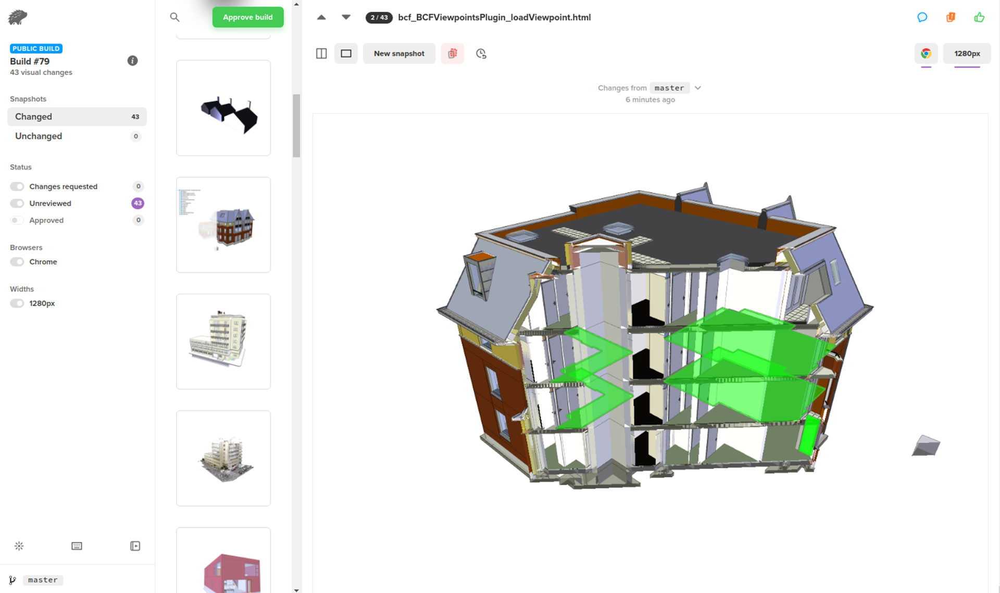

## Introduction

With xeokit supported in most major browsers, it's impossible to maintain that support through manual testing. In this guide, we offer a quick look at how we use continuous integration and automated visual testing to ensure that xeokit continues to work as expected. This is just the bare beginnings of our test suite, which will become more sophisticated as we continue to build it up.

{/* truncate */}

## Percy

We use [Percy](https://percy.io/) for automated visual testing. Percy's visual test review workflow gives us confidence in xeokit, while at the same time reduces the time taken to review GitHub pull requests.

Each time somebody makes a pull request to one of our repositories, Percy will automatically run our suite of tests on their changes. Percy will then attach the test report to the request, and if any of the tests fail, Percy flags the PR as needing fixes before it can be merged.

Each of our tests is a single HTML page that contains a xeokit Viewer with a full-page canvas. The Viewer in each page is programmed to test a particular feature within xeokit and render the result to its canvas.

When running our tests, Percy will successively load each page into a headless browser, while saving a snapshot of each page to the test report. When snapshot images have changed since the last test run, Percy flags those changes for review.



*Percy enables us to integrate visual reviews into our daily workflows, to automate previously manual work. Visual testing is an essential part of maintaining the xeokit repositories with confidence.*


*We also use Percy to thoroughly test xeokit's native XKT model format and conversion tools.*

## Percy Setup for xeokit-sdk Repository

Let's take a look at how we've set up visual testing for the xeokit-sdk repository. The file tree below shows the general structure of this repository. We've added three things to support automated visual testing:

* `./tests` contains our visual test pages.

* `snapshots.js` is the Percy script that runs our test pages.

* `./assets` contains our test models and metadata, shared between the `examples` and `tests` directories.

We've also installed `percy/script` and `http-server` as npm dev dependencies in `package.json`.

```
xeokit-sdk
│
├── LICENSE.txt
├── README.md
├── CHANGE_LOG.md
├── src
├── docs
├── package.json
│
├── assets
│   ├── models
│   └── metaModels
│
├── examples
│   ├── annotations_clickFlyToPosition.html
│   ├── annotations_clickShowLabels.html
│   ├── annotations_createAtCenterOfClickedObject.html
│   ├── annotations_createWithMouse.html
│   └── ... (more)
│
├── snapshots.js
└── tests
    ├── loading_XKT.html
    ├── effects_logarithmicDepthBuffer_PerformanceModel_batching_RTC.html
    ├── effects_logarithmicDepthBuffer_PerformanceModel_instancing_RTC.html
    ├── effects_logarithmicDepthBuffer_sceneGraph_RTC.html
    └── ... (more)
```


## A Percy test Page

The snippet below shows one of our test pages within the xeokit-sdk repository. This page is called `loading_XKT.html` and lives in the `./tests` directory at the root of the repository.

Our example test page sets up a xeokit viewer, loads a BIM model into it, then calls `signalTestComplete` to notify the Percy test runner that it's ready to have its snapshot taken. That function is a little helper we created, that inserts a dummy element into the DOM, which the test runner detects.

```html
<!doctype html>
<html lang="en">
<head>
    <meta charset="utf-8">
    <title>xeokit-sdk Visual Test</title>
    <link href="./css/pageStyle.css" type="text/css" rel="stylesheet"/>
</head>
<body>
<canvas id="myCanvas"></canvas>
</body>
<script type="module">

    import {Viewer} from "../src/viewer/Viewer.js";
    import {XKTLoaderPlugin} from
        "../src/plugins/XKTLoaderPlugin/XKTLoaderPlugin.js";
    import {signalTestComplete} from "./lib/utils.js";

    const viewer = new Viewer({
        canvasId: "myCanvas",
        transparent: true
    });

    viewer.camera.eye = [-3.933, 2.855, 27.018];
    viewer.camera.look = [4.400, 3.724, 8.899];
    viewer.camera.up = [-0.018, 0.999, 0.039];

    const xktLoader = new XKTLoaderPlugin(viewer);

    const model = xktLoader.load({
        id: "myModel",
        src: "./../assets/models/xkt/duplex/duplex.xkt",
        metaModelSrc: "./../assets/metaModels/duplex/metaModel.json",
        edges: true
    });

    model.on("loaded", () => {
        signalTestComplete();
    });

</script>
</html>
```

## Percy Test Runner Script

Shown below is the repository's test runner script `./snapshot.js`, which lives at the root of the repository. Percy will execute this script to run our tests.

Those `testPage` calls will process our test pages. Notice our example test page in that sequence, which we've truncated here for brevity. As the script processes each page, it loads the page into Percy's headless browser, then saves a snapshot of the page to the test report.

```js
const PercyScript = require('@percy/script');
const httpServer = require('http-server');

PercyScript.run(async (page, percySnapshot) => {

    async function testPage(pageName) {
        await page.goto('http://localhost:8080/tests/' + pageName);
        await page.waitFor(() => !!document.querySelector('#percyLoaded'));
        await percySnapshot(pageName, {
            widths: [1280]
        });
    }

    let server = httpServer.createServer();

    server.listen(8080);

    console.log(`Server started`);

    // ...more tests

    await testPage('loading_XKT.html');
    await testPage('loading_XKT_pointCloud.html');
    await testPage('loading_XKT_doublePrecision.html');
    await testPage('loading_XKT_dataSource.html');

    // ...more tests

    server.close();
});
```

## Running the Tests Manually

With the xeokit-sdk repository integrated with [percy.io](https://percy.io), and having installed percy/script and http-server as npm dev dependencies, we can run its visual test suite from the console. Only project admins can do that though, since they'll need the authorization token from [percy.io](https://percy.io).

```bash
export PERCY_TOKEN=<our percy token>
npm run test

> percy exec -- node ./snapshots.js
[percy] created build #78: https://percy.io/73524691/xeokit-sdk/builds/9797656
[percy] percy has started.
Server started
[percy] snapshot taken: 'sceneRepresentation_PerformanceModel_batching_triangles.html'
[percy] snapshot taken: 'sceneRepresentation_PerformanceModel_batching_geometries.html'
[percy] snapshot taken: 'sceneRepresentation_PerformanceModel_batching_RTC_triangles.html'
//...
[percy] stopping percy...
[percy] waiting for 43 snapshots to complete...
[percy] done.
[percy] finalized build #79: https://percy.io/73524691/xeokit-sdk/builds/9797715
```
