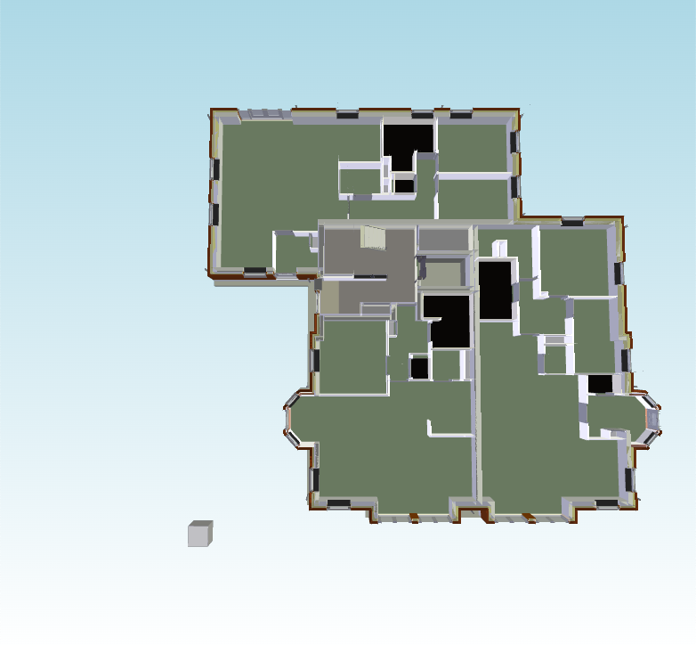
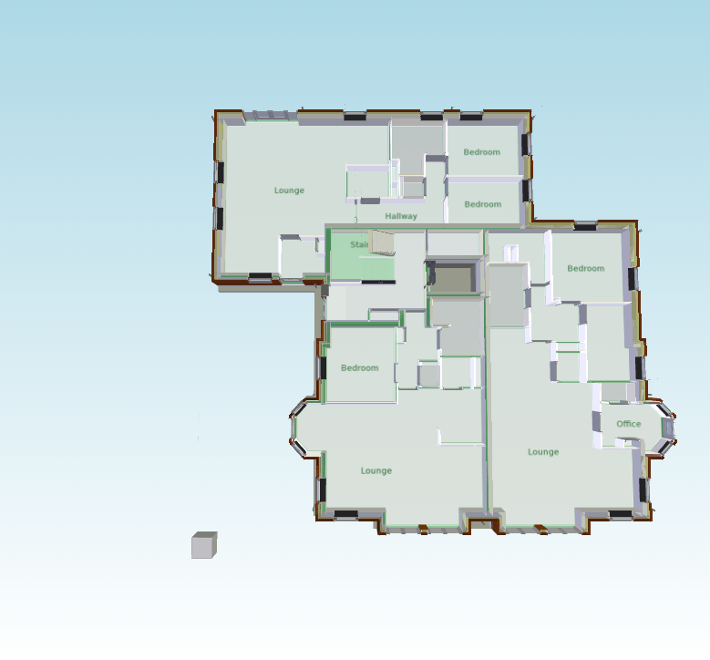

# 2D Overlay

One of a commonly used features of a BIM viewer is displaying a 2D overlay (e.g. a floor plan) within the 3D model.
This article demonstrates how such an overlay can be implemented with [xeokit](https://xeokit.io), by using general purpose abstractions provided by the SDK.

- [1\. Scene setup](#1-scene-setup)
- [2\. Overlay image loading](#2-overlay-image-loading)
- [3\. Overlay mesh creation](#3-overlay-mesh-creation)
- [4\. Floor plan adjustment](#4-floor-plan-adjustment)
- [5\. Complete example](#5-complete-example)
- [6\. Interactive Overlay fitting (advanced)](#6-interactive-overlay-fitting-advanced)

{/* truncate */}

## 1\. Scene setup

The example starts with a minimalist scene that loads the `Schependomlaan.ifc.xkt` model, and places a `SectionPlane` that cuts through the first floor at the height of 1 unit:

```js
<!doctype html>
<html>
  <body style="overflow-y: hidden; overflow-x: hidden; margin: 0; width: 100%; height: 100%;">
    <canvas id="myCanvas" style="position: absolute; width: 100%; height: 100%; background-image: linear-gradient(lightblue, white);"></canvas>
  </body>
  <script type="module">

import { SectionPlanesPlugin, Viewer, XKTLoaderPlugin } from "https://cdn.jsdelivr.net/npm/@xeokit/xeokit-sdk/dist/xeokit-sdk.es.min.js";

const viewer = new Viewer({ canvasId: "myCanvas" });

viewer.camera.eye  = [7, 30,  -8];
viewer.camera.look = [7,  0, -10];
viewer.camera.up   = [0,  1,   0];

new XKTLoaderPlugin(viewer).load({ src: "../../assets/models/xkt/v8/ifc/Schependomlaan.ifc.xkt" });

new SectionPlanesPlugin(viewer, { overviewVisible: false }).createSectionPlane({ pos: [0, 1, 0], dir: [0, -1, 0] });

// ...

  </script>
</html>

```


The model renders as follows:



## 2\. Overlay image loading

The 2D overlay will display a floor plan from the `schependomlaanPlanView.png` image.
The image is loaded before it's used as a texture:

```js
// ...

import { buildPlaneGeometry, math, Mesh, PhongMaterial, ReadableGeometry, Texture } from "https://cdn.jsdelivr.net/npm/@xeokit/xeokit-sdk/dist/xeokit-sdk.es.min.js";

const image = new Image();
image.src = "../../assets/images/schependomlaanPlanView.png";
image.onload = function() {
    // Create the floor plan Texture
    const scene = viewer.scene;
    const planTexture = new Texture(scene, { image: image });

    // ...
};
```

## 3\. Overlay mesh creation

The overlay is created by combining a `Mesh`, a plane geometry, and a `PhongMaterial`:

```js
// ...
image.onload = function() {
    // Create the floor plan Texture
    // ...

    // Create the floor plan Mesh
    const planMesh = new Mesh(scene, {
        pickable: false,
        geometry: new ReadableGeometry(scene, buildPlaneGeometry()),
        material: new PhongMaterial(scene, {
            alpha: 0.75,
            diffuse:  [0, 0, 0],
            diffuseMap:  planTexture,
            emissiveMap: planTexture,
            backfaces: true
        })
    });

    // ...
};
```

Unless the floor plan mesh is to be interacted with, it's advised to use the `pickable: false` flag, to avoid the mesh interfering with the `Scene::Pick` method calls.

The specific `Material` settings are highly application-specific, and it's encouraged for the SDK users to experiment with them.
One of the parameters that's advised to be used though is `backfaces: true`, which will make the floor plan visible from both the front and back side.

## 4\. Floor plan adjustment

Finally, the floor plan mesh is positioned and scaled to match the model's layout.
The overlay is placed at the height of 0.1 unit, which is slightly above the first floor level.
The value of the scale, as well as the X and Z coordinates, has been determined empirically to fit the model in the example.

```js
// ...
image.onload = function() {
    // Create the floor plan Texture
    // ...

    // Create the floor plan Mesh
    // ...

    // Scale and position the Mesh
    const planHeight = 0.1
    const planPosition = [ 10.946, planHeight, -10.343 ];
    const planScale = 22.66;
    const t = math.translationMat4v(planPosition);
    // Preserve image's aspect ratio when scaling
    const s = math.scalingMat4v([planScale * image.width / image.height, 1, planScale]);
    planMesh.matrix = math.mulMat4(t, s, math.mat4());
};
```


The floor plan adjusted to the model looks as below:



## 5\. Complete example

The complete example is presented below:

```js
<!doctype html>
<html>
  <body style="overflow-y: hidden; overflow-x: hidden; margin: 0; width: 100%; height: 100%;">
    <canvas id="myCanvas" style="position: absolute; width: 100%; height: 100%; background-image: linear-gradient(lightblue, white);"></canvas>
  </body>
  <script type="module">

import { SectionPlanesPlugin, Viewer, XKTLoaderPlugin } from "https://cdn.jsdelivr.net/npm/@xeokit/xeokit-sdk/dist/xeokit-sdk.es.min.js";

const viewer = new Viewer({ canvasId: "myCanvas" });

viewer.camera.eye  = [7, 30,  -8];
viewer.camera.look = [7,  0, -10];
viewer.camera.up   = [0,  1,   0];

new XKTLoaderPlugin(viewer).load({ src: "../../assets/models/xkt/v8/ifc/Schependomlaan.ifc.xkt" });

new SectionPlanesPlugin(viewer, { overviewVisible: false }).createSectionPlane({ pos: [0, 1, 0], dir: [0, -1, 0] });

import { buildPlaneGeometry, math, Mesh, PhongMaterial, ReadableGeometry, Texture } from "https://cdn.jsdelivr.net/npm/@xeokit/xeokit-sdk/dist/xeokit-sdk.es.min.js";

const image = new Image();
image.src = "../../assets/images/schependomlaanPlanView.png";
image.onload = function() {
    // Create the floor plan Texture
    const scene = viewer.scene;
    const planTexture = new Texture(scene, { image: image });

    // Create the floor plan Mesh
    const planMesh = new Mesh(scene, {
        pickable: false,
        geometry: new ReadableGeometry(scene, buildPlaneGeometry()),
        material: new PhongMaterial(scene, {
            alpha: 0.75,
            diffuse:  [0, 0, 0],
            diffuseMap:  planTexture,
            emissiveMap: planTexture,
            backfaces: true
        })
    });

    // Scale and position the Mesh
    const planHeight = 0.1
    const planPosition = [ 10.946, planHeight, -10.343 ];
    const planScale = 22.66;
    const t = math.translationMat4v(planPosition);
    // Preserve image's aspect ratio when scaling
    const s = math.scalingMat4v([planScale * image.width / image.height, 1, planScale]);
    planMesh.matrix = math.mulMat4(t, s, math.mat4());
};

  </script>
</html>
```

<iframe width="100%" height="400" border="0" src="https://xeokit.github.io/xeokit-sdk/examples/overlay/floorPlan_example.html"></iframe>

> [Run this example](https://xeokit.github.io/xeokit-sdk/examples/overlay/#floorPlan_example)

## 6\. Interactive Overlay fitting (advanced)

The workflow presented above places a 2D overlay inside a 3D scene with a known transformation (a translation and a scale in this case).

Another common scenario might be a feature that lets end user to instantiate an overlay in a scene, and then to fit it interactively to a model.
There are many possible ways such an interaction could be achieved, relying on end user's input devices.
Ultimately the specifics of the interaction that match application's UX need to be determined by the viewer code outside of the SDK.
xeokit SDK’s repository provides an example of a "fitting" interaction, that's presented at [https://xeokit.github.io/xeokit-sdk/examples/scenegraph/#floorPlan\_mouseEdit](https://xeokit.github.io/xeokit-sdk/examples/scenegraph/#floorPlan_mouseEdit).

The interaction uses mouse input in a sequence of steps:

1. A cyan colored dot needs to be placed over the 2D overlay.
2. After the left mouse button is clicked, the overlay will start following the mouse cursor, anchored at the location the overlay was clicked at.
3. Next mouse click will fix the overlay to a translated position.
4. Another yellow dot needs to be placed over another part of the overlay.
5. After the mouse button is clicked, the overlay will start rotating and scaling up or down along with the the mouse cursor.
5a. If the `Ctrl` key is pressed while rotating and scaling the overlay with a mouse, the rotation gets locked to 9° steps, which might be helpful in preserving overlay’s current rotation.
6. Final mouse click will "settle" the overlay with its current translation and scale.

This demonstrative interaction is implemented as the `setupOverlayAlignmentControl` function at [https://github.com/xeokit/xeokit-sdk/blob/master/examples/scenegraph/overlay.js](https://github.com/xeokit/xeokit-sdk/blob/master/examples/scenegraph/overlay.js).

The code that employs the function is as follows:

```js
// ...
import { setupOverlayAlignmentControl } from "./overlay.js";
image.onload = function() {
    // Create the floor plan Texture
    // ...

    // Create the floor plan Mesh
    // ...

    // Scale and position the Mesh
    // ...

    // Use the illustrative alignment control to put the overlay in the desired place
    const overlayCtrl = setupOverlayAlignmentControl(viewer, planMesh);
    window.document.addEventListener("keydown", e => overlayCtrl.setStepRotation(e.shiftKey));
    window.document.addEventListener("keyup",   e => overlayCtrl.setStepRotation(e.shiftKey));
};
```


> [Run this example](https://xeokit.github.io/xeokit-sdk/examples/overlay/#floorPlan_mouseEdit)

**IMPORTANT:**
It’s important to understand that this particular “fitting” interaction has been provided as an example or a guideline for viewer programmers on how to implement such a feature on top of the xeokit SDK.
Rather than relying on the function's particular location and implementation, users are encouraged to copy its code to their own viewers, and adjust according to their specific UX requirements.
