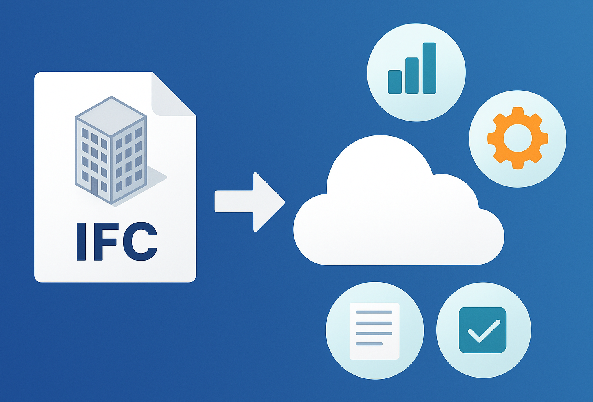
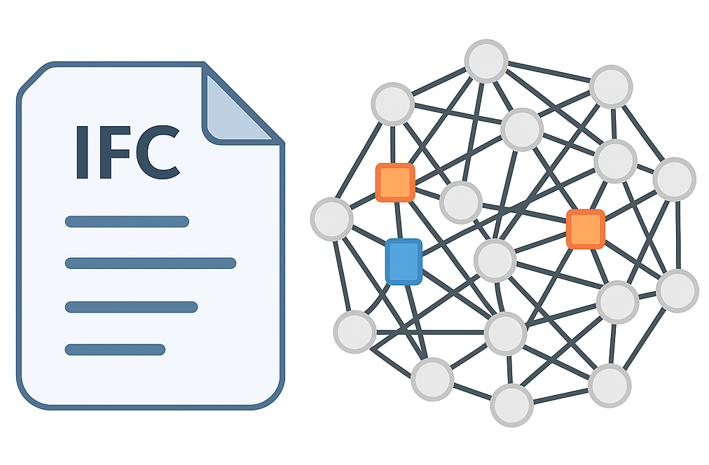
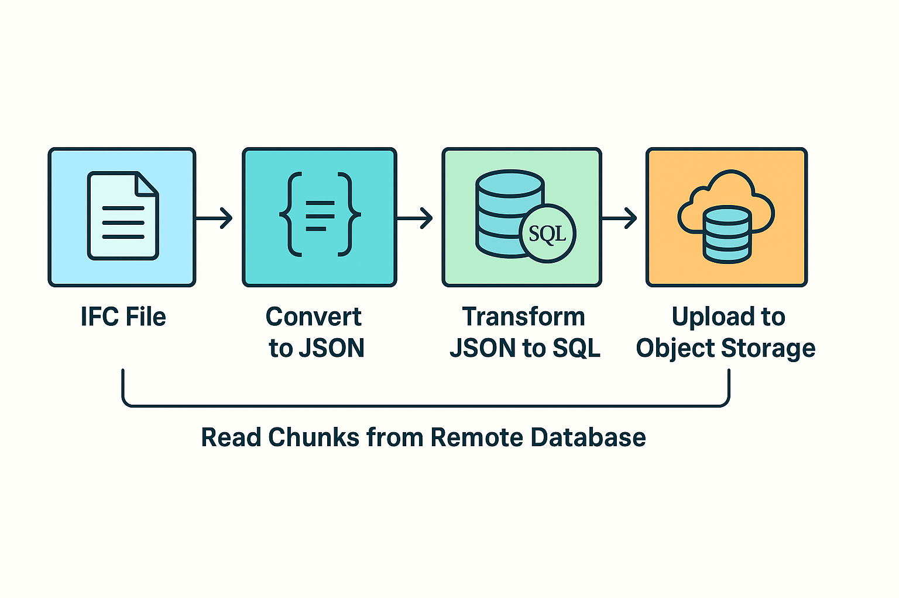
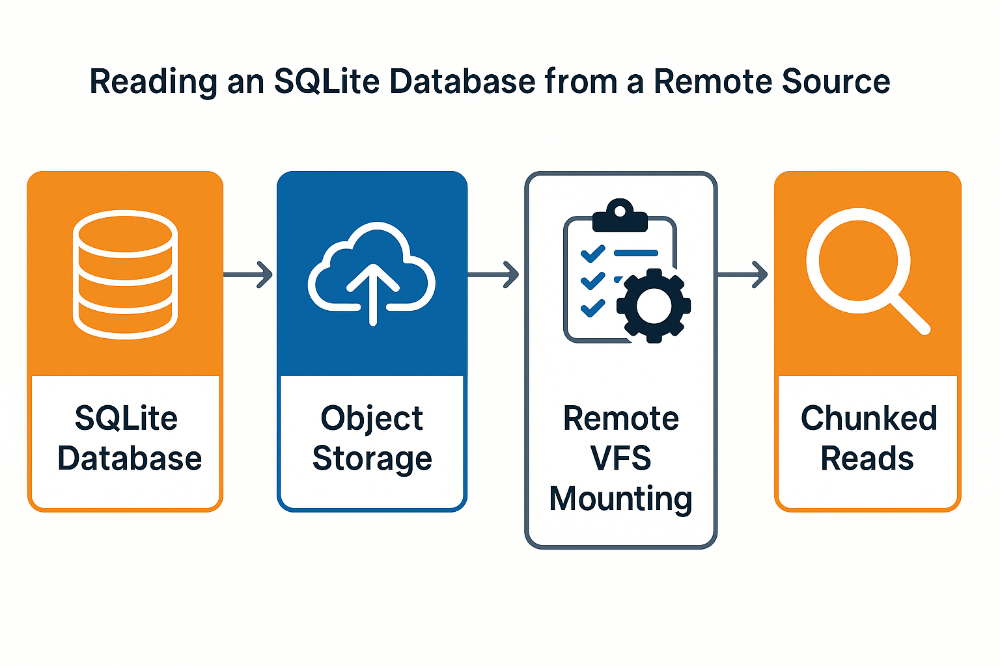
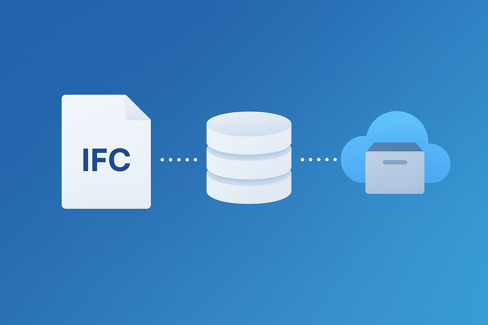

# Loading property sets on demand in xeoVision: flexible handling of IFC metadata

**🔎 How to search IFC metadata without downloading gigabytes of data?**

At xeoVision, we’ve developed an innovative approach to **on-demand property set loading**.  
👉 Extracting metadata to JSON  
👉 Converting it into lightweight SQLite databases  
👉 Remotely reading data _chunk by chunk_ from object storage

This allows even very large IFC models to be searched quickly, efficiently, and without heavy network loads.

📖 In the article, I explain the entire process — from cxconverter to remote VFS and data transfer optimization.
<!-- truncate -->

## What are IFC files and their metadata?

The IFC (Industry Foundation Classes) format is a standard method of data exchange in the construction industry (AEC – Architecture, Engineering, Construction). IFC files store not only the geometry of 3D models but also metadata, such as material properties, classifications, information about installation elements, or schedules.

This metadata is organized into so-called property sets (Psets). These are collections of properties that describe building objects — for example, for a door, it might include: manufacturer, insulation coefficient, dimensions, etc.

**Why is this important?**
Metadata enables advanced analysis, search, and reporting without the need to render the entire 3D model.

On our [platform](https://xeo.vision) we use [xeokit-sdk](https://github.com/xeokit/xeokit-sdk) to display and manage BIM models including IFC files. Check [xeokit.io](https://xeokit.io/) for more information. We also use [cxconverter](https://github.com/Creoox/creoox-ifc2gltfcxconverter) tool which is managed and licensed by [Creoox](https://creoox.com).

## Why is searching metadata files difficult?

Although IFC files contain rich metadata describing the properties of objects, searching through them is a complex and inefficient process. The data is scattered throughout the file and linked by complicated relationships that require tracking multiple dependencies, even for simple queries. IFC does not offer native indexing, so each search requires analyzing large portions of the file. For models sized in the hundreds of megabytes or even gigabytes, this leads to significant memory and CPU load.

An additional challenge is the modern way of working — project teams often work remotely and need instant access to data without downloading entire models. In such conditions, traditional methods that rely on fully loading IFC files for every search operation are impractical and result in significant performance limitations.

## Metadata extraction from an IFC file and conversion to SQL

IFC files contain not only the geometry of 3D objects but also vast amounts of descriptive data — from basic attributes, such as dimensions, to detailed information about materials, physical properties, and relationships between objects. However, this data in the IFC format is recorded in a complex manner that is not well-suited for fast searching. The structure of IFC resembles more a graph of relationships than a classic database: information is scattered, often nested, and requires multi-step unfolding of relationships between entities.

**That’s why the first step of our pipeline was to create an efficient method for extracting metadata from IFC.**

### Extraction to JSON

At [xeoVision](https://xeo.vision), we developed the [cxconverter](https://github.com/Creoox/creoox-ifc2gltfcxconverter) tool, which analyzes the IFC file and extracts metadata in JSON format. This stage includes:

* Identifying property sets (Psets) assigned to objects.
* Expanding relationships (e.g., which Psets are assigned to which objects, which attributes are direct and which are inherited).
* Converting the IFC graph structure into a more linear, easier-to-process JSON format.

### JSON to SQL (SQLite) conversion

While JSON is convenient for storing raw data, it is not effective for searching large datasets, especially when it comes to complex conditional queries or JOIN operations. Therefore, the next step was **transforming the JSON data into an SQL database** — specifically **SQLite**.

**Advantages of SQLite for this use case:**

- **Self-contained file** – the entire database is a single file, easy to transfer and version.
- **Lightweight** – no need to maintain a database server.
- **Indexing** – the ability to create indexes for the most frequently searched fields (e.g., object IDs, property set names).
- **High read performance** – SQLite is optimized for data reading, which perfectly suits the "load on demand" scenario.

**The conversion process includes:**

1. **Mapping JSON fields to SQL tables** – e.g., IFC objects → `elements` table, property sets → `properties` table, relationships → `relations` table.
2. **Creating indexes** for key columns to speed up queries.
3. **Optimizing the database schema** to meet the needs of metadata searching and filtering operations.

## Reading an SQLite Database from a Remote Source

After converting the metadata into an SQLite database, a new challenge arises: **how to enable fast and efficient access to the data without downloading the entire database file?** In a project team environment, where bandwidth may be limited or operations take place in the cloud, downloading files that are hundreds of megabytes in size each time is impractical. That’s why at [xeoVision](https://xeo.vision) we developed a system that allows for **on-demand data loading**, according to the actual needs of the user or application.

Our approach includes several key mechanisms:

### Storing the SQLite database in object storage

Each SQLite database associated with a given IFC model is stored in object storage — in our case, Exoscale. This approach provides:

- **No need to maintain dedicated file servers or database servers.**
- Object storage offers scalability, high availability, and relatively low data storage costs.
- Files can be easily versioned and shared among different clients or teams.
    
### Remote VFS mounting

To enable data access without fully downloading the database, we use a **Virtual File System (VFS)**. This solution allows applications to open and search the SQLite database as if it were local, while in reality only selected portions of the file are read.

**VFS benefits:**

- Works transparently for applications — no changes required in how SQL queries are executed.
- Allows dynamic data retrieval during application runtime, significantly speeding up operations.
- Reduces transfer costs and network latency, since only the necessary parts of the file are downloaded.
    
### Using `pragma_size` and chunked reading

A key improvement is the use of **pragma_size**, which enables control over the size of data blocks (chunks) retrieved from object storage. As a result:

- When executing an SQL query, the client retrieves **only those parts of the database that contain the requested information**.
- The total volume of data transferred over the network is reduced, which is critical when working with large models or under limited bandwidth conditions.
- The system intelligently caches fetched blocks, minimizing the number of requests to remote storage during subsequent operations.
    
### Advantages of the "on-demand" approach

In summary, the on-demand metadata reading mechanism provides:

- **Minimized data transfer** — users never download more than they need.
- **Fast access to object properties** without time-consuming downloading and loading of entire databases. 
- **Scalability** — regardless of the size of the IFC file or the number of models handled by the system.
- **Flexibility** — the solution works equally well for small teams and large organizations working in distributed environments.
    
As a result, users can smoothly search model properties, even when the models contain hundreds of thousands of objects and gigabytes of data, without worrying about performance or infrastructure overload.

## Why not store metadata in a single unified database on a remote server?

At first glance, a centralized SQL database seems like an attractive solution — one database, a single source of truth, and easy global queries. However, in practice, significant limitations quickly emerge. Each additional IFC model greatly increases the size of the database, leading to slower search operations and making it difficult to maintain efficient indexes. Managing permissions and versioning data in a central database becomes increasingly complex. Importantly, the lack of data isolation means that any change or failure can affect all projects using the system — a serious risk in large organizations or shared environments.

Centralization also leads to higher scaling and data transfer costs. Every query generates network traffic regardless of the user’s actual needs, and moving or archiving data for individual models becomes complicated and time-consuming.

Instead, we chose a decentralized approach: each model has its own lightweight SQLite database stored in object storage. This solution ensures full data isolation, simplifies versioning, and allows flexible migration and archiving of individual models. Combined with the ability to read data on demand and download only the necessary fragments, this eliminates the typical problems of centralized databases while increasing the system’s performance and scalability.

## Summary

In summary, managing and searching metadata in large IFC files requires modern solutions that go beyond traditional approaches based on fully loading data or centralized SQL databases. At [xeoVision](https://xeo.vision), we have developed a flexible and scalable pipeline that enables the extraction of metadata into JSON format, conversion into a lightweight SQLite database, and storage of that database in object storage. This makes the data easy to version, transfer, and isolate for each model individually.

A key element of our architecture is the ability to read data "on demand" using remote VFS mounting and a mechanism for retrieving only the necessary fragments of the database. This solution significantly reduces data transfer and eliminates problems associated with large IFC file sizes. Users can quickly search metadata without the need to download entire databases, improving performance and user experience even in distributed environments with limited network access. This enables smooth work with very large BIM datasets while maintaining flexibility and control over the data lifecycle.

Working application can be found at [https://xeo.vision](https://xeo.vision/). If you have any questions or suggestions, please feel free to contact [Creoox](https://creoox.com) or me directly. I would be happy to share more information about this project and its practical applications.