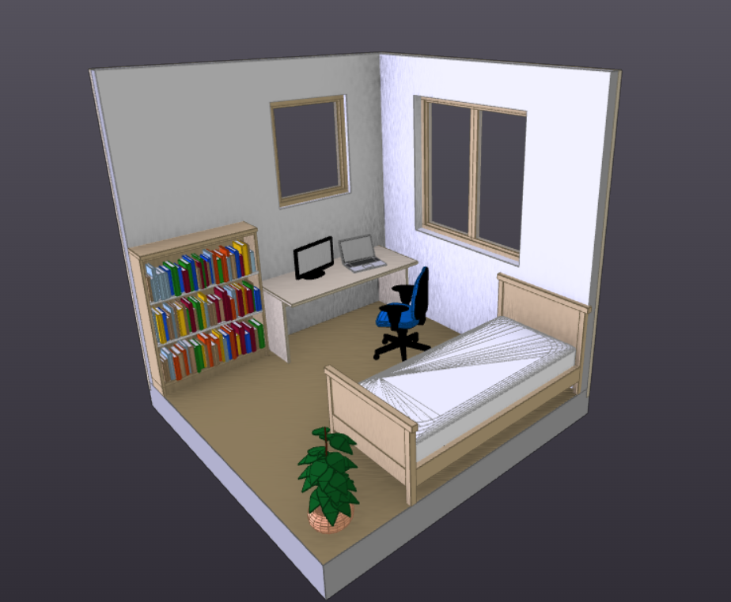
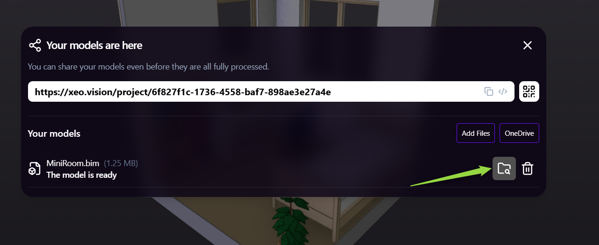

# Model transfer with dotbim + xeo.vision

## Introduction

**dotbim** is a minimalist file format for BIM. It was created to simplify the description of BIM models as much as possible. Thanks to open-source community many different connectors and apps started to support this file format. You will find the whole list of supporting apps here: https://github.com/paireks/dotbim?tab=readme-ov-file#apps-supporting-bim

**xeo.vision** is an online 3D BIM Viewer. Once you drag & drop your model into xeo.vision it will display it, but also it will instantly make it possible to share this model via link or by QR code. Once you shared the model with your friend, he will be able to not only see it, but also to download it into their own computer. xeo.vision already supports .bim files, but also .ifc, .glb, .xkt, .las/.laz, .obj, .stl.

This combination makes it possible to share your geometry + metadata with your colleagues as simple as possible.

Let's take a look on the examples below.

<!-- truncate -->

## Rhino/Grasshopper into xeo.vision

In this example we create some simple geometry + metadata model from scratch in Grasshopper & export it into .bim. Later we will share this model in xeo.vision.

Here is the simple GH scripts which creates some bricks. You can find this GH definition here: https://github.com/paireks/dotbimGH/blob/master/TestsInsideGH/BricksRotated.gh

This definition is using opensource dotbimGH plugin, which allows you to create your .bim file. You can find this plugin available on the food4rhino here: https://www.food4rhino.com/en/app/dotbimgh

Once we exported the .bim file, we drag & drop it to xeo.vision to upload it. Here is the result: https://xeo.vision/project/ab5a28f9-a95e-4ce1-8eb0-ea65bf6f968a

You can select on specific objects & browse the metadata.

For this simple metadata model is really simple: all elements are classified as Brick & each of them have 1 property which is "Z Level". It's all set here in Grasshopper:

## Archicad -> xeo.vision -> Blender

In this example we use Bimdots' Dotbim Importer-Exporter plugin to export .bim file from Archicad. This plugin is open-source & available right here: https://bimdots.com/product/dotbim-in-out/.

Once we exported .bim file & dropped it into xeo.vision it's already here: https://xeo.vision/project/6f827f1c-1736-4558-baf7-898ae3e27a4e

What you can do is you can share this link with someone else, so she or he can download this model on their own computer.

To do it you have to click here:

Once someone else downloads it he can import this file somewhere else. E.g. I imported this one to Blender using dotbim-blender addon from Nathan Hild, which is also open-source & available here: https://github.com/paireks/dotbim-blender

This way we exported geometry & metadata from Archicad, we shared it using xeo.vision and imported it inside Blender.

## Other connectors

All connectors are listed here: https://github.com/paireks/dotbim?tab=readme-ov-file#connectors---plugins-that-allow-to-export-andor-import-of-bim-files-to-other-software

So there are many different ways how you can transfer you .bim files using xeo.vision.

For instance take a look at this video:

<iframe width="560" height="315" src="https://www.youtube.com/embed/sybo0PeYWCU?si=uJEi62spK9tdF5AT" title="YouTube video player" frameborder="0" allow="accelerometer; autoplay; clipboard-write; encrypted-media; gyroscope; picture-in-picture; web-share" referrerpolicy="strict-origin-when-cross-origin" allowfullscreen></iframe>

This one comes from Grzegorz Olszewski who created dotbim-Tekla connector: https://github.com/LetsConstructIT/dotbim-Tekla

## Conclusion

This combination opens new possibilities regarding model sharing. It may also inspire you to find your own workflow useful to you!

For BIM app developers it may be also another argument for supporting .bim files. Once you create the export to .bim files you can store your geometry & data the way you want and later visualize it and share it via xeo.vision.
