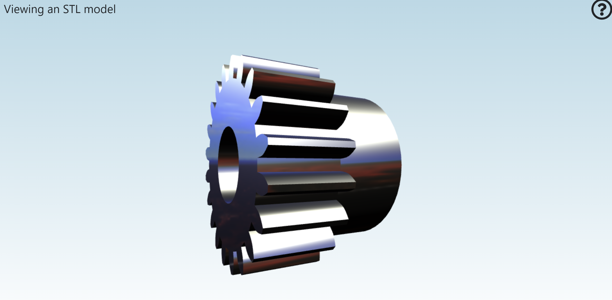
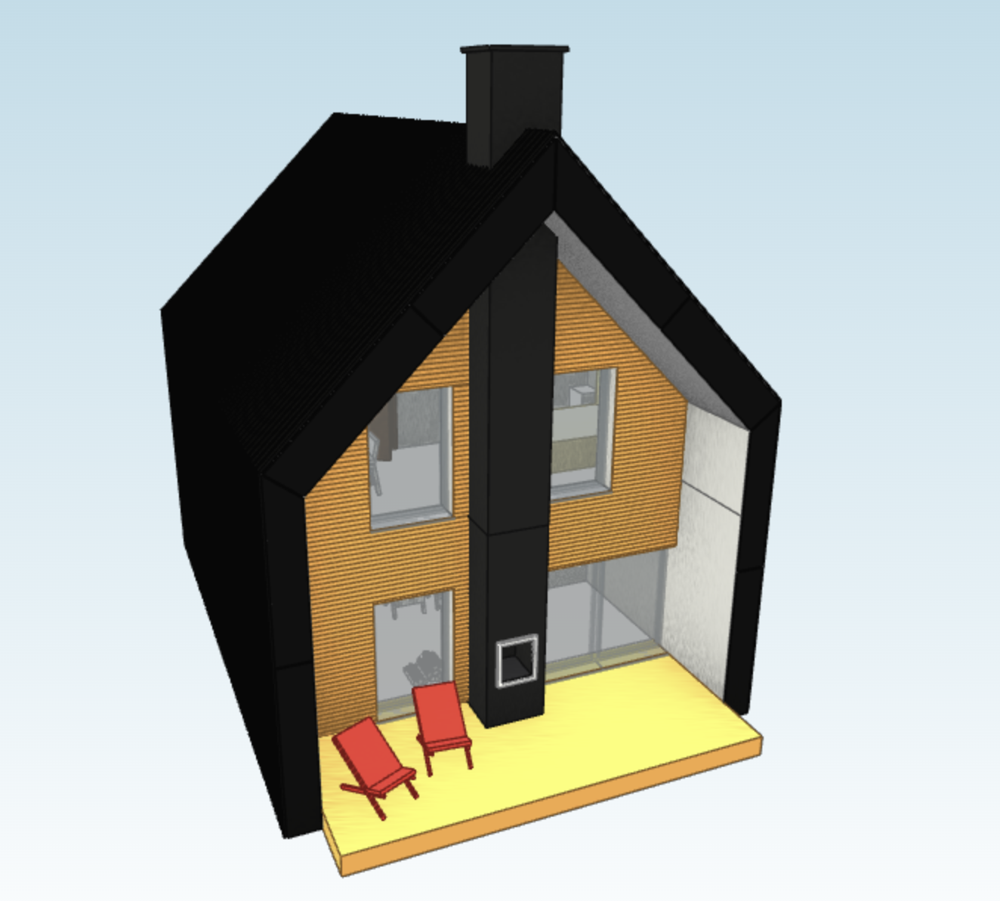
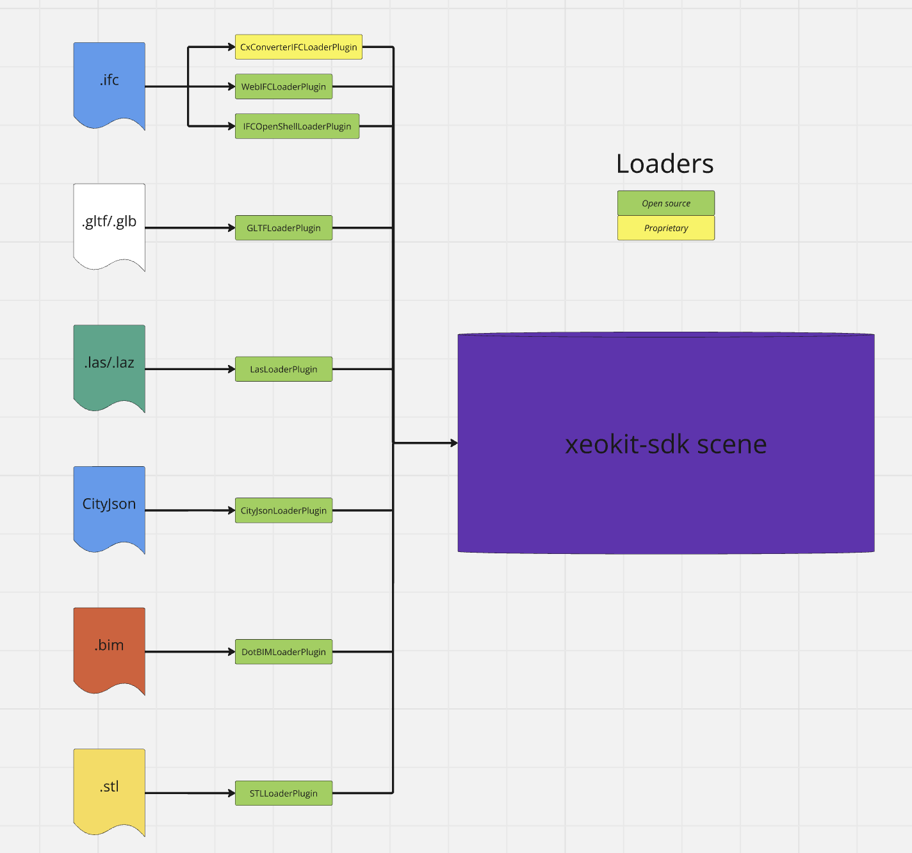
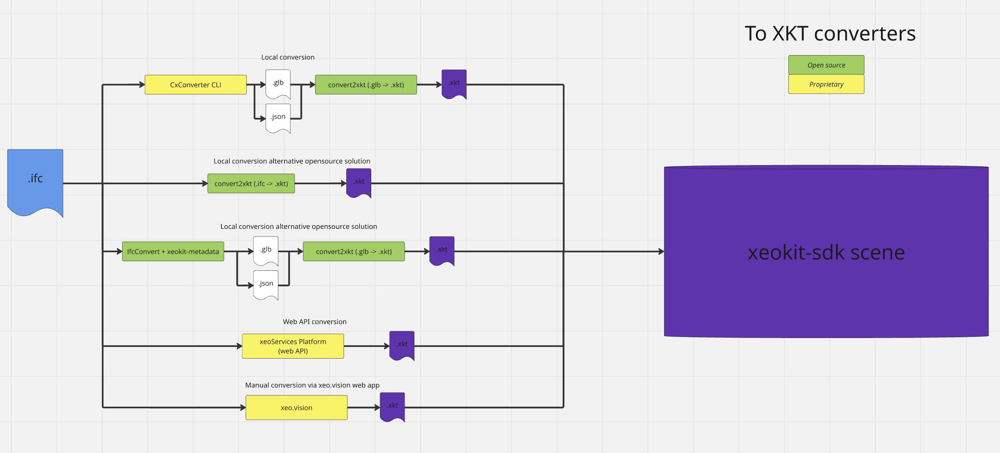
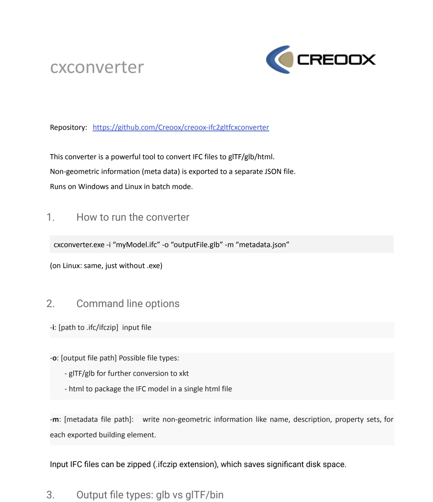
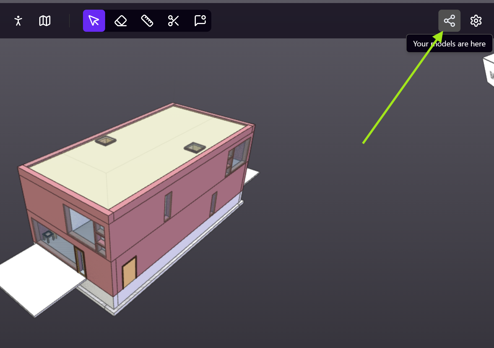
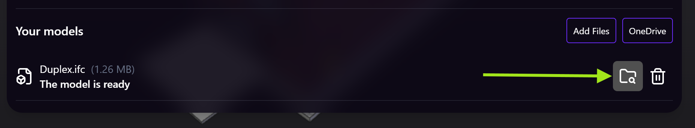
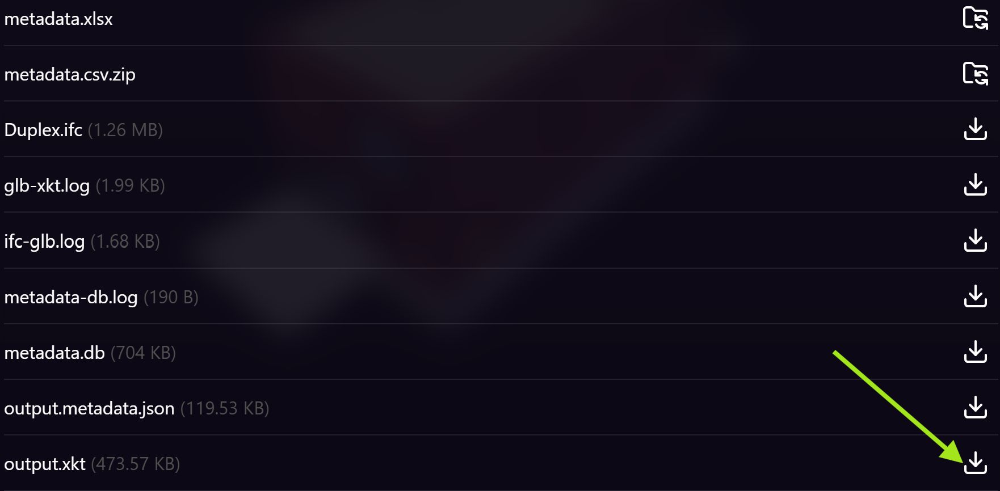

# Xeokit Loaders & Converters

## Introduction

To visualize the external 3D model inside the Xeokit, we have to convert it into Xeokit Scene Model.

There are various different conversion methods, some of them are fully open-source, some of them are proprietary. Some of them are super simple to use, while others are a bit more complex.

In this article I'd like to go through most of them, to make it easier to understand what are the possible options for now.
{/* truncate */}`

## Loaders

The simplest way from user perspective to load the external 3D model is to do it directly via loaders.

You can see all the loaders in this directory: https://github.com/xeokit/xeokit-sdk/tree/master/src/plugins.

For instance, there is an STLLoaderPlugin. With few lines of code:

```javascript
const stlLoader = new STLLoaderPlugin(viewer);

const sceneModel = stlLoader.load({
    id: "myModel",
    src: "../../assets/models/stl/binary/spurGear.stl",
    smoothNormals: true
});
```

you can directly load the STL model:



Or loading the .bim file using DotBIMLoaderPlugin:

```javascript
const dotBIMLoader = new DotBIMLoaderPlugin(viewer);

const sceneModel = dotBIMLoader.load({
	id: "myModel",
	src: "../../assets/models/dotbim/House.bim",
	saoEnabled: true, // optional, to enable SAO effects
	edges: true, // optional, to enable edges rendering
	rotation: [-90, 0, 0]
});
```



What loaders do is they translate the specific file format scene description into the Xeokit Scene Model description. Because of that loading time can be a bit longer, depending on various different factors, such as the complexity of the external format itself, size of the model, or the quality of the loader itself.



## Conversion to XKT

### IFC to XKT

XKT is the native file format of xeokit SDK. Its goal is to enable rapid loading of large BIM datasets in browsers. That's why we recommend to pre-convert large files into XKT and then load them into he xeokit-sdk scene.

With IFC alone we have multiple ways how to convert it into XKT file:



### CxConverter + convert2xkt (xeokit-convert)

Our recommended way is to do it via CxConverter. You can try CxConverter yourself by downloading it from here: https://github.com/Creoox/creoox-ifc2gltfcxconverter

To run the CxConverter:

```cmd
cxconverter.exe -i "myModel.ifc" -o "outputFile.glb" -m "metadata.json"
```

(without the ".exe" for Linux).

You can find more information about the conversion options inside the document attached to CxConverter release called "cxconverter.pdf":



Then you can use the xeokit-convert (https://github.com/xeokit/xeokit-convert) to convert it into XKT:

```cmd
node convert2xkt.js -s outputFile.glb -o outputFile.xkt -l
```

Once you have the XKT file you can load it using XKTLoaderPlugin:


### xeoServices & xeo.vision

xeoServices provides a set of functionalities for working with different 3D/BIM formats (including IFC) over the convenient REST API. One of the features is ability to convert IFC into XKT. You can learn more about xeoServices here: https://docs.xeo.vision/guide/what-is-xeovision.html.

xeo.vision (https://xeo.vision/) on the other hand is a full BIM viewer application built on the top of xeokit and CxConverter. You can also convert the IFC files into XKTs inside the xeo.vision manually, e.g. for experiments.

Once you upload the model into xeo.vision, click the button on the top-right corner:



Then click here to find all files:



And then here to download the XKT file:



### ifcConvert + xeokit-metadata

Some time ago there was created yet another way of conversion, which is fully open-source. It requires usage of ifcConvert (https://docs.ifcopenshell.org/ifcconvert.html) to convert geometries into GLB file and xeokit-metadata (https://github.com/bimspot/xeokit-metadata) to convert metadata into JSON file. After that you could convert it using xeokit-convert (https://github.com/xeokit/xeokit-convert) into XKT file.

### What about other formats to XKT?

xeokit-convert (https://github.com/xeokit/xeokit-convert) can convert also other file formats into the XKT. But depending on the size of the format, the format itself, sometimes it's not worth converting and you will be good with direct loaders instead. The rule of thumb is that if the model is small, then you can try if using the loader is enough first.

## Summary

You can load different file formats into the Xeokit using loaders and/or by converting into XKT. For huge models we recommend converting it into XKT file using one of the mentioned pipelines. For IFC into XKT conversion we recommend using CxConverter + convert2xkt.
