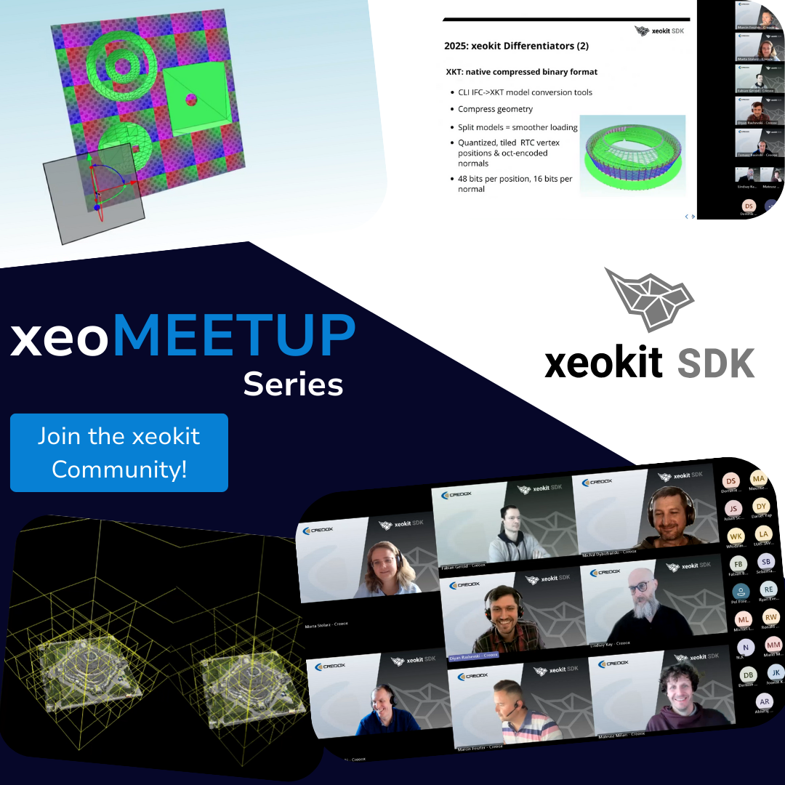

# xeoMeetup: Connecting the xeokit Community

**xeoMeetup** is our live event series where web-based 3D rendering meets real-world AECO engineering challenges.

{/* truncate */}

## What is xeoMeetup about?

xeoMeetup exists for one main reason: **to stay closely connected with the xeokit community**.

As xeokit evolves, we want a space where we can share updates directly and hear your thoughts in return. It’s about having real conversations around browser-based 3D, point clouds, BIM workflows, performance, and practical applications.

Whether you’re developing with xeokit, integrating it into workflows, conducting research, or learning how web-based 3D works — xeoMeetup is a place to connect, exchange ideas, and get inspired by real-world solutions.

We use these sessions to:
* Share recent developments and explain our technical approaches
* Collect your feedback and answer questions live
* Spark discussions that move the ecosystem forward

And just as importantly, to **showcase xeokit in action**.

---

## Spotlight: xeokit in action

xeoMeetup is a platform for sharing practical experience. In our **Spotlight** editions, members of the community present production applications built with xeokit. These sessions offer insight into practical implementation challenges, architectural decisions, and lessons learned along the way.

Check out our first Spotlight edition here: [Watch on YouTube](https://youtu.be/-R_pFgKva1k?si=OB3me_3lPwYbdy9m)

**Built something with xeokit?**

If you’re working on a project that uses xeokit — whether it’s a production system or a research initiative — we’d love to hear from you.

Let’s put your project in the Spotlight! [**Become Part of xeoMeetup**](https://2fvgt6.share-eu1.hsforms.com/2HsuOZsxASLS2xaQNtMSt9Q).

--

## Why join us live?

Watching a recording is useful — but being there live is different. When you join xeoMeetup live, you can:

* **Be part of the discussion:** Your questions and feedback help shape what we explore in future sessions.
* **Meet the xeokit team:** Connect with the people behind the code, including xeokit’s original author, Lindsay Kay, and gain insights straight from the source.
* **Learn from real implementations:** In Spotlight editions, you hear firsthand how xeokit is used in production environments.

It’s about dialogue, practical experience, and shared progress.

---

## Catch up with previous sessions

All our sessions are recorded and available to the community. You can explore them anytime.

▶️ Visit and subscribe to our [YouTube channel](https://youtube.com/playlist?list=PLxit5dQCqPXMpZWxWBbe_wkO8vVv51q0E&si=ERZx9FLq0OepYVHc) for the full archive.

---

## Don't miss the next xeoMeetup

Want to stay in the loop and receive automatic invitations to upcoming live xeoMeetup events?

[**Join the xeoMeetup Invite List!**](https://forms.office.com/e/emBZer74PF)

We’ll only use your email to send xeoMeetup invitations. You can unsubscribe at any time.

 

**See you at the next xeoMeetup!** 👋