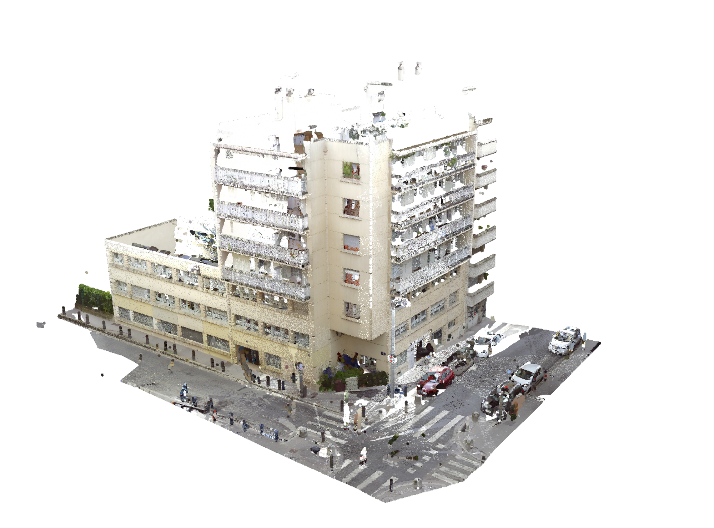

# Viewing a glTF Point Cloud with XKTLoaderPlugin

- [Introduction](#introduction)
- [1\. Install convert2xkt](#1-install-convert2xkt)
- [2\. Convert glTF to XKT](#2-convert-gltf-to-xkt)
- [3\. View the XKT in the Browser](#3-view-the-xkt-in-the-browser)

# Introduction

In this mini-tutorial, we'll use xeokit's `convert2xkt` CLI tool to convert a point cloud model from LAS/LAZ into xeokit's native XKT geometry format, which we'll then view in the browser using a xeokit Viewer.

The XKT format compresses models into a compact payload from which xeokit can load large numbers of objects over the Web in seconds, at full geometric precision.

For our glTF file, we'll use a point cloud capture of an apartment in Lyon, France, which was provided by [BIMData](https://bimdata.io). When that's converted and loaded, it will look like the example below. This model contains 2.6 million points, and xeokit can usually load it over a good Internet connection in around ~5 seconds.

> [!NOTE]
> [Run this example](https://xeokit.github.io/xeokit-sdk/examples/#loading_XKT_MAP_pointCloud)



# 1\. Install convert2xkt

Using git and npm, clone and install our `xeokit-convert` repository, which contains the `convert2xkt` tool that we'll use to convert our glTF into XKT.

Be sure to use the latest versions of both `xeokit-convert` and `xeokit-sdk`.

```
git clone https://github.com/xeokit/xeokit-convert.git
cd xeokit-convert
npm install
```

# 2\. Convert glTF to XKT

Now convert the glTF into an `XKT` file:

```
node convert2xkt.js -s MAP-pointcloud.gltf -o MAP-pointcloud.xkt -l

[convert2xkt] Reading input file: MAP-pointcloud.gltf
[convert2xkt] Input file size: 69896.88 kB
[convert2xkt] Converting...
[convert2xkt] Converted objects: 1
[convert2xkt] Converted geometries: 1
[convert2xkt] Converted triangles: 0
[convert2xkt] Converted vertices: 2621090
[convert2xkt] Converted to: XKT v9
[convert2xkt] XKT size: 21084.03 kB
[convert2xkt] Compression ratio: 3.32
[convert2xkt] Conversion time: 3.30 s
[convert2xkt] Writing XKT file: MAP-pointcloud.xkt
```

Now we have the point cloud model geometry in a compact format that can be loaded efficiently into xeokit.

# 3\. View the XKT in the Browser

Finally, let's view our model on the Web using xeokit. We'll create a [Viewer](https://xeokit.github.io/xeokit-sdk/docs/class/src/viewer/Viewer.js~Viewer.html) attached to an HTML canvas, install an [XKTLoaderPlugin](https://xeokit.github.io/xeokit-sdk/docs/class/src/plugins/XKTLoaderPlugin/XKTLoaderPlugin.js~XKTLoaderPlugin.html), and use that to load our XKT model. Find the full example [here](https://xeokit.github.io/xeokit-sdk/examples/#loading_LAZ_Autzen).

```
import {Viewer,XKTLoaderPlugin} from 
"https://cdn.jsdelivr.net/npm/@xeokit/xeokit-sdk@2.0.0-alpha.6/dist/xeokit-sdk.es.min.js";

const viewer = new Viewer({
     canvasId: "myCanvas"
});

viewer.scene.camera.eye = [-33.39, 19.86, 16.48];
viewer.scene.camera.look = [8.29, 8.28, 0.31];
viewer.scene.camera.up = [0.23, 0.96, -0.09];


const xktLoader = new XKTLoaderPlugin(viewer);

const modelNode = xktLoader.load({
     id: "myModel",
     src: "MAP-pointcloud.xkt"
});
```

> [!NOTE]
> [Run this example](https://xeokit.github.io/xeokit-sdk/examples/#loading_XKT_MAP_pointCloud)