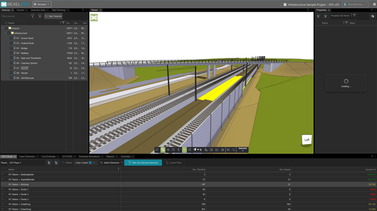
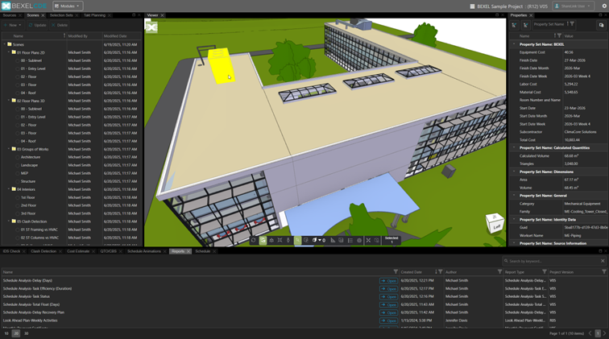
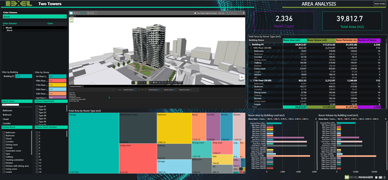

# Revolutionizing BIM Visualization Through High-Performance xeokit SDK Implementation in BEXEL Manager

## Introduction & Context

In the era of digital transformation within the construction industry, effective 3D visualization has become a cornerstone of successful BIM projects. BEXEL Manager, as a premium BIM solution, sought to expand its capabilities with a high-performance web viewer that can seamlessly integrate with its powerful 4D and 5D BIM modules while complementing its established desktop environment. 

To achieve this, the BEXEL team selected [xeokit SDK](https://github.com/xeokit/xeokit-sdk) – an open‑source web 3D graphics toolkit, purpose‑built for the AEC (Architecture, Engineering, Construction) industry and BIM. This strategic decision empowered BEXEL’s developers to deliver a lightweight yet highly capable web viewer, enabling smooth visualization of complex, federated AEC models with excellent performance and precision.

The implementation of xeokit in BEXEL Manager not only resolved technical challenges but also unlocked new possibilities for the platform's intelligent construction planning engine, facilitating more sophisticated 4D/5D BIM analyses and real-time progress monitoring. The outcome is a significantly enhanced user experience in the BEXEL Viewer module and the capability to handle larger, more complex BIM projects within cloud environments.

<!-- truncate -->

## Business and Technical Challenge

BEXEL Manager, serving as an advanced BIM solution offering comprehensive capabilities for visualization, model data management, clash detection, automated quantity take-off, cost management, intelligent planning, and progress monitoring. Platform users, working with increasingly large and complex construction projects, demanded a 3D visualization tool that would not only ensure smooth operation but also enable precise analysis of every BIM model element without the need to install additional desktop software.

The first fundamental challenge involved handling large, federated BIM models originating from diverse sources and disciplines in the browser. Contemporary construction projects often comprise hundreds of thousands, sometimes millions of BIM elements, representing architecture, structural engineering, MEP installations, and other disciplines. Traditional 3D visualization solutions encountered significant performance limitations when attempting to render such complex data structures within web browser environments.

The second important requirement focused on precise handling of global coordinates with double precision accuracy. Construction projects frequently operate on real geographical coordinates, where every meter holds significance for planning and execution accuracy. Standard WebGL implementations, utilizing single-precision floating-point arithmetic, proved insufficient for providing the required precision in large infrastructure projects.

>Source: https://bexelmanager.com/bexel-cde-demo/

The platform also needed to ensure support for industry-standard formats, particularly IFC (Industry Foundation Classes) and BCF (BIM Collaboration Format), while enabling integration with point clouds from laser scanning. This requirement proved especially critical for real-time progress monitoring, where comparison between design models and actual construction status constitutes a key element of quality control workflows.

Equally significant was the deep integration with 4D and 5D BIM simulation workflows, which form the core of the intelligent construction plan generation system based on location-based scheduling principles. The visualization module needed not only to present 3D models but also enable dynamic element colouring according to schedules, work progress analysis, construction sequence visualization, and integration with cost management systems While many existing solutions offered only limited customization, BEXEL elevated these workflows with the help of the fully customizable xeokit SDK to a new level of flexibility and intelligence, creating a truly end-to-end planning and monitoring environment.

Furthermore, a critical technical hurdle emerged around preserving and accessing the complete IFC data and properties within the lightweight web viewer. BEXEL's clients require not merely 3D geometry but also the rich metadata embedded in BIM models, including component names, specifications, material properties, cost data, and technical parameters. By enabling performant, browser-based access to this rich dataset with interactive querying capabilities, BEXEL delivered a solution that empowers users to work smarter, faster, and with greater confidence.

## Why xeokit?

The technology selection process for the new 3D visualization system in BEXEL Manager required detailed analysis of available solutions regarding performance, functionality, and integration capabilities. After thorough market evaluation, the technical team chose xeokit SDK - an open-source toolkit - for several key reasons.

The primary and most important factor was the exceptional WebGL performance offered by xeokit. The SDK provides capability for rapid loading and browsing of enormous IFC and CAD models, loading hundreds of megabytes within seconds. This performance stems from an advanced WebGL renderer architecture specifically designed to handle highly detailed BIM models. Unlike general 3D libraries, xeokit was optimized for the specific requirements of the AEC industry, translating to significantly superior performance when rendering complex geometric structures typical of construction projects.

The second crucial argument was comprehensive support for industry formats and real-world coordinates with double precision. xeokit offers native support for IFC, BCF, and point clouds, which was essential for full integration with the BEXEL ecosystem. Particularly significant proved to be the optimized XKT format, enabling compression and rapid loading of large BIM models, transforming multi-megabyte IFC files into efficient data structures ready for browser rendering.

Another decisive factor was the SDK's plugin-based architecture, which enabled deep customization and functionality extension. xeokit allows developers to create fully configurable and extensible custom BIM viewers through plugins. This modularity proved crucial for integration with existing BEXEL Manager workflows, enabling implementation of specialized analytical functions without compromising performance or stability.

## Results and Impact

Using xeokit as a high-performance basis for 3D visualization, BEXEL has made it the cornerstone of its platform. The result is a system that not only meets but exceeds industry expectations and sets new standards.

The 4D BIM simulation capabilities now enable visualization of construction sequences with full precision, allowing users to interactively explore construction scenarios and identify potential bottlenecks before they impact timelines. The 5D cost management system gained powerful visualization capabilities, enabling users to color-code elements by cost criteria and analyze budget deviations spatially.

BEXEL Viewer built with xeokit SDK provides advanced measurement tools, sectioning functions, and intelligent element selection while maintaining browser accessibility. Properties panel provides instant access to complete IFC metadata for any selected element, eliminating external data lookup needs and creating a unified visual and analytical environment.

Enhanced collaboration features through BCF integration and point cloud support facilitate reality capture workflows for quality control and progress verification.

>Source: https://bexelmanager.com/bexel-cde-demo/

## Implementation Process and Partnership
The implementation was driven by BEXEL’s clear vision and technical expertise, supported through a long-term partnership with Creoox, the company behind xeokit. This collaboration allowed BEXEL’s development team to stay fully focused on innovating core BIM workflows and utilizing xeokit SDK for quickly building their own BEXEL Viewer with it, while relying on [Creoox](https://creoox.com) for technical guidance and support. This partnership approach proved essential for navigating the complex technical requirements, ensuring high level of flexibility, autonomy and seamless integration with BEXEL Manager's existing architecture.

## Conclusion
The implementation of [xeokit SDK](https://github.com/xeokit/xeokit-sdk) in BEXEL Manager demonstrates how thoughtful technology selection and strong partnerships deliver transformative business outcomes. Through collaboration with Creoox, BEXEL Manager achieved new standards of performance and functionality in BIM visualization. With solid technological foundations established, BEXEL Manager is positioned to meet future challenges and maintain market leadership in advanced BIM solutions.
