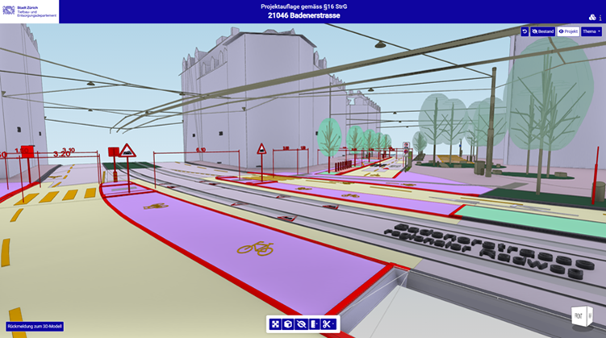
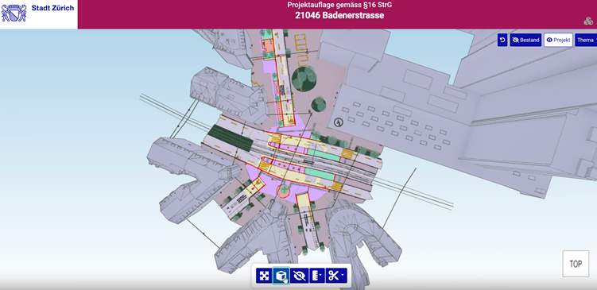
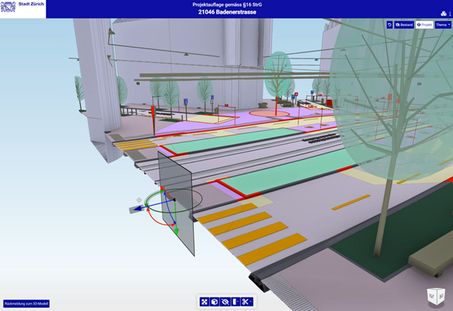
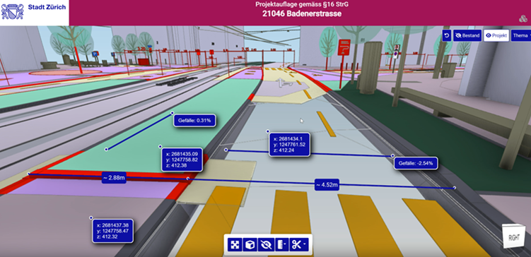

# How Zurich Enables Digital Civic Participation through a 3D BIM Viewer
## A case study of a xeokit SDK-based solution for urban planning transparency

### Introduction & Context

The City of Zurich, one of Europe’s most forward-thinking urban centers, is renowned for its progressive public services and commitment to sustainability. In 2024, the Tiefbauamt (Civil Engineering Office) took a major step toward modernizing how it communicates with citizens about major infrastructure projects. For the first time, as part of the official Planauflage (public consultation) procedure, the city provided an interactive 3D BIM model alongside traditional planning documents.

The pilot project, Projektauflage 21046 Badenerstrasse, marked a turning point. By publishing a 3D BIM model accessible directly in a web browser, Zurich allowed residents to explore the project from any angle, compare existing and planned states, and fully grasp the changes in context. This innovation was not only about technology - it was also about building trust, empowering participation, and supporting the city’s broader “Digitale Stadt” strategy and its long-term vision of a digital twin of Zurich.

{/* truncate */}

### The City's Challenge

Zurich faced a communication gap in how it presented major urban projects. While road infrastructure projects were formally published during the Mitwirkung (§13 StrG) and Planauflage (§16/17 StrG) phases, the process relied heavily on 2D site plans, technical cross-sections, and static PDF documents displayed at the municipal office. Legally sufficient, yes - but practically inaccessible to most residents.

Citizens often struggled to understand how abstract lines on paper would translate into changes in their daily environment. Was a crossing moving closer to their building? How would new green spaces reshape their neighbourhood? These questions remained unanswered for many. Moreover, the limited availability of plans - mostly on-site during office hours - restricted participation, while the formal, bureaucratic process of submitting objections discouraged broader civic engagement.

At the same time, Zurich’s urban planners were working with rich, complex BIM data that required specialized tools, effectively shutting out the public from information already available in digital form. Any new approach also had to respect strict legal compliance: traditional 2D plans remained the binding documents, and any 3D innovation could only serve as an informative, supplementary layer.

The City of Zurich was driven by a bold ambition: to go beyond the limitations of static 2D documents and to empower its residents with an intuitive, browser-based 3D experience. The vision was to make planning accessible on any device, support openBIM standards like IFC and overlay with precise GIS data. Additionally, public efforts should result in public goods or in this case public open-source projects. And above all, to see projects “through the eyes of a citizen” rather than through engineering drawings.

### The Solution: xeokit SDK as an enabler

To overcome these challenges, Zurich embraced [xeokit SDK](https://github.com/xeokit/xeokit-sdk), an open-source platform designed for high-performance full-precision visualization of BIM models directly in the browser. Built on WebGL and supporting openBIM standards like IFC and real-world coordinates with double precision for overlay with georeferenced models and GIS data, xeokit allowed the city to transform complex engineering data into a **clear, interactive, and accessible experience**.

#### Key Features:
- **View Filters:**
  - Reset to default view
  - Show only existing environment
  - Show only planned project elements
  - Filter elements by thematic category (e.g. roads, buildings)
- **Tools:**
  - Filter, show/hide objects (including multi-select)
  - Zoom to entire project, side views navigation
  - Switch between perspective and orthographic projection
  - Measure distance, coordinates, terrain slopes
  - Create custom section cuts
- **Intuitive UI:** Accessible interface with tooltips, icons and video tutorials
- **Citizen feedback:** A contact form directly embedded in the viewer encourages civic engagement

These features allow residents with no technical background to intuitively explore planned projects, compare existing vs future states, and assess changes with clarity.

### Live Demo
Explore the live 3D Viewer – Projektauflage Badenerstrasse (Official City of Zurich portal): https://taz.stadt-zuerich.ch/planauflage_ifc_viewer/modelviewer

### The Badenerstrasse Pilot in the Context of the BIM Stadt Zürich 2026 Strategy (BIM@StZH)

The Badenerstrasse pilot project fits seamlessly into the long-term framework of the BIM Stadt Zürich 2026 strategy. This strategy formulates a clear vision: “We use BIM for consistent data and information management ... to make better decisions that lead to better results in the long term” The viewer developed for the Planauflage is a practical manifestation of that vision, turning highly technical data into an accessible 3D experience that supports better decision-making for both professionals and citizens. At the same time, the project embodies the guiding principles (Leitsätze) of the strategy: it increases transparency by opening the planning process to the public, strengthens collaboration across departments by involving planners, IT, and GIS experts, and relies on open standards and open-source technology with xeokit SDK at its core. In terms of strategic goals, the pilot brings the city closer to creating a digital twin of Zurich, establishes new workflows for cross-departmental coordination, and most importantly, extends transparency beyond the administration to include citizens themselves. Within the roadmap (Stufenplan), which moves from Sensibilisierung (awareness) through Befähigung (enablement) to Transformation, the Badenerstrasse pilot is a textbook example of the Befähigung phase. It tested technical feasibility, validated the use of openBIM formats in public processes, and provided a scalable foundation for expanding BIM-based communication citywide - paving the way for the full transformation envisioned by 2026.

### Conclusion

The success of the Badenerstrasse project demonstrates how an open-source solution like [xeokit SDK](https://github.com/xeokit/xeokit-sdk) can address real-world urban challenges: making projects more transparent, empowering citizens to participate, and giving administrations full control over their technology stack without vendor lock-in.

Zurich has thus established itself as a pioneer of digital urbanism. The project proved that BIM can leave the confines of design offices and reach the streets – literally, in the form of an interactive 3D model accessible to all.

