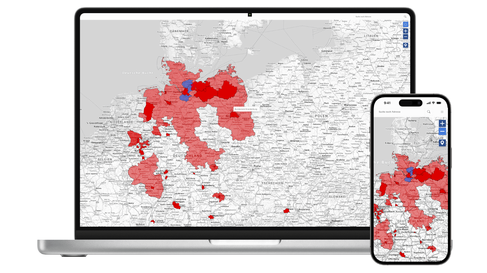
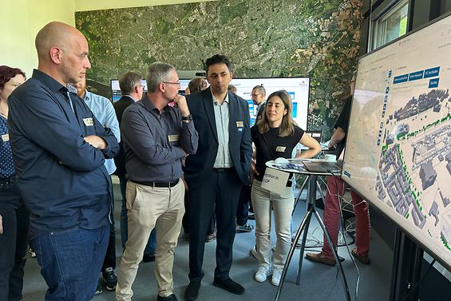
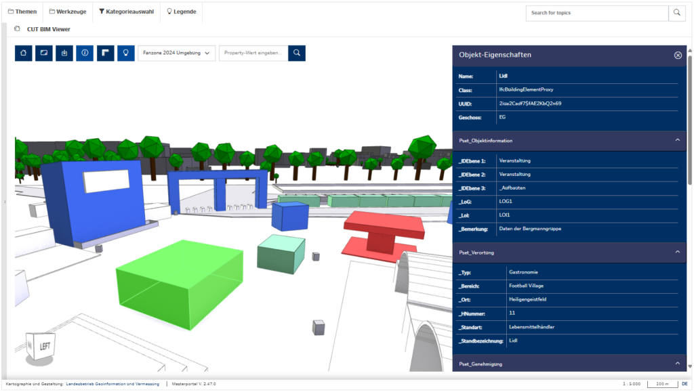
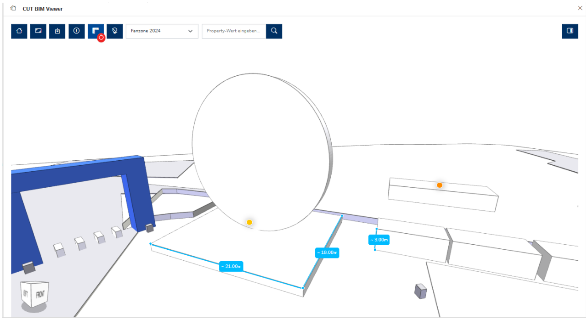
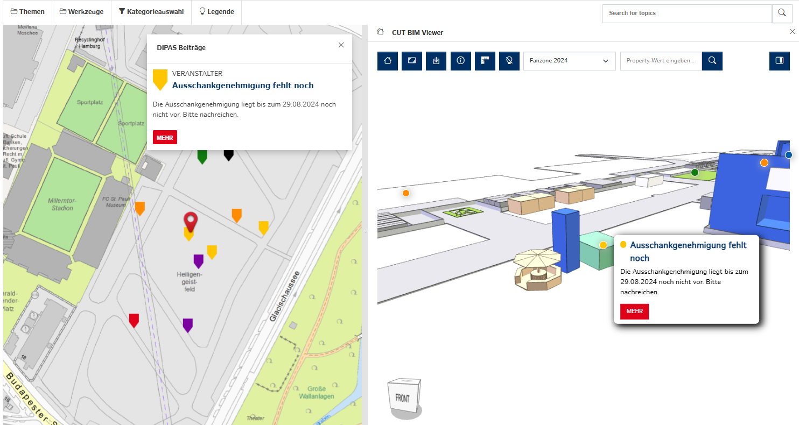
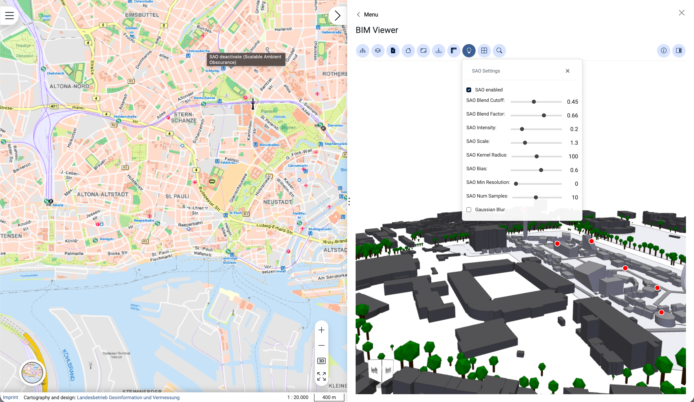
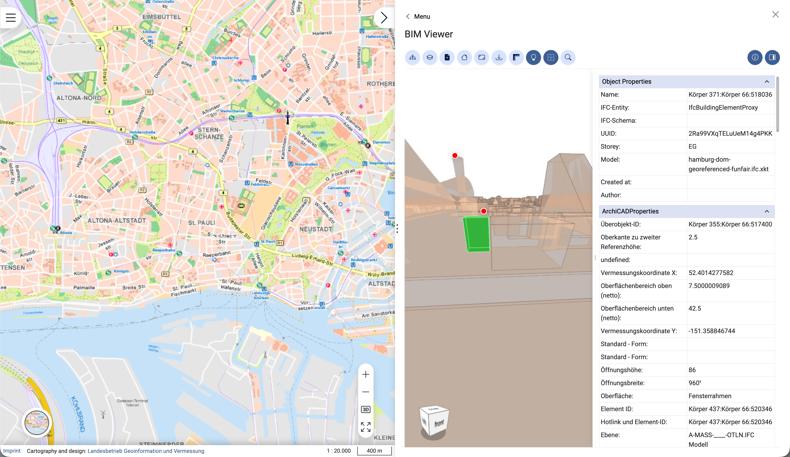

# Hamburg's Digital Urban Planning Revolution with open source xeokit 3D Viewer

Hamburg, one of Europe's leading metropolises, has positioned itself at the forefront of digital urban planning through its participation in the "Connected Urban Twins" (CUT) project — a collaboration with Leipzig and Munich aimed at developing cutting-edge urban data platforms and digital twins between 2021 and 2025.

By taking part in the Connected Urban Twins project, Hamburg is not only shaping its own digital future but also actively contributing to Germany's broader digital transformation. Together with other cities, the city is building scalable solutions that can be replicated nationwide, ensuring that innovations in BIM and digital planning benefit municipalities of all sizes. The map below illustrates the growing Geoportal Community, highlighting Hamburg's role as a central contributor to this nationwide initiative.

>Source: https://www.masterportal.org/

As part of this transformation, Hamburg adopted an open-source 3D viewer based on the [xeokit SDK](https://github.com/xeokit/xeokit-sdk). While not the core of the initiative, xeokit significantly adds value by supporting the integration of BIM technologies and providing modern digital tools that streamline planning processes and improve the coordination of events in the city.

Supporting this transformation, xeokit follows its mission of making BIM adoption easier by providing open, web technologies for advanced 3D visualization.

{/* truncate */}

### The Challenges

Before the CUT project and the integration of xeokit, Hamburg struggled with complex and inefficient approval processes for large urban events. Coordination relied on scattered materials such as 2D drawings, PDFs, phone calls, and correction notes, which created unnecessary iterations, delays, and administrative overhead. Communication between stakeholders was often fragmented, making it harder to ensure smooth planning and execution.

A major milestone in overcoming these challenges was the integration of a BIM viewer into the Masterportal. This step laid the foundation for using BIM models not only in event coordination but also in a wide range of urban applications. The viewer was designed as a flexible add-on, with continuous improvements planned to adapt its functionality to evolving project requirements and to enable future extensions.

### Implementation

To address these points, Hamburg's Landesbetrieb Geoinformation und Vermessung (LGV) — the city's geoinformation and cadastral agency — played a key role. The BIM-Leitstelle (BIM Coordination Center) within LGV spearheaded the integration of the [xeokit SDK](https://github.com/xeokit/xeokit-sdk) 3D viewer into core city systems, including the Masterportal geoportal and the citizen participation platform DIPAS.

Masterportal, as a toolkit based on OpenLayers and Vue.js, provided a great modular architecture to host both the CesiumJS engine and the xeokit viewer. This integration allows users to switch seamlessly between traditional 2D maps, large-scale geospatial 3D environments (powered by Cesium for terrain and city-wide 3D Tiles), and detailed 3D BIM models (managed by xeokit) within a single, unified interface. By combining Cesium's ability to visualize the broader urban context with xeokit's precision in handling IFC data, the platform creates a comprehensive digital twin also in urban built environment. Furthermore, the DIPAS platform empowers citizens to leave comments and feedback directly on specific locations within these 3D models, facilitating true digital collaboration.

>Source: https://bim.hamburg.de/bim-leitstelle-des-lgv-stellte-ihre-entwicklungen-auf-der-udp-fachtagung-vor-966328

The result was a significant consolidation of data sources, standardization of approval processes and the introduction of full Building Information Modeling (BIM) standards — moving decisively away from paper-driven workflows.

>Source: https://www.connectedurbantwins.de/en/loesungen/bim-based-coordination-platform-for-major-events/

In the CUT project, ensuring the scalability of the solution was a top priority. The integration of the BIM viewer was designed not only to meet current requirements but also to enable future product development and the implementation of new features without needing a complete system overhaul. Xeokit played a pivotal role at this stage — its high degree of customizability and flexibility made it possible to effectively address these challenges. As a result, xeokit provided a solid foundation for ongoing product evolution and seamless integration optimization, allowing the platform to adapt as needs change and the project grows.

### Features Driving the Digital Twin

The xeokit viewer introduced a suite of powerful functions:

- Direct loading and interactive navigation of IFC models in the browser 
- Measurement tools for distances 
- Attribute inspection of individual BIM objects 
- Adding annotations to the IFC model 
- Adding and editing comments 

and more. 

>Source: https://bim.hamburg.de/connected-urban-twins-bim-basierte-abstimmungsplattform-fuer-grossveranstaltungen--1040218

Furthermore, Hamburg is automating the conversion of geospatial GIS data to BIM-ready IFC models to ensure, by the end of 2025, that city model data is fully interoperable and ready for new BIM use cases.

>Source: https://bim.hamburg.de/connected-urban-twins-bim-basierte-abstimmungsplattform-fuer-grossveranstaltungen--1040218

### Tangible Benefits and Open Source as a Standard 

The [xeokit SDK](https://github.com/xeokit/xeokit-sdk) implementation has yielded clear, city-wide benefits:

- Significantly faster preparation and review of urban plans 
- More robust, transparent, and collaborative decision-making 
- Enhanced citizen involvement, resulting in higher public trust and acceptance 

Digital tools have streamlined administrative processes, marking Hamburg as a leader in the digital future of urban planning.

A defining aspect of the project is the dedication to open-source technologies: all key software components are released under open licenses. As Claudius Lieven, Head of Urban Workshop Hamburg (Stadtwerkstatt), highlights in [video](https://youtu.be/eoStH80wyWo): "Open source is a very important aspect of the CUT project. All software modules created should be open source. DIPAS, for example, is open source. The Masterportal is open source, so it can be shared and reused by other cities and municipalities in Germany, without them needing to purchase the software." This not only lowers adoption barriers but also enables cities across Germany to replicate and build on Hamburg's solutions, fostering knowledge and technology transfer.

### Summary

Through ambitious digitalization, spearheaded by open 3D visualization tools based on the [xeokit SDK](https://github.com/xeokit/xeokit-sdk), Hamburg has set a new benchmark for urban management and citizen participation. The implementation of the xeokit SDK in Hamburg has delivered tangible, city-wide benefits that have transformed urban planning processes. These digital tools have significantly accelerated the preparation of plans and the making of administrative decisions. As a result, Hamburg emerges as a leader and model for other cities aiming to embark on the path toward a digital future of urban planning. This vision is closely aligned with xeokit's mission to democratize BIM adoption by making advanced 3D visualization accessible to everyone through open, web-based technologies.
